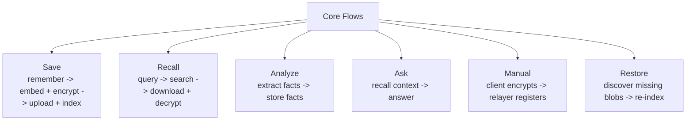

# Core Flows

## Flow Diagram

## Save Flow

1. the SDK signs a `remember` request
2. the relayer verifies the delegate key and resolves the owner
3. the relayer embeds the text and encrypts it
4. the encrypted payload is uploaded to Walrus
5. PostgreSQL stores the vector plus blob ID under owner and namespace

## Recall Flow

1. the SDK signs a `recall` request
2. the relayer embeds the query
3. PostgreSQL returns the closest matches for owner and namespace
4. the relayer downloads matching blobs from Walrus
5. the relayer decrypts them and returns plaintext results

## Analyze Flow

1. the SDK sends text to `analyze`
2. the relayer extracts memorable facts with an LLM
3. each fact is embedded, encrypted, uploaded, and indexed
4. all stored facts remain scoped to the current namespace

## Ask Flow

1. the SDK or app sends a question to `ask`
2. the relayer recalls relevant memories for context
3. those memories are injected into an LLM prompt
4. the relayer returns the answer plus the memories used

## Full Client-Side Manual Flow

For `MemWalManual`, the client:

1. embeds the text locally
2. encrypts with SEAL locally
3. sends encrypted payload plus vector to the relayer for registration
4. later searches by vector and decrypts blobs locally

## Restore Flow

Restore is now incremental:

1. the SDK calls `restore(namespace, limit?)`
2. the relayer queries Walrus-related chain metadata for that owner and namespace
3. it compares on-chain blob IDs with local vector entries
4. it restores only missing blobs
5. missing blobs are decrypted, re-embedded, and inserted back into PostgreSQL

The restore flow fills gaps. It does not wipe and rebuild the namespace blindly.
