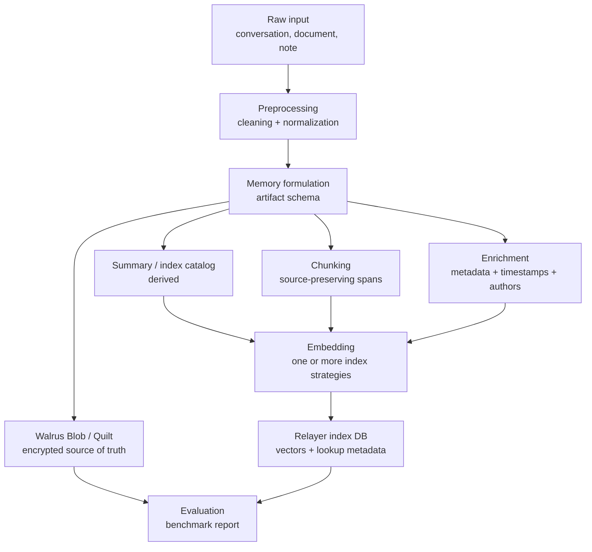

# Memory Pipeline Redesign Plan

This is a working plan for the next MemWal memory pipeline. The goal is to preserve original authored content on Walrus while allowing the relayer to evolve indexing and retrieval strategies without data loss or breaking changes.

## Current State

The current relayer has a simple source-of-truth model:

- `/api/remember` receives plaintext, embeds the whole input, SEAL-encrypts the same plaintext, uploads the ciphertext to Walrus, then stores `{ owner, namespace, blob_id, embedding }` in PostgreSQL.
- `/api/analyze` extracts LLM facts from the input and stores each extracted fact as a separate memory. This is useful for small personal facts, but it is not a safe replacement for original documents or conversations.
- `/api/recall` embeds the query, searches pgvector, downloads matching blobs from Walrus, decrypts them, and returns plaintext.
- `/api/restore` discovers blobs from on-chain metadata, downloads and decrypts them from Walrus, then re-embeds each decrypted plaintext to rebuild missing vector rows.

This already makes Walrus the durable encrypted storage layer, but the stored payload is not yet a versioned memory artifact. Because of that, the relayer cannot reliably rebuild richer future indexes such as chunks, summary catalogs, source spans, or multi-vector entries from a stable schema.

## Design Principles

1. Walrus must store enough original authored content to be the durable source of truth.
2. Summary, extracted facts, chunks, embeddings, and retrieval indexes are derived artifacts.
3. Derived artifacts can be rebuilt from Walrus without needing the old relayer database.
4. Authorship, source, timestamp, and transformation metadata must be explicit.
5. Benchmarking must decide retrieval/indexing behavior. We should not replace raw memory with summaries based on intuition.
6. Backward compatibility matters: existing plaintext blobs should remain restorable through the current flow.

## RAG Best Practices To Apply

The redesign should apply current RAG practice without overfitting to one vendor or framework.

References:

- Anthropic Contextual Retrieval: https://www.anthropic.com/engineering/contextual-retrieval
- Azure AI Search hybrid search overview: https://learn.microsoft.com/en-us/azure/search/hybrid-search-overview
- LangChain RAG evaluation workflow: https://docs.langchain.com/langsmith/evaluate-rag-tutorial
- EMNLP 2024, "Searching for Best Practices in Retrieval-Augmented Generation": https://aclanthology.org/2024.emnlp-main.981/

Best practices that matter for MemWal:

1. Use hybrid retrieval as a first-class benchmark candidate.
   - Dense vector search handles semantic similarity.
   - Sparse lexical search such as BM25 handles exact names, numbers, IDs, clause labels, dates, and legal terms.
   - Use rank fusion, preferably Reciprocal Rank Fusion (RRF), before introducing learned weighting.

2. Preserve source text and attach metadata to chunks.
   - Chunking should be source-preserving, not summarizing.
   - Chunks should carry source spans, section labels, author IDs, timestamps, and document kind.
   - The system should be able to cite or reconstruct the original passage from a retrieved chunk.

3. Avoid naked chunks when document-level context matters.
   - For long documents, contracts, and deal memos, a chunk can be ambiguous without its surrounding section or document context.
   - Benchmark contextual chunks: prepend a short derived context string for indexing, while still storing the exact chunk text separately.
   - The contextualized text is for retrieval only; it must not replace original authored text.

4. Benchmark reranking separately.
   - Retrieval can collect a wider candidate set, for example top 50-150.
   - Reranking can reduce that set to the final top K.
   - Reranking should be measured with latency and cost because it adds runtime work.

5. Evaluate retrieval and answer quality separately.
   - Retrieval metrics should include Recall@k, MRR, nDCG, and source-span hit rate.
   - Answer metrics should include correctness, groundedness/faithfulness, and citation support.
   - A benchmark result is not enough if it only reports final LLM answer quality, because retrieval failures and generation failures need different fixes.

6. Tune by domain.
   - Chat memory, contracts, deal memos, and noisy web documents likely need different chunk sizes and fusion weights.
   - The benchmark must report scores per dataset category, not only an aggregate score.

## Key Decision

For the new MemWal design, Walrus should store a versioned Memory Blob or Quilt artifact, not only a summary and not only an embedding target.

The recommended default is:

- Store original authored plaintext or source-preserving cleaned plaintext on Walrus.
- Store structured metadata describing authorship, source, timestamps, and processing version.
- Optionally store derived summaries/catalogs/chunks in the same artifact if they are useful, but treat them as rebuildable.
- Store embeddings and search indexes in the relayer database as operational state only.

## Target Pipeline



## Component Definitions

### Preprocessing

Cleaning removes obvious retrieval noise while preserving original meaning:

- Strip HTML tags, navigation, boilerplate, repeated headers/footers.
- Normalize whitespace and encoding.
- Preserve raw text separately when exact replay or legal fidelity matters.
- Produce deterministic processing metadata so changes can be audited later.

### Memory Formulation

Memory formulation turns input into a versioned artifact. This is where we decide whether the memory is a conversation, document, note, contract, deal memo, or extracted fact set.

The artifact should preserve:

- Original authored text or a pointer/span map to it.
- Authorship and source identity.
- Timestamp and namespace.
- Processing version.
- Relationship between raw text, cleaned text, chunks, catalog, and derived indexes.

### Summary / Index Catalog

The catalog is a retrieval aid, not the source of truth.

Expected uses:

- Route broad user queries to relevant documents or sections.
- Represent high-level topics, entities, decisions, obligations, dates, and unresolved questions.
- Improve recall for queries that do not lexically match exact chunks.

The catalog must be marked as derived and rebuildable.

### Chunking

Chunking should preserve source text, not summarize it.

Initial target:

- 200-800 tokens per chunk for chat/fact memory.
- 500-1000 tokens per chunk for long documents.
- 10-15% overlap when chunk boundaries are mechanical.
- Prefer natural boundaries: paragraphs, sections, clauses, turns, headings.
- Store source spans so retrieved chunks can cite or reconstruct the original text.
- For contracts and deal memos, prefer structure-aware chunks around clauses, sections, definitions, parties, obligations, and dates.
- For long documents, benchmark parent-child retrieval: index smaller child chunks, then return a larger parent section for answer context.
- For ambiguous chunks, benchmark contextual indexing: store exact chunk text, but embed/index `contextual_header + chunk_text`.

### Enrichment

Enrichment is optional, but it should be structured:

- `owner`, `namespace`, `agent_id`
- source type and source URI
- authors and participant roles
- created/observed timestamps
- document title, section title, message turn IDs
- model and pipeline version used to derive summaries/chunks

### Embedding

Embedding should support multiple index strategies:

- Whole artifact embedding
- Summary/catalog embedding
- Chunk embedding
- Contextual chunk embedding
- Highlight/fact embedding
- Hybrid indexes that combine catalog routing and chunk retrieval

The relayer DB should track index kind and source pointers, not only `blob_id`.

### Retrieval

Retrieval should become a configurable strategy rather than a single vector lookup.

Candidate retrieval modes:

- Dense vector retrieval over whole artifacts, catalogs, chunks, or contextual chunks.
- Sparse lexical retrieval over cleaned text and chunks.
- Hybrid retrieval using dense + sparse results with RRF.
- Optional reranking over a larger candidate set.
- Optional catalog routing before chunk retrieval for large memory spaces.

### Memory Blob / Quilt Translator

The translator serializes the formulated memory artifact into the encrypted payload uploaded to Walrus.

The artifact should be versioned so future relayers can restore old memory data and rebuild new indexes.

## Proposed Artifact Shape

This is a draft schema, not yet an implementation contract.

```json
{
  "schema": "memwal.memory_artifact",
  "version": 1,
  "artifact_id": "uuid",
  "owner": "0x...",
  "namespace": "default",
  "kind": "conversation | document | note | fact_set",
  "source": {
    "type": "chat | contract | deal_memo | note | web | pdf",
    "uri": null,
    "title": "Optional title",
    "created_at": "2026-05-07T00:00:00Z"
  },
  "authors": [
    {
      "id": "user-or-agent-id",
      "role": "user | assistant | counterparty | system",
      "display_name": "Optional"
    }
  ],
  "raw": {
    "content_type": "text/plain",
    "text": "Exact authored plaintext when required",
    "sha256": "hex"
  },
  "cleaned": {
    "text": "Cleaned plaintext, if different from raw",
    "transform": "pipeline-name@version"
  },
  "chunks": [
    {
      "id": "chunk-0",
      "text": "Source-preserving chunk text",
      "source_span": { "start": 0, "end": 500 },
      "section": "Optional section heading",
      "authors": ["user-or-agent-id"]
    }
  ],
  "catalog": {
    "summary": "Derived high-level index summary",
    "topics": ["topic"],
    "entities": ["entity"],
    "claims": ["claim"],
    "derivation": {
      "model": "model-name",
      "prompt_version": "catalog-v1"
    }
  },
  "metadata": {
    "created_by": "relayer",
    "pipeline_version": "memory-pipeline-v1"
  }
}
```

## Relayer DB Changes To Consider

The current `vector_entries` table is too narrow for hybrid retrieval. It should evolve toward an index table that can represent many rows per Walrus artifact.

Draft fields:

- `id`
- `owner`
- `namespace`
- `blob_id`
- `artifact_id`
- `index_kind`: `whole | catalog | chunk | highlight | fact`
- `source_ref`: chunk ID, catalog field, or raw span
- `indexed_text_kind`: `raw | cleaned | contextualized | summary`
- `embedding`
- `embedding_model`
- `lexical_document`: optional text/search vector for BM25 or PostgreSQL full-text search
- `pipeline_version`
- `created_at`

This allows the same Walrus blob to support different retrieval strategies while keeping Walrus as the restore source.

## Benchmark Plan

Benchmarking should answer which strategy retrieves the right evidence most reliably.

### Strategies

1. `whole_blob_embedding`
   - Baseline matching the current `/api/remember` behavior.

2. `summary_only`
   - Store/search only derived summary/catalog text as retrieval input.
   - Expected to do well for broad topics and poorly for exact clauses/details.

3. `chunking_only`
   - Store/search source-preserving chunks.
   - Expected to do well for exact details and citations, but may miss broad queries.

4. `contextual_chunking`
   - Embed/index chunk text with a short derived context header.
   - Return the exact chunk text and source span, not the contextual header as source truth.

5. `hybrid_chunking`
   - Run dense vector search and sparse lexical search over chunks, then fuse with RRF.
   - Expected to help contracts, deal memos, exact dates, names, IDs, and clause references.

6. `catalog_plus_chunks`
   - Search catalog and chunks together, or use catalog to route to chunks.
   - Expected target design if benchmarks validate it.

7. `catalog_plus_hybrid_chunks`
   - Use catalog as a coarse index and hybrid chunk retrieval for evidence.
   - This is the likely production candidate if it improves recall without excessive latency.

8. `hybrid_plus_rerank`
   - Retrieve a wider candidate set with hybrid search, then rerank to final top K.
   - Expected to improve precision, but must justify extra latency/cost.

9. `fact_extraction_only`
   - Baseline matching current `/api/analyze`.
   - Useful for personal facts, risky for contracts and long-form authored documents.

### Datasets

Create a small but diverse eval set first:

- Multi-turn conversation with multiple speakers and preferences.
- Contract with obligations, parties, dates, exceptions, and exact clauses.
- Deal memo with financial terms and non-obvious constraints.
- Long note/document with sections and repeated concepts.
- Noisy web/html-like document to test cleaning.

Each dataset item should include:

- Raw input text.
- Expected preserved authorship metadata.
- Query set.
- Expected answer or relevant source span.
- Required citation or exact quote target when applicable.

### Metrics

Primary metrics:

- Recall@k: did retrieval include the right evidence?
- MRR: how highly was the right evidence ranked?
- nDCG@k: did the ranking place highly relevant evidence above partial evidence?
- Source-span hit rate: did retrieval include the exact expected passage or clause?
- Exact answerability: can a downstream model answer using retrieved context only?
- Source traceability: can the system point back to author and source span?
- Originality preservation: can restored artifact reproduce the source text or required spans?

Secondary metrics:

- Ingest latency
- Recall latency
- Storage bytes on Walrus
- Number of vector rows
- Number of lexical rows or indexed text entries
- Embedding token cost
- Reranking cost
- Restore completeness

### Output

The benchmark harness should produce:

- `benchmark-results.json`
- `benchmark-report.md`
- Per-strategy score table.
- Per-query failures with retrieved evidence for debugging.

## Execution Plan

### Phase 1: Spec And Alignment

Owner suggestion: Henry

- Finalize the Memory Blob / Quilt requirements.
- Decide which artifact fields are mandatory for v1.
- Decide how existing plaintext blobs remain backward compatible.
- Define the benchmark acceptance criteria.

Output:

- Approved artifact schema draft.
- Approved benchmark protocol.

### Phase 2: Benchmark Harness

Owner suggestion: Margo

- Build offline benchmark runner against static fixtures.
- Implement strategy adapters:
  - whole blob
  - summary only
  - chunking only
  - contextual chunking
  - hybrid chunking
  - catalog plus chunks
  - hybrid plus rerank
  - fact extraction only
- Generate comparable reports.

Output:

- Repeatable benchmark command.
- Initial report with current baseline and proposed strategies.

### Phase 3: Relayer Design Patch

Owner suggestion: Harry Phan

- Draft DB migration for multi-index vector rows.
- Add Rust types for versioned memory artifacts.
- Add translator layer from memory artifact to encrypted Walrus payload.
- Add restore logic that can detect artifact version and rebuild indexes.

Output:

- Implementation plan or PR for schema/types behind a feature flag.

### Phase 4: Production Rollout

Owner suggestion: shared

- Start with feature-flagged ingest strategy.
- Keep current `/api/remember` behavior as compatibility mode.
- Add artifact-aware restore.
- Compare production-like benchmark before switching defaults.

Output:

- Feature-flagged new memory pipeline.
- Rollout checklist.

## Open Questions

1. Should a single Walrus blob contain raw text plus all derived artifacts, or should Quilt link separate raw/catalog/chunk blobs?
2. What is the max artifact size before we split into Quilt parts?
3. Should exact raw text always be stored, or can cleaned text plus source hash be sufficient for low-risk note/chat memories?
4. Which retrieval path should be default for chat memory versus legal/document memory?
5. How should client APIs expose `kind`, `source`, and `authors` without making simple `remember(text)` harder to use?

## Immediate Next Step

Build the benchmark harness before changing production storage semantics. The harness should objectively compare the current baseline against summary-only, chunking-only, and catalog-plus-chunk retrieval on the same fixtures and queries.
