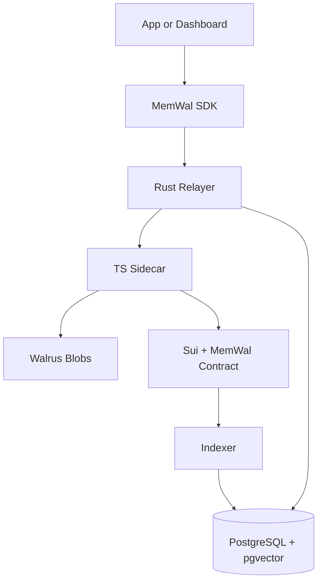
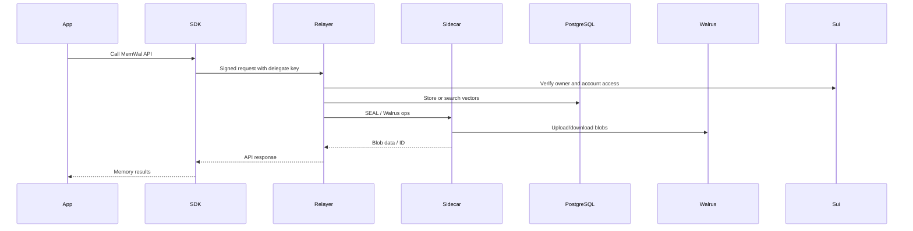

# System Overview

MemWal currently has these main components:

1. an application or dashboard
2. the TypeScript SDK
3. the Rust relayer backend
4. a TypeScript sidecar for SEAL and Walrus operations
5. PostgreSQL with pgvector
6. Walrus blob storage
7. the MemWal contract on Sui
8. the indexer for account sync

## System Diagram

## High-Level Flow

- applications call the SDK with a delegate key
- the SDK signs each request
- the relayer verifies the delegate key against onchain account state
- the relayer stores and searches vectors by owner plus namespace
- the sidecar handles SEAL and Walrus-specific operations used by the backend
- Walrus stores encrypted payloads
- Sui anchors ownership and delegate authorization
- the indexer keeps account data synced into PostgreSQL for faster lookup

## High-Level Flow Diagram

## Two Main Operating Modes

### Default SDK Mode

`MemWal` sends signed requests to the relayer and lets the backend handle most of the workflow.

### Full Client-Side Manual Mode

`MemWalManual` lets the client handle SEAL encryption, Walrus downloads, and embedding calls
directly while still using the relayer for registration and search.

## New Restore Shape

Restore is part of the architecture, not just an ops note. The relayer can:

1. discover blobs by owner and namespace from on-chain metadata
2. compare them against local vector state
3. restore only missing entries
4. re-embed and re-index incrementally

That makes the system more resilient when local vector state is incomplete.
