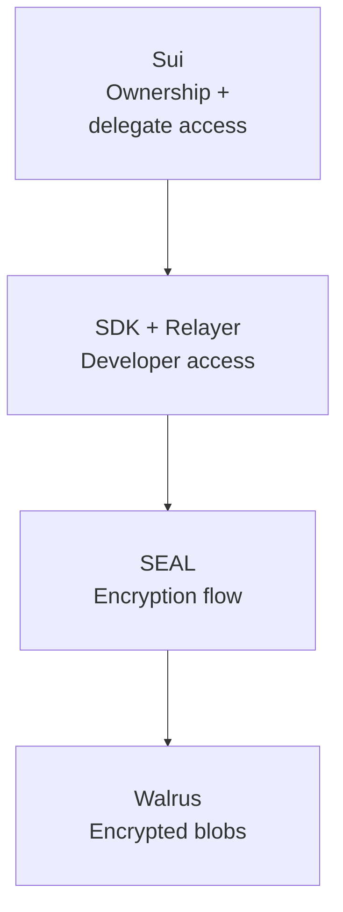
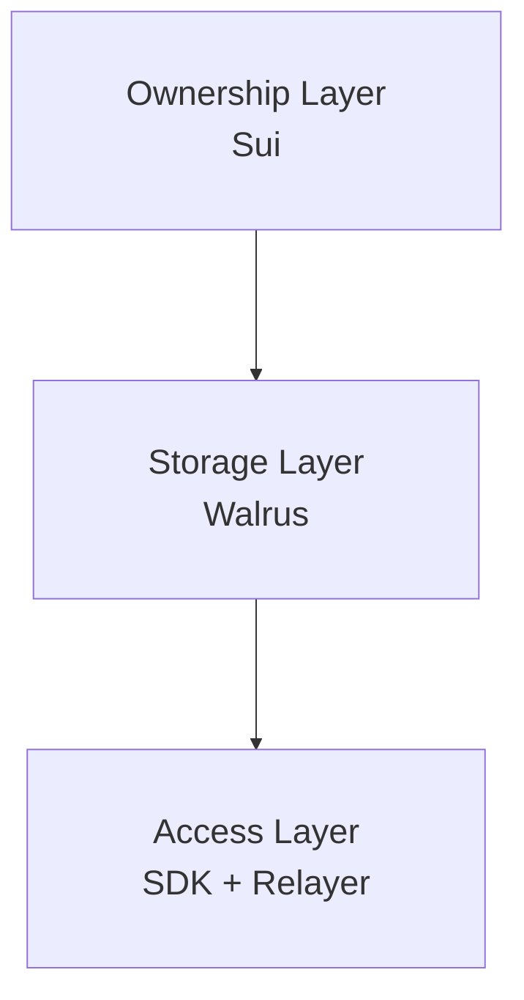

# Explaining MemWal

MemWal gives AI apps memory without collapsing ownership, storage, and app access into one system.

## The Short Version

- Sui anchors ownership and delegate access
- Walrus stores encrypted blobs
- the relayer gives developers a practical API

## Why This Exists

Most AI memory systems put data, access, and operator control in one database. MemWal splits those
concerns apart while keeping the integration path usable.

## Why Walrus + SEAL + Sui

- **Sui**: ownership and delegate keys
- **SEAL**: encryption and decryption flow
- **Walrus**: durable encrypted payloads
- **SDK + Relayer**: application-facing access layer

## Mental Model

Think of MemWal as three layers:

1. ownership
2. storage
3. access
