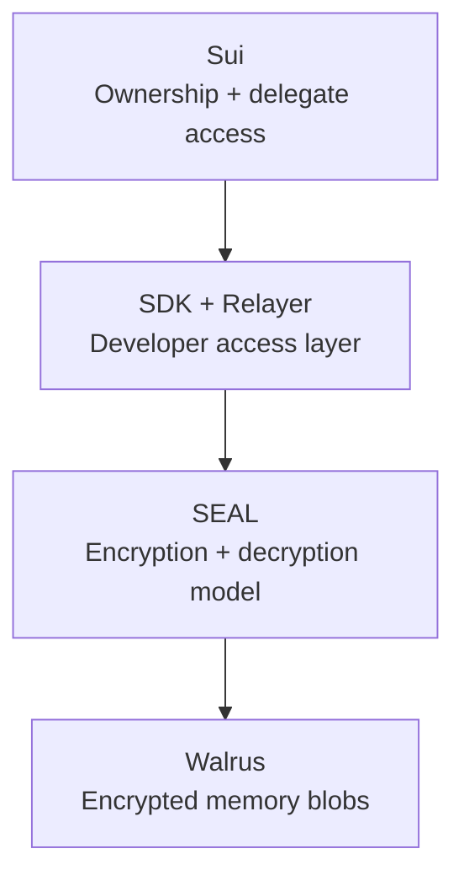
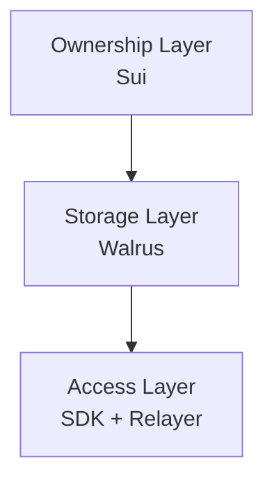

# Explaining MemWal

MemWal gives AI apps a memory layer where **ownership, storage, and application access are
separate concerns**.

In plain language, MemWal is trying to answer a simple product question:

> How do we give AI systems long-term memory without making the application operator the sole
> owner of the user's memory account and storage model?

## Why This Exists

Most AI memory systems are centralized databases owned and operated by the same service that
reads and writes user data. MemWal changes that model:

- Sui holds account ownership and delegate authorization
- Walrus stores encrypted memory payloads
- the relayer provides a practical developer interface for memory operations

This means developers still get a usable API, but the protocol does not pretend that storage,
ownership, and application access are all the same thing.

## Why Walrus + SEAL + Sui

- **Walrus** stores blob data
- **SEAL** provides the encryption and access policy model
- **Sui** anchors ownership and delegate-key access

Together, they let developers build memory-enabled apps without collapsing storage, identity,
and access control into one opaque service.

## The MemWal Mental Model

You can think about the stack in three layers:

1. **Ownership layer** on Sui
2. **Storage layer** on Walrus
3. **Developer access layer** through the SDK and relayer

That layering is the main idea behind MemWal. The SDK makes it practical, but the protocol model
is bigger than the SDK alone.
