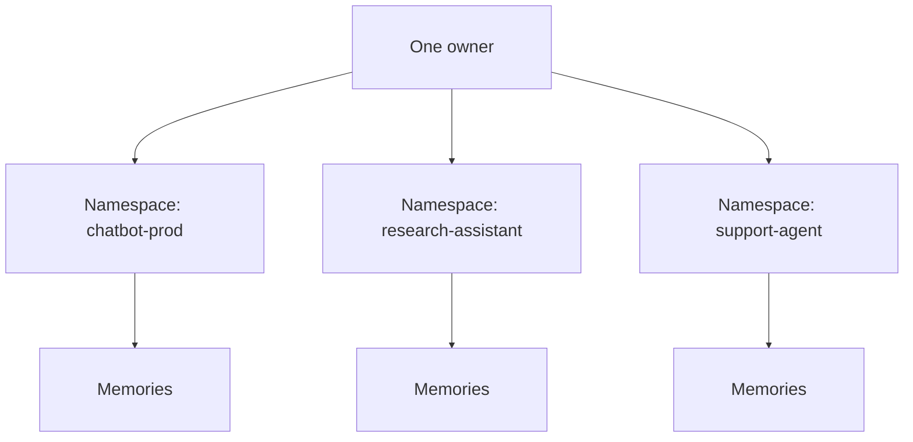

Namespace is the top-level isolation boundary in MemWal.

## In Practice

- `owner`: which user or account owns the memory
- `namespace`: which app, tenant, or product surface the memory belongs to

Together, `owner + namespace` define the active storage and retrieval boundary.




## Where It Shows Up

- `MemWalConfig.namespace`
- request payloads for `remember`, `recall`, `analyze`, `ask`, and `restore`
- PostgreSQL vector entries
- Walrus blob metadata as `memwal_namespace`
- restore discovery by owner and namespace

## What It Is Not

Namespace is not:

- a separate MemWal contract object
- a separate delegate registration flow
- a contract-level permission primitive
- part of the `seal_approve` policy itself

It is written onchain through Walrus blob metadata, but the MemWal contract still centers on owner
and delegate authorization.

## Why It Exists

Use namespace to avoid one flat memory pool.

Examples:

- one namespace per app
- one namespace per tenant boundary
- one namespace per environment like `staging` and `prod`

## How It Affects The System

- **SDK**: passes namespace with each request or falls back to the configured default
- **Relayer**: stores and searches by `owner + namespace`
- **Walrus**: stores `memwal_namespace` metadata on uploads
- **Restore**: rebuilds one namespace at a time
- **Contract**: still stays account-level, not namespace-level

## Good Usage

- keep namespace stable
- set it explicitly
- use one namespace per product surface

Avoid:

- relying on `"default"` after early testing
- mixing unrelated apps into one namespace
- changing namespace values casually after data already exists

## Example

```ts
const memwal = MemWal.create({
  key: process.env.MEMWAL_PRIVATE_KEY!,
  serverUrl: process.env.MEMWAL_SERVER_URL,
  namespace: "researcher-prod",
});

await memwal.remember("User prefers weekly sprint summaries.");
await memwal.recall("What reporting style does this user prefer?");
await memwal.restore("researcher-prod");
```
