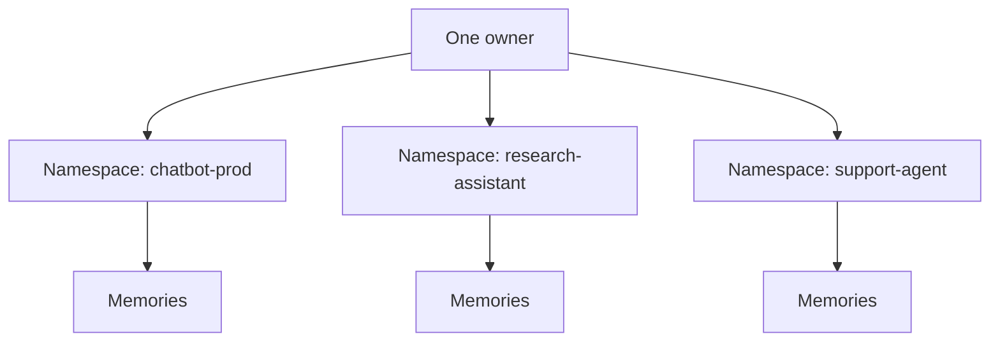

# Namespace

Namespace is the top-level boundary for memory isolation in MemWal.

## Namespace Diagram

## Where Namespace Shows Up

In the current codebase, namespace exists in all of these places:

- `MemWalConfig.namespace` in the SDK
- request payloads for `remember`, `recall`, `analyze`, `ask`, and `restore`
- PostgreSQL vector entries
- Walrus blob metadata as `memwal_namespace`
- restore queries that recover blobs by owner and namespace

If you do nothing, it defaults to `"default"`.

## Why It Matters

- it prevents unrelated products from sharing one flat memory pool
- it gives recall and restore a clear boundary
- it makes blob discovery and re-indexing predictable
- it keeps beta integrations easier to reason about operationally

## Recommended Mental Model

Think of a namespace as an app-level memory partition.

Examples:

- `chatbot-prod`
- `research-assistant`
- `playground`
- `support-agent`

Inside a namespace, you can still build narrower retrieval behaviors at the application layer,
but MemWal's core storage and restore boundaries start at namespace.

## Recommendation

Choose a namespace intentionally and keep it stable. Do not rely on `"default"` past quick testing.
