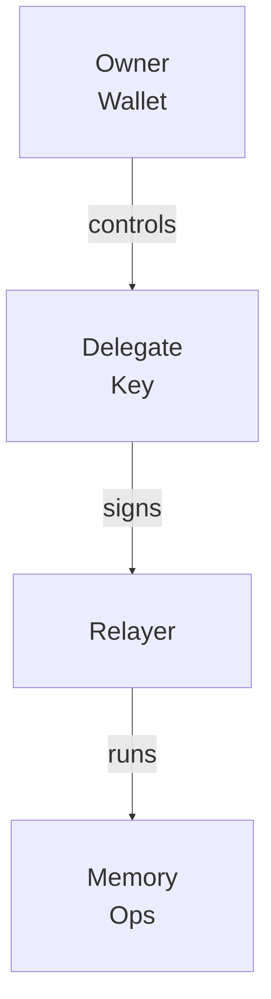

# Ownership and Access

MemWal separates who owns memory from what keys and services can use it.

## Responsibility Diagram

## Owner Wallet

- controls the MemWal account onchain

## Delegate Key

- signs SDK requests
- is verified onchain by the relayer
- maps back to the owner and account

## Relayer

- verifies requests
- applies namespace boundaries
- runs the current beta workflow

## Why It Matters

- the owner wallet stays separate from app credentials
- the delegate key is the day-to-day app credential
- the relayer is an execution surface, not the owner
