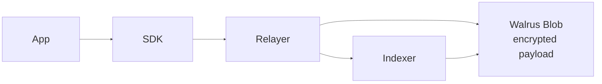
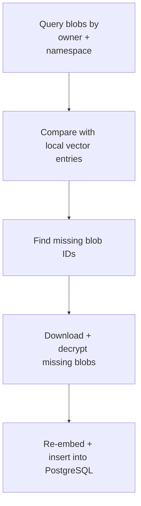

# Storage Structure

MemWal splits storage into a payload layer and an index layer.

## Storage Diagram

## Payload Layer

- encrypted payloads live on Walrus
- blob metadata carries `memwal_namespace`

## Index Layer

- PostgreSQL stores vectors
- entries are keyed by `owner + namespace + blob_id`
- this is what recall searches

## Logical Boundary

`owner + namespace` is the practical memory boundary in the current system.

## Restore Flow

Restore is incremental:

1. find blobs for one owner and namespace
2. compare with local indexed state
3. restore only missing entries

## Why This Split Exists

- Walrus is the durable payload layer
- PostgreSQL is the searchable local index
- the relayer can rebuild the index without rewriting the payload layer
