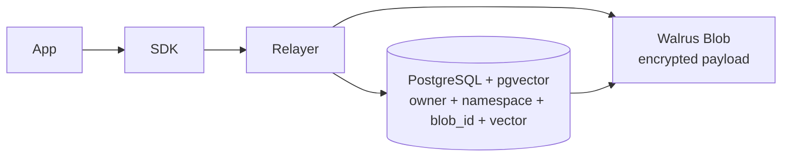
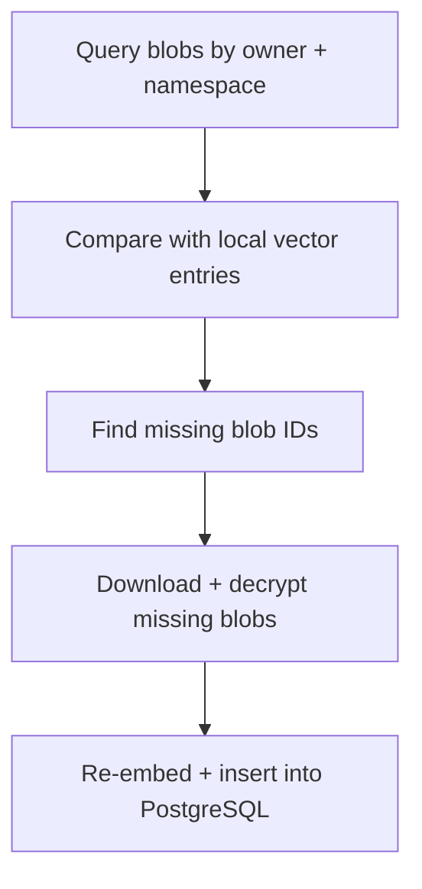

# Storage Structure

MemWal splits storage into a payload layer and an index layer.

## Storage Diagram

## Blob Layer

The memory payload itself is stored as an encrypted blob on Walrus.
This is the durable content layer of the system.

When the relayer uploads a blob, it also writes metadata that lets the system recover the blob
later by owner and namespace.

## Index Layer

The relayer stores vector metadata in PostgreSQL with pgvector.
Each stored memory is tied to:

- an owner
- a namespace
- a blob ID
- an embedding vector

This is what powers semantic search and namespace-aware recall.

## Why Namespace Matters To Storage

Namespace is not just a UI label. In the current codebase it is part of the storage contract:

- SDK requests include a namespace or fall back to `"default"`
- vector entries are stored and searched by owner plus namespace
- Walrus uploads store `memwal_namespace` metadata
- restore uses that metadata to discover blobs on-chain

## Restore From Chain

The new restore flow treats Walrus plus on-chain blob metadata as the discovery source of truth.
The relayer:

1. queries blobs for an owner and namespace
2. checks which blob IDs are already indexed locally
3. restores only the missing ones
4. decrypts, re-embeds, and inserts fresh vector entries

That means restore is incremental rather than destructive.

## Supporting Tables

The current stack also keeps supporting state such as:

- account ownership mappings
- delegate-key cache entries
- indexer cursor state

## Why This Split Exists

Keeping payloads and search metadata separate gives MemWal two important properties:

- large memory payloads do not need to live in the vector database
- search stays fast without giving up a user-owned blob layer
