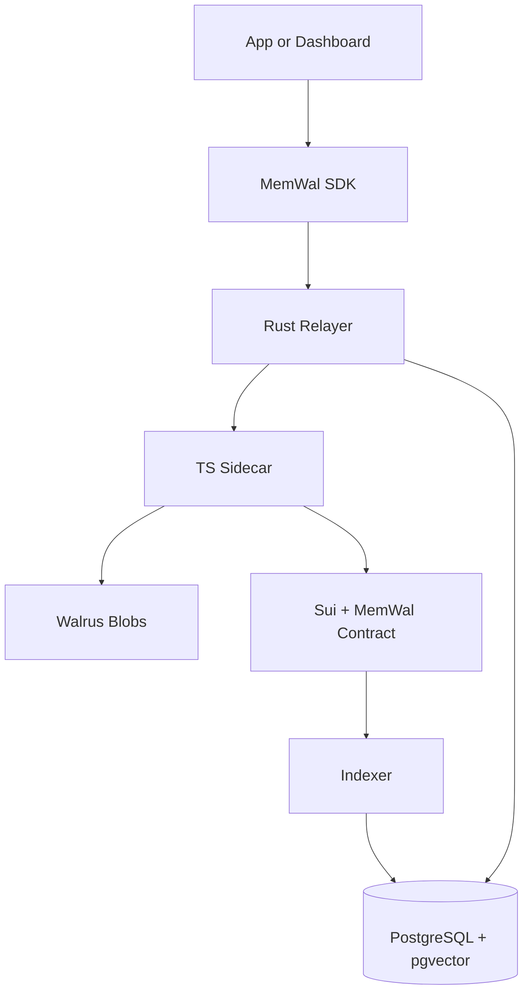
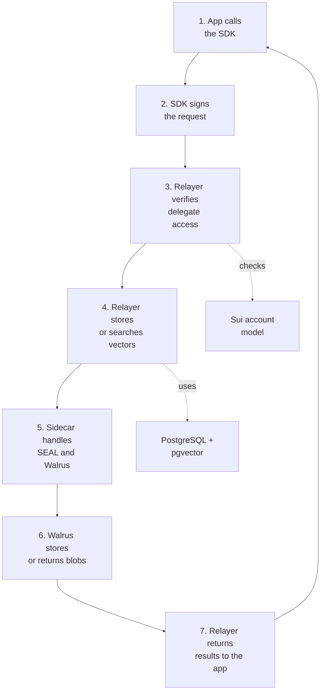

MemWal has eight main pieces:

1. app or dashboard
2. TypeScript SDK
3. Rust relayer
4. TypeScript sidecar
5. PostgreSQL + pgvector
6. Walrus
7. Sui contract
8. indexer

## System Diagram

## High-Level Flow

- app calls the SDK
- SDK signs the request
- relayer verifies delegate access onchain
- relayer stores and searches vectors by `owner + namespace`
- sidecar handles backend SEAL and Walrus work
- indexer keeps account data synced into PostgreSQL

## High-Level Flow Diagram

## Operating Modes

### Default SDK

`MemWal` lets the relayer handle embedding, encryption, retrieval, and restore.

### Manual Client Flow

`MemWalManual` lets the client handle embeddings and local SEAL operations. The relayer still
handles upload relay, registration, search, and restore.

## Restore

Restore is part of the system design, not just an ops note:

1. discover blobs by owner and namespace
2. compare with local vector state
3. restore only missing entries
