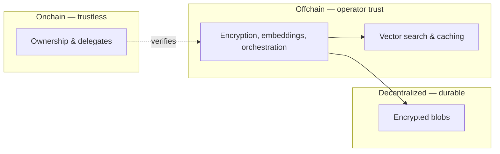

MemWal's security model is split between onchain enforcement and offchain operations. Understanding where trust lives helps you make informed decisions about your deployment.

## What's enforced onchain

These guarantees are cryptographic and tamper-proof — no one can bypass them:

- **Ownership** — only the owner's private key controls a MemWal account
- **Delegate authorization** — delegate keys are registered and verified onchain
- **Access control** — the smart contract determines who can act on an account

Even a compromised relayer cannot change who owns an account or forge delegate permissions.

## Where the relayer is trusted

The relayer abstracts Web3 complexity to give developers a simple REST API. This convenience comes with a trust trade-off — the relayer handles sensitive operations on behalf of users:

| What the relayer sees | Why |
|----------------------|-----|
| Plaintext memory content | It generates embeddings and encrypts before storing |
| Decrypted content on recall | It decrypts blobs to return results to the SDK |
| Vector embeddings | It stores and searches them for semantic recall |

This means the **relayer operator can see your data in transit**. This is similar to how a traditional backend API works — your server sees the data it processes.

## Mitigating relayer trust

You have options depending on your trust requirements:

- **Use the public relayer** — convenient for getting started and prototyping. You trust the MemWal team to operate it responsibly.
- **Self-host your own relayer** — you control the infrastructure, so the trust boundary is entirely yours. No third party sees your data.
- **Manual client flow** — use `MemWalManual` to handle encryption and embedding entirely on the client side. The relayer only sees encrypted payloads and vectors, never plaintext. This is recommended for Web3-native users who want full control over their data and are comfortable managing keys, signing, and SEAL operations directly.

## What lives where

- **Onchain (trustless)**: ownership, delegate keys, access control — enforced by Sui smart contracts
- **Offchain (operator trust)**: encryption, embedding, search — handled by the relayer and indexed database
- **Decentralized (durable)**: encrypted memory payloads — stored on Walrus, no single point of failure

## Current status

This describes the production beta model. The trust boundaries are designed to evolve — future versions may introduce client-side encryption by default or additional verifiability layers. Self-hosting remains the strongest option for teams that need full control today.
