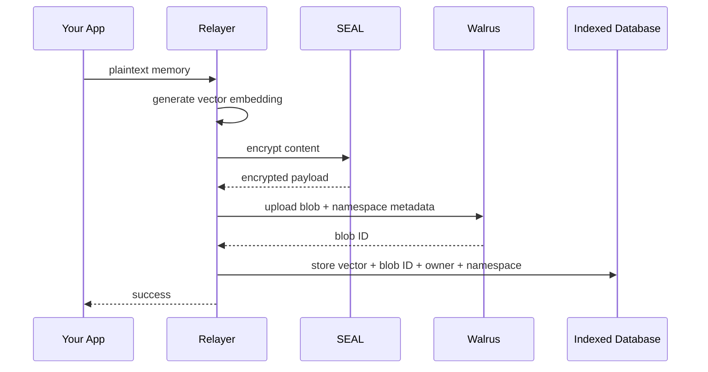
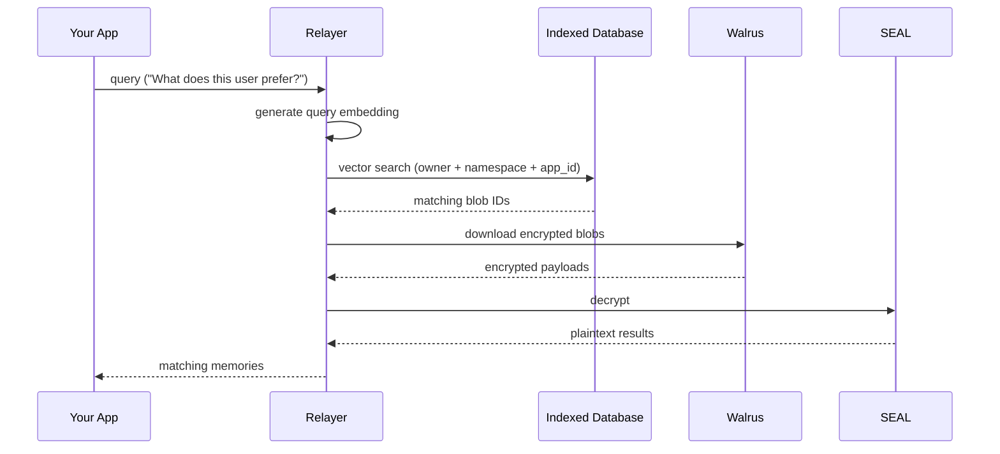

When you call `memwal.remember(...)`, your data goes through several steps before it's stored. Here's what happens.

## Storing a memory

<Steps>
  <Step>
    ### Embedding

    The relayer generates a vector embedding from your plaintext content. This embedding is a numerical representation of the meaning of your memory — it's what makes semantic search possible during recall.
  </Step>

  <Step>
    ### Encryption

    The plaintext content is encrypted using SEAL (Sui's encryption framework). The encrypted payload can only be decrypted by the owner or their authorized delegates.
  </Step>

  <Step>
    ### Blob upload

    The encrypted payload is uploaded to Walrus as a blob. Metadata including the namespace is attached so the blob can be discovered later during restore. Walrus stores it durably across a decentralized network — there's no single point of failure.
  </Step>

  <Step>
    ### Vector indexing

    The vector embedding, along with the blob ID, owner address, namespace, and app ID, is stored in the indexed database (PostgreSQL + pgvector). This is the searchable index that powers recall.
  </Step>
</Steps>

## Recalling a memory

1. Your query is converted into a vector embedding
2. The database is searched for the closest matching vectors, scoped to your memory space (`owner + namespace + app_id`)
3. Matching encrypted blobs are downloaded from Walrus
4. The blobs are decrypted via SEAL
5. Plaintext results are returned to your app

## Two layers, one system

| Layer | Stores | Purpose |
|-------|--------|---------|
| **Walrus** | Encrypted blobs | Durable, decentralized source of truth |
| **Indexed Database** | Vector embeddings + metadata | Fast semantic search for recall |

The indexed database is rebuildable — if it's ever lost, the [restore flow](/sdk/usage) can rediscover blobs from Walrus by owner and namespace, then re-embed and re-index them. Walrus is the permanent record.
