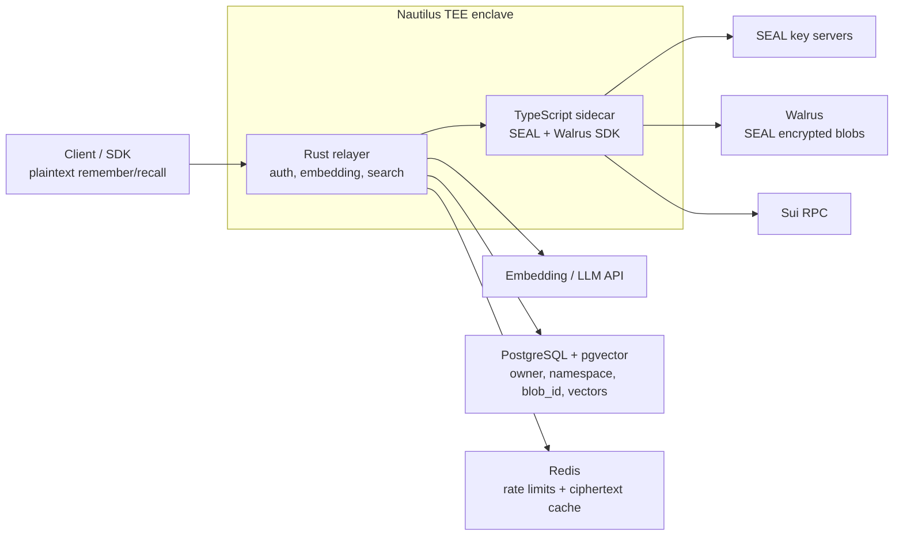

Run the MemWal relayer inside a Nautilus TEE when you want the default SDK flow
without giving the host operator direct access to plaintext memory payloads.
The goal is a tamper-resistant, hardware-attested deployment pattern: incoming
memories may still be plaintext at the relayer API boundary, but the relayer
processes them inside the TEE and sends SEAL-encrypted ciphertext out to Walrus.

This pattern keeps the existing relayer behavior: clients send plaintext to the
relayer, the relayer embeds and SEAL-encrypts it, encrypted blobs go to Walrus,
and PostgreSQL stores searchable vector metadata. The difference is that the
plaintext boundary moves from a normal host process into the enclave.

<Note>
This is a deployment pattern, not a separate relayer implementation. Validate
the manifest fields against the Nautilus version you deploy with, and use the
reference files in `services/server/deploy/nautilus` as the MemWal-specific
starting point.
</Note>

## Architecture Flow



Write path:

1. Client sends plaintext to the TEE relayer.
2. The relayer validates delegate-key auth and generates embeddings inside the enclave.
3. The sidecar SEAL-encrypts the plaintext inside the enclave.
4. The sidecar uploads only SEAL ciphertext to Walrus.
5. PostgreSQL stores `owner`, `namespace`, `blob_id`, blob size, and pgvector embeddings.

Recall path:

1. Client sends a plaintext query to the TEE relayer.
2. The relayer embeds the query and searches pgvector by `owner + namespace`.
3. The sidecar downloads matching ciphertext blobs from Walrus and SEAL-decrypts inside the enclave.
4. The relayer returns plaintext matches to the authenticated client.

## Reference Template

Template files:

| File | Purpose |
| --- | --- |
| `services/server/deploy/nautilus/README.md` | Operator checklist and file map |
| `services/server/deploy/nautilus/nautilus.toml.example` | Reference Nautilus manifest values for this service |
| `services/server/deploy/nautilus/runtime.env.example` | Runtime environment and secret mapping |

Copy the template before editing:

```bash
cp services/server/deploy/nautilus/nautilus.toml.example .nautilus.toml
cp services/server/deploy/nautilus/runtime.env.example .env.nautilus
```

Then replace placeholder values and wire `.env.nautilus` into your Nautilus or
CI secret mechanism. Do not bake secrets into the enclave image.

The relayer image can be built from the existing Dockerfile:

```bash
docker build \
  -f services/server/Dockerfile \
  -t memwal-relayer:nautilus \
  services/server
```

Use Nautilus to build and deploy the enclave image from that payload, then pin
the image measurement or attestation identity produced by the deployment. The
exact build/publish/run commands are Nautilus-version specific; the MemWal
requirements are the runtime variables and external endpoints listed below.

## Required Runtime Variables

These map directly to the existing self-hosted relayer config.

| Variable | Secret | Notes |
| --- | --- | --- |
| `DATABASE_URL` | yes | PostgreSQL connection string. `pgvector` must exist before boot |
| `REDIS_URL` | yes | Required for rate limits and Redis-backed caches |
| `MEMWAL_PACKAGE_ID` | no | MemWal package used for SEAL policy and blob metadata |
| `MEMWAL_REGISTRY_ID` | no | Account registry object ID |
| `SUI_NETWORK` | no | `mainnet` or `testnet` |
| `SUI_RPC_URL` | no | Sui fullnode endpoint reachable from the enclave |
| `SERVER_SUI_PRIVATE_KEY` | yes | Primary server key for SEAL decrypt authorization |
| `SERVER_SUI_PRIVATE_KEYS` | yes | Optional upload key pool; takes priority for Walrus uploads |
| `SEAL_SERVER_CONFIGS` or `SEAL_KEY_SERVERS` | maybe | SEAL key server config. Use `SEAL_SERVER_CONFIGS` for committee servers |
| `OPENAI_API_KEY` | yes | Embedding and LLM provider key |
| `OPENAI_API_BASE` | no | OpenAI-compatible base URL |
| `WALRUS_PUBLISHER_URL` | no | Walrus upload endpoint |
| `WALRUS_AGGREGATOR_URL` | no | Walrus download endpoint |
| `WALRUS_UPLOAD_RELAY_URL` | no | Upload relay override if required by the sidecar |
| `PORT` | no | Relayer HTTP port; default `8000` |
| `SIDECAR_URL` | no | Keep inside the enclave, usually `http://127.0.0.1:9000` |
| `LOG_FORMAT` | no | Set `json` for production logs |
| `ALLOWED_ORIGINS` | no | Browser CORS allowlist |

Keep `BENCHMARK_MODE` unset or `false` in TEE deployments. Benchmark mode stores
plaintext in PostgreSQL and bypasses SEAL/Walrus storage.

## External Endpoints

The enclave must be allowed to reach:

- PostgreSQL
- Redis
- Sui RPC
- Walrus publisher
- Walrus aggregator
- Walrus upload relay, if configured
- SEAL key servers or committee aggregators
- OpenAI-compatible embedding and LLM provider

If your Nautilus deployment requires an explicit outbound allowlist, mirror the
values from `runtime.env.example`. Prefer private networking for PostgreSQL and
Redis. Public AI, Sui, Walrus, and SEAL endpoints should still be egress-limited
to exact hosts.

## Secrets Handling

- Inject secrets at runtime through Nautilus/CI secrets, not through Docker build args.
- Keep `SERVER_SUI_PRIVATE_KEY`, `SERVER_SUI_PRIVATE_KEYS`, `DATABASE_URL`, `REDIS_URL`, `OPENAI_API_KEY`, `ENOKI_API_KEY`, and SEAL API keys out of git.
- Restrict host access to the runtime env file and any Nautilus secret store.
- Disable debug consoles and broad shell access on production enclave hosts.
- Rotate the server wallet keys if the host-side secret delivery path is exposed.

## Operational Verification

After deployment, check the public health endpoint:

```bash
curl "$TEE_RELAYER_URL/health"
```

Check metrics if your ingress exposes them to trusted operators:

```bash
curl "$TEE_RELAYER_URL/metrics"
```

Run a remember/recall smoke test through the TEE endpoint:

```bash
TEE_RELAYER_URL=https://tee-relayer.example.com \
MEMWAL_DELEGATE_KEY=... \
MEMWAL_ACCOUNT_ID=0x... \
pnpm dlx tsx <<'TS'
import { MemWal } from "@mysten-incubation/memwal";

const namespace = `tee-smoke-${Date.now()}`;
const memwal = MemWal.create({
  key: process.env.MEMWAL_DELEGATE_KEY!,
  accountId: process.env.MEMWAL_ACCOUNT_ID!,
  serverUrl: process.env.TEE_RELAYER_URL!,
  namespace,
});

await memwal.health();
const memory = `TEE smoke memory ${new Date().toISOString()}`;
const job = await memwal.remember(memory);
await memwal.waitForRememberJob(job.job_id);
const recall = await memwal.recall("What smoke memory was stored?", 5);

if (!recall.results.some((item) => item.text.includes("TEE smoke memory"))) {
  throw new Error("TEE remember/recall smoke test failed");
}

console.log({ namespace, job_id: job.job_id, recalled: recall.results.length });
TS
```

Inspect logs for:

- Rust relayer startup: sidecar readiness, PostgreSQL connection, Redis connection, Walrus endpoints, and `WalrusSealEngine`.
- TypeScript sidecar startup and `/health`.
- SEAL encrypt/decrypt errors.
- Walrus upload/download errors.
- Sui RPC or account-resolution errors.
- Rate-limit fallback logs, which indicate Redis trouble.

Logs should contain request IDs, route labels, lengths, and error classes. They
should not contain memory text, recall queries, prompts, delegate keys, or
database URLs.

## Failure Modes

| Symptom | Likely Cause | Check |
| --- | --- | --- |
| `/health` fails | Relayer process, sidecar boot, or ingress issue | Enclave process logs and sidecar readiness logs |
| `remember` stays running | Walrus upload, wallet signing, or job queue failure | `remember_jobs`, Apalis job rows, sidecar Walrus logs |
| `recall` returns empty after smoke write | Wrong namespace/account, pgvector issue, or upload job incomplete | Poll remember job, verify `owner + namespace`, check PostgreSQL migrations |
| SEAL decrypt fails | Wrong server wallet, delegate auth, SEAL config, or key server outage | `SEAL_SERVER_CONFIGS`, `SERVER_SUI_PRIVATE_KEY`, key server reachability |
| Embedding calls fail | AI endpoint blocked or invalid API key | `OPENAI_API_BASE`, `OPENAI_API_KEY`, outbound allowlist |
| TLS/cert errors to DB or Redis | Host rewrite/proxy broke hostname validation | Preserve original hostnames when proxying TLS endpoints |
| Plaintext appears in logs | Logging hygiene regression or debug middleware | Disable debug logs and scrub host/enclave log sinks |

## Security Considerations

TEE deployment reduces trust in the relayer host, but it does not make the
default SDK path end-to-end encrypted.

- Plaintext exists inside the enclave while handling `remember`, `recall`, `analyze`, `ask`, and `restore`.
- SEAL encryption begins inside the sidecar before Walrus upload. Walrus should only receive encrypted bytes.
- Treat the enclave as tamper-resistant, not magically tamper-proof. Attestation and measurement pinning are what let clients distinguish the intended TEE image from a normal host process.
- PostgreSQL stores vectors and metadata, not production plaintext. Do not enable `BENCHMARK_MODE`.
- External embedding and LLM providers may see plaintext unless you run those services inside the enclave or switch to a provider/trust model you accept.
- TLS should terminate inside the enclave or use an equivalent enclave-protected channel. If a host load balancer terminates TLS before forwarding to the enclave, the host can observe plaintext.
- The host still controls availability, traffic routing, and endpoint allowlists. TEE protects confidentiality and integrity of code/data inside the enclave, not uptime.
- Client-side attestation verification is required for the strongest story. Publish the expected Nautilus image measurement and require clients or gateway policy to verify it. Without verification, users still trust that the advertised endpoint is the enclave deployment.
- Keep structured logs, metrics labels, traces, and error bodies free of plaintext and secrets.

If you need the relayer to never see plaintext at all, use the manual SDK flow
instead of the default relayer-handled path.

## Read Next

- [Self-Hosting](/relayer/self-hosting)
- [Environment Variables](/reference/environment-variables)
- [Trust & Security Model](/fundamentals/architecture/data-flow-security-model)
- [Sui Nautilus docs](https://docs.sui.io/concepts/cryptography/nautilus)
