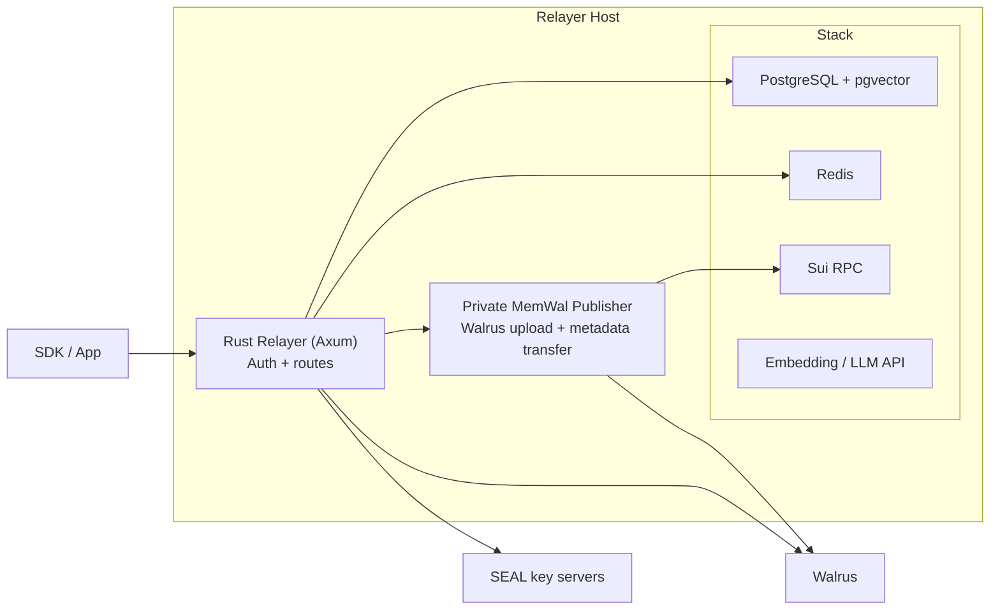

The relayer is the backend that turns SDK calls into memory operations. Using a delegate key signed by the client, it handles the critical workflows — embedding, encryption, storage, and search — on behalf of the user.

## What It Does

- **Authenticates requests** by verifying Ed25519 signatures against onchain delegate keys, then resolving the owner and account context
- **Generates embeddings** for text using an OpenAI-compatible API (default model: `text-embedding-3-small`, 1536 dimensions)
- **Encrypts and decrypts** data with native Rust SEAL support, bound to the owner's address and the Walrus Memory package ID
- **Uploads** encrypted blobs through the private MemWal publisher, which writes MemWal metadata and transfers Blob objects
- **Downloads** encrypted blobs from Walrus aggregators, with Redis ciphertext caching for hot reads
- **Stores and searches vectors** in PostgreSQL (pgvector), scoped by memory space (`owner + namespace`)
- **Orchestrates higher-level flows** like `analyze` (LLM-based fact extraction using `gpt-4o-mini`) and `ask` (memory-augmented Q&A)
- **Restores memory spaces** by discovering onchain MemWal blobs with native Sui RPC, decrypting, re-embedding, and re-indexing missing rows
- **Cleans up expired blobs** reactively — when Walrus returns 404 during recall, the relayer deletes the stale vector entries from the database

## Architecture

The relayer is a Rust service (Axum) that calls a private MemWal publisher for Walrus uploads and runs SEAL encrypt/decrypt natively.

No TypeScript sidecar is started by the relayer. The runtime services are the Rust relayer, PostgreSQL, Redis, and the self-hosted MemWal publisher.

## Key Pool

For the `analyze` endpoint (which stores multiple facts concurrently), the relayer supports a pool of Sui private keys (`SERVER_SUI_PRIVATE_KEYS`). Each concurrent Walrus upload uses a different key from the pool in round-robin order, bypassing per-signer serialization and enabling parallel uploads.

## Rate Limiting & Abuse Prevention

To prevent spam and ensure stability, the relayer implements a cost-weighted, multi-layered rate limiting system backed by a Redis sliding window.

### Cost-Weighted Points
Because endpoints have different computational and storage costs, they consume varying amounts of "points":
- **Heavy endpoints** (e.g., `/api/analyze` which does LLM extraction, embedding, encryption, and walrus upload) = **10 points**
- `/api/remember` (embed, encrypt, upload) = **5 points**
- `/api/restore` and `/api/remember/manual` = **3 points**
- `/api/ask` (recall + LLM answering) = **2 points**
- **Simple endpoints** (e.g., `/api/recall`) = **1 point**

### Types of Limits & Terminology
1. **Per Account (User)**: The "Account" or "User" refers to the Sui address of the actual user (identified by `auth.owner`). Account limits are:
   - **60 points / minute** (burst limit)
   - **500 points / hour** (sustained limit)
2. **Per Delegate Key (Instance)**: A "Delegate Key" is the throwaway ed25519 keypair running directly on the client instance (e.g., in a browser extension or a specific device). To mitigate the risk if a specific ephemeral delegate key is compromised, each key is independently limited to **30 points / minute**.
3. **Storage Quota**: Each account is limited to a total of **1 GB** of Walrus blob storage.

For self-hosted deployments, *all* of these limits and quotas can be fully configured via environment variables. See [Self-Hosting](/relayer/self-hosting) for configuration details.

## Single-Instance Design

Each relayer deployment is tied to a single Walrus Memory package ID (`MEMWAL_PACKAGE_ID`). The package ID is used for SEAL encryption key derivation and Walrus blob metadata. Queries in the vector database are scoped by `owner + namespace`, while the package ID provides cross-deployment isolation at the encryption layer.

<Note>
The current relayer only supports a single active package ID at a time. If you deploy a separate Walrus Memory contract, you need to run a separate relayer instance with its own database.
</Note>

## Trust Boundary

In the default SDK path, the relayer sees plaintext data because it handles encryption and embedding on your behalf. This is a deliberate trade-off for developer experience — it means Web2 developers don't need to manage cryptographic operations.

If you need to minimize this trust, you can [self-host](/relayer/self-hosting)
the relayer, run the [TEE deployment pattern](/relayer/nautilus-tee),
or use the [manual client flow](/sdk/usage/memwal-manual) to handle encryption
and embedding entirely on the client side. See
[Trust & Security Model](/fundamentals/architecture/data-flow-security-model)
for the full breakdown.
