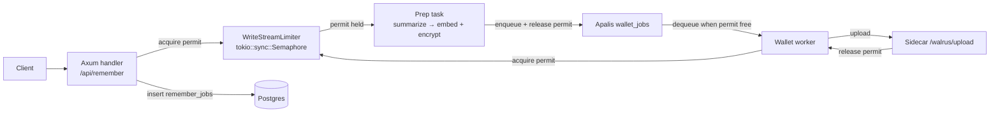

## Relayer write-stream redesign

| | |
|---|---|
| **Linear** | [WALM-116](https://linear.app/mysten-labs/issue/WALM-116/relayer-redesign-the-write-stream) |
| **Status** | Design approved, pending implementation plan |
| **Owner** | Max Mai |
| **Date** | 2026-06-15 |

## 1. Problem statement

The relayer write stream (`/api/remember`, `/api/remember/bulk`, `/api/remember/manual`, and the store path inside `/api/analyze`) can overload the TypeScript sidecar's Walrus upload path.

Observed symptoms:

- The sidecar `/health` endpoint reports `queuedWalrusUploads` climbing during bursts (past incidents reached ~120 queued uploads).
- Sidecar upload-slot acquisition times out after 120 s, returning `503` to the Rust worker.
- Apalis wallet workers retry quickly, burning their retry budget while the backlog drains.
- Congestion-requeue logic exists, but it is reactive: it only kicks in after the queue is already deep.

The root cause is that **concurrency control lives in the sidecar**, downstream of an unbounded enqueue. The Rust workers can produce upload jobs faster than the sidecar can consume them, so the queue grows.

## 2. Goal

Move the effective upload-slot budget into the Rust relayer so that:

1. The number of concurrently active write operations is bounded by a single, explicit configuration.
2. No embedding/encryption prep work starts unless an upload slot is available.
3. The sidecar `/walrus/upload` queue stays near zero under normal load.
4. Existing durability and retry semantics are preserved.

## 3. Non-Goals

- This design does **not** add distributed coordination across multiple relayer instances. It targets the current single-instance deployment.
- It does **not** change the authentication, encryption, embedding, or vector-search paths.
- It does **not** redesign the read stream (`/api/recall`, `/api/ask`).
- It does **not** remove the Apalis job queue; it only gates when work enters and leaves the queue.

## 4. Design overview

Add a `WriteStreamLimiter` to `AppState`. It is a thin wrapper around `tokio::sync::Semaphore` with `WRITE_STREAM_MAX_CONCURRENCY` permits.

Every memory item that results in a sidecar `/walrus/upload` call must acquire one permit before starting prep work, and must release it when the active work phase ends. The same permit pool is shared between prep tasks and upload workers, so the total number of active writes is always bounded.



The sidecar keeps its existing global and per-wallet upload semaphores as a safety net, configured with a slightly higher ceiling than the Rust limit.

## 5. Components

### 5.1 `WriteStreamLimiter`

New file: `services/server/src/services/write_stream.rs`

Responsibilities:

- Own the write-stream concurrency budget.
- Provide `acquire(timeout)` and `acquire_many(n, timeout)`.
- Return a permit guard that releases the permit on drop.
- Expose metrics for active/queued permit waiters.

```rust
pub struct WriteStreamLimiter {
    semaphore: Arc<Semaphore>,
    max_permits: usize,
}

pub enum AcquireError {
    Timeout,
    Closed,
    WouldExceedCapacity { requested: usize, max: usize },
}

impl WriteStreamLimiter {
    pub fn new(max_permits: usize) -> Self;
    pub async fn acquire(&self, timeout: Duration) -> Result<WriteStreamPermit, AcquireError>;
    pub async fn acquire_many(&self, n: usize, timeout: Duration) -> Result<WriteStreamPermit, AcquireError>;
}
```

The permit guard implements `Drop` to release the permit even if the task panics or the request is cancelled.

### 5.2 `AppState`

Add a field:

```rust
pub write_stream_limiter: Arc<WriteStreamLimiter>,
```

Initialize in `main.rs` after config load.

### 5.3 Route handlers

#### `/api/remember`

1. Validate request and insert `remember_jobs` row (`status='running'`).
2. Acquire one permit from `write_stream_limiter` with a bounded timeout.
3. If acquisition times out, return `429 Too Many Requests` immediately. The row remains `running`; the stale-job sweeper marks it failed after `STALE_REMEMBER_JOB_AFTER`.
4. Pass the permit to `spawn_prepare_remember_job`.
5. The prep task releases the permit after enqueueing the wallet job (or on failure).

#### `/api/remember/bulk`

1. Validate items and insert one `remember_jobs` row per item.
2. Attempt to acquire `items.len()` permits with a bounded timeout.
3. If the full set cannot be acquired, return `429`. No prep work starts.
4. Split the acquired batch permit into one guard per item. Each item holds its own permit through embedding/SEAL-encryption prep.
5. The item's permit is released when its prep completes (successfully, by handing off to the durable bulk queue) or fails. The wallet worker later reacquires a permit before the actual sidecar upload.

#### `/api/remember/manual`

1. Validate request.
2. Acquire one permit.
3. Call `engine.store_blob(...)` synchronously (this calls the sidecar `/walrus/upload` directly).
4. Release permit on completion.

#### `/api/analyze`

- **Production path**: after fact extraction, attempt to acquire `facts.len()` permits with a bounded timeout. If acquisition fails, return `429`. Then split the batch permit into one guard per fact. Each fact holds its permit through embedding/SEAL-encryption prep and releases it when that fact's prep completes (or fails). The wallet worker later reacquires a permit before the actual sidecar upload.
- **Benchmark mode (`BENCHMARK_MODE=true`)**: each fact calls `engine.store_blob(...)` synchronously. Acquire one permit per fact, hold it for the duration of the synchronous store, and release on completion.

### 5.4 Wallet worker

`execute_wallet_job` acquires one permit before calling `upload_blob`, and releases it after the sidecar call completes (success or terminal failure).

If permit acquisition times out, the job is left in the Apalis queue and is retried. Because permits are only held by active work, retries naturally back off until slots free up.

### 5.5 Sidecar safety net

The sidecar keeps:

- `WALRUS_UPLOAD_MAX_CONCURRENCY` (default = number of keys, same as today)
- `WALRUS_UPLOAD_PER_WALLET_CONCURRENCY` (default `1`)
- `WALRUS_UPLOAD_ACQUIRE_TIMEOUT_MS` (default `120_000`)

Recommended production tuning:

```text
WRITE_STREAM_MAX_CONCURRENCY = 8
WALRUS_UPLOAD_MAX_CONCURRENCY = 12
WALRUS_UPLOAD_PER_WALLET_CONCURRENCY = 1
```

The sidecar limit should be higher than the Rust limit so it only fires if Rust leaks a slot or if another caller (MCP, direct) bypasses Rust.

## 6. Data flow

### 6.1 Single `/api/remember`

```
Client POST /api/remember
  → Axum handler validates body
  → INSERT remember_jobs (status='running')
  → write_stream_limiter.acquire(timeout)
       └─ timeout → 429
  → spawn_prepare_remember_job(permit)
       ├─ summarize-for-embedding (if needed)
       ├─ embed(text_summary) || SEAL encrypt(original)
       ├─ check storage quota
       ├─ enqueue WalletOperation::UploadAndTransfer
       └─ release permit
  → Apalis worker dequeues job
       ├─ write_stream_limiter.acquire(timeout)
       ├─ POST /walrus/upload
       ├─ update remember_jobs (done / failed)
       └─ release permit
  ← Client polls /api/remember/:job_id
```

### 6.2 `/api/remember/bulk`

```
Client POST /api/remember/bulk with N items
  → validate all items
  → INSERT N remember_jobs rows
  → write_stream_limiter.acquire_many(N, timeout)
       └─ timeout → 429 (no prep starts)
  → spawn N prep tasks, each with one permit
  ← return 202 + job_ids
```

## 7. Error handling

| Scenario | Behavior |
|---|---|
| Slot acquisition timeout in handler | Return `429 Too Many Requests`. The `remember_jobs` row remains `running`; stale-job sweeper handles abandoned rows. |
| Request needs more permits than configured ceiling (`WouldExceedCapacity`) | Return `429 Too Many Requests` immediately. The request is never queued and no prep work starts. |
| Prep failure (embed/encrypt/quota) | Release slot immediately, mark `remember_jobs` as `failed`. |
| Wallet job transient failure | Apalis retries. Each retry attempt reacquires a slot before calling the sidecar. |
| Wallet job permanent failure / object locked | Mark `remember_jobs` as `failed`; release slot. |
| Sidecar safety-net timeout | Treated as transient; worker releases slot and Apalis retries. |
| Server crash while slot held | In-memory permit is lost. Surviving queued Apalis jobs reacquire fresh slots on restart. Recovery is bounded by the number of in-flight jobs. |
| Panic in prep or worker task | Permit guard drops on panic, releasing the slot. |

## 8. Configuration

New environment variables:

| Variable | Default | Min | Max | Description |
|---|---|---|---|---|
| `WRITE_STREAM_MAX_CONCURRENCY` | `8` | `1` | `100` | Maximum concurrent active writes (prep + upload). |
| `WRITE_STREAM_ACQUIRE_TIMEOUT_MS` | `5_000` | `100` | `60_000` | How long a handler waits for a permit before returning `429`. |

Existing variables that remain relevant:

| Variable | Notes |
|---|---|
| `WALLET_JOB_CONCURRENCY` | Number of Apalis workers. Should be ≥ `WRITE_STREAM_MAX_CONCURRENCY`. |
| `WALRUS_UPLOAD_MAX_CONCURRENCY` | Sidecar safety net; should be > `WRITE_STREAM_MAX_CONCURRENCY`. |
| `WALRUS_UPLOAD_PER_WALLET_CONCURRENCY` | Keep at `1` to avoid Sui object-lock collisions. |
| `WALRUS_UPLOAD_ACQUIRE_TIMEOUT_MS` | Sidecar safety-net timeout. Can be reduced once Rust owns the budget. |

## 9. Observability

Add Prometheus metrics:

| Metric | Type | Labels | Description |
|---|---|---|---|
| `memwal_write_stream_permits_total` | Gauge | none | Total permits configured. |
| `memwal_write_stream_permits_available` | Gauge | none | Currently available permits. |
| `memwal_write_stream_waiters_total` | Gauge | none | Tasks waiting for a permit. |
| `memwal_write_stream_acquired_total` | Counter | `result="success\|timeout\|failure"` | Permit acquisition outcomes. |
| `memwal_write_stream_rejected_total` | Counter | `route` | Requests rejected with `429` due to slot exhaustion. |

Logs:

- `write_stream: acquired permit` / `write_stream: permit timeout` at `info` level.
- Include `route`, `owner_prefix`, `job_id`, and `wait_ms` where applicable.

## 10. Testing

### 10.1 Unit tests

- `WriteStreamLimiter::new(0)` falls back to minimum.
- `acquire` returns a permit when available.
- `acquire` times out correctly.
- `acquire_many` returns all permits or none.
- Permit guard releases on drop and on panic.

### 10.2 Integration tests

- **Saturation test**: `WRITE_STREAM_MAX_CONCURRENCY=2`, slow mock sidecar, 10 concurrent `/api/remember` requests. Assert at most 2 concurrent `/walrus/upload` calls and the rest receive `429`.
- **Bulk atomicity test**: `WRITE_STREAM_MAX_CONCURRENCY=3`, `/api/remember/bulk` with 5 items. Assert `429` and zero embeddings/encrypts.
- **Recovery test**: kill a prep task mid-flight, assert permit is released and other requests can proceed.

### 10.3 Regression tests

- `cargo test` passes.
- Sidecar TS test suite passes.
- Existing end-to-end tests for remember/recall pass.

### 10.4 Load validation

Run a targeted benchmark that previously produced `queuedWalrusUploads > 20`. Verify the metric stays near zero and p95 `/api/remember` latency is stable.

## 11. Risks and mitigations

| Risk | Mitigation |
|---|---|
| Lower throughput because prep and upload share the same pool. | Tune `WRITE_STREAM_MAX_CONCURRENCY` and `WALLET_JOB_CONCURRENCY`; if needed, a future iteration can split prep and upload slots. |
| Bulk requests starve single-item requests. | Bulk must acquire all permits upfront; clients should expect `429` on large bursts. Consider lowering `MAX_BULK_ITEMS` if needed. |
| Slot leak due to a bug. | Permit guard uses `Drop`; add metrics for available permits to detect leaks; sidecar safety net catches overflow. |
| Retry storm after a crash. | Bounded by in-flight jobs at crash time; Apalis retry budget still applies. |

## 12. Future work

- **Distributed limiter**: If the relayer scales horizontally, replace the in-process semaphore with a Redis-backed semaphore so instances share the budget.
- **Two-tier slots**: If throughput measurements show prep is the bottleneck, split into prep-slot and upload-slot pools.
- **Admission by account**: Consider per-account write slots to prevent one noisy neighbor from consuming the global budget.

## 13. Open questions

None. Design approved for implementation planning.
