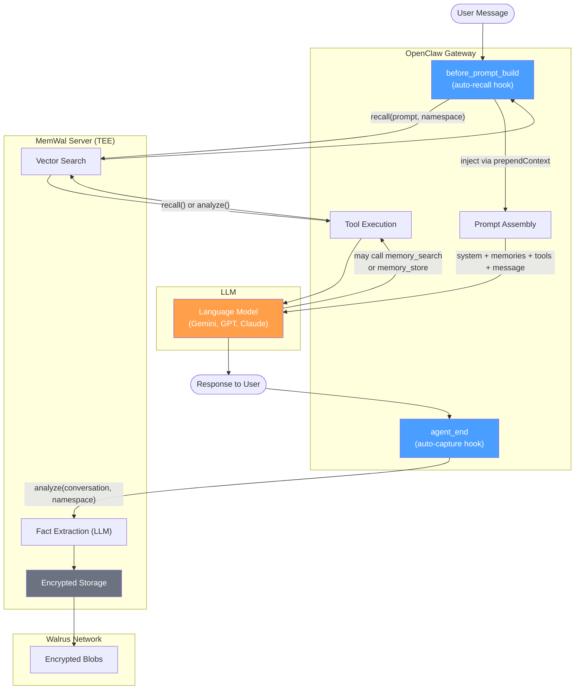
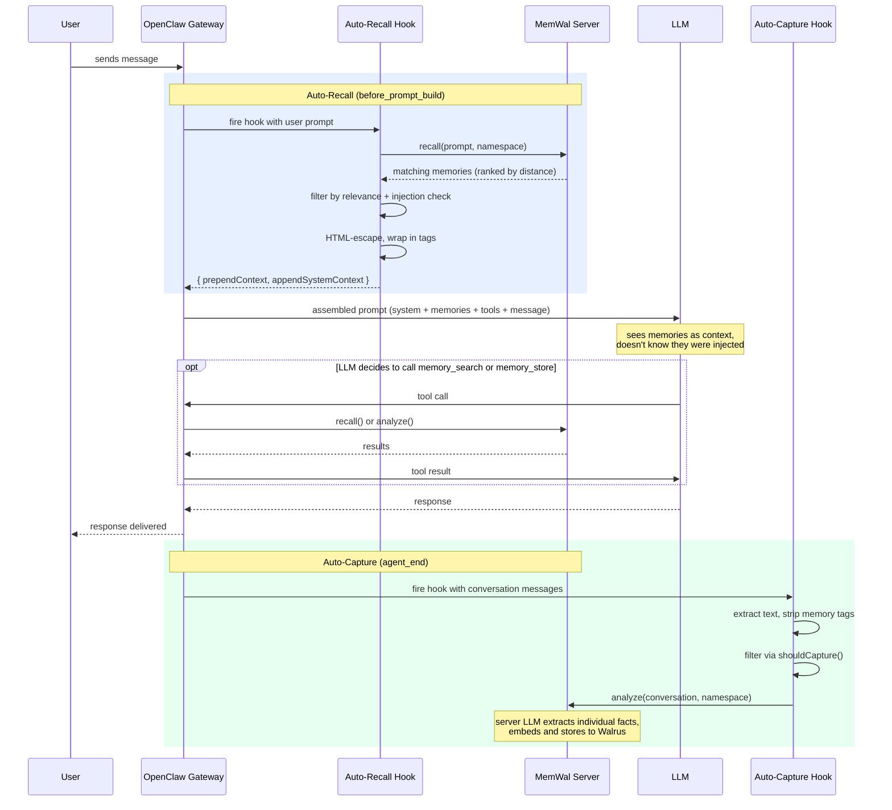

# @cmdoss/memory-memwal

OpenClaw memory plugin — encrypted, decentralized long-term memory via MemWal + Walrus.

Replaces OpenClaw's default `memory-core` plugin. Memories are encrypted with SEAL, stored on Walrus, and tied to a Sui blockchain identity (Ed25519 key).

## Architecture

The plugin sits between OpenClaw's gateway and the MemWal server. It operates at two layers — hooks run in the Node.js gateway process (invisible to the LLM), while tools are function definitions the LLM can call.



## How it works

The plugin operates through two layers:

- **Hooks** (automatic, invisible) — run in the Node.js process on lifecycle events. The LLM never sees them, doesn't trigger them, and can't prevent them.
- **Tools** (LLM-controlled, opt-in) — function definitions sent to the LLM. The LLM decides when to call them based on conversation context.

Hooks are the primary mechanism — they work without any configuration beyond the plugin itself. Tools are secondary and require explicit `tools.allow` in the agent profile.

### Message flow

Every conversation turn follows this sequence:



**Auto-recall** searches MemWal for memories relevant to the user's prompt and injects them into the LLM's context via `prependContext`. It also injects a namespace instruction via `appendSystemContext` so that if the LLM calls tools, they scope to the correct agent's memory space. This instruction is injected in all code paths — even when no memories are found or recall fails — so tools always have the right namespace.

**Auto-capture** runs after the response is sent. It extracts recent messages, strips any `<memwal-memories>` tags (to prevent feedback loops where recalled memories get re-stored), filters through `shouldCapture()` to skip trivial content, then sends the conversation to MemWal's `analyze()` endpoint. The server-side LLM extracts individual facts and stores them as encrypted blobs on Walrus.

## Prerequisites

- [OpenClaw](https://openclaw.ai) `>=2026.3.11`
- [bun](https://bun.sh) (package manager)
- A MemWal account with Ed25519 key pair
- A running MemWal server

## Installation (local development)

This plugin is not yet published to npm. To install from the monorepo:

### 1. Install dependencies

```bash
cd packages/openclaw-memory-memwal
bun install
```

### 2. Link into OpenClaw's extensions directory

OpenClaw discovers plugins from `~/.openclaw/extensions/`. Symlink this package:

```bash
mkdir -p ~/.openclaw/extensions
ln -s "$(pwd)" ~/.openclaw/extensions/memory-memwal
```

### 3. Set environment variables

```bash
# Add to your shell profile (.zshrc, .bashrc, etc.)
export MEMWAL_PRIVATE_KEY="your-64-char-hex-key"
```

You can also set `MEMWAL_ACCOUNT_ID` and `MEMWAL_SERVER_URL` if you prefer env vars over hardcoding in config.

### 4. Configure OpenClaw

Add to your `openclaw.json` (usually at `~/.openclaw/openclaw.json`):

```json
{
  "plugins": {
    "slots": {
      "memory": "memory-memwal"
    },
    "entries": {
      "memory-memwal": {
        "enabled": true,
        "config": {
          "privateKey": "${MEMWAL_PRIVATE_KEY}",
          "accountId": "0x3247e3da...",
          "serverUrl": "https://staging-api-dev.up.railway.app"
        }
      }
    }
  }
}
```

### 5. Restart OpenClaw

```bash
openclaw gateway stop && openclaw gateway
```

You should see in the logs:

```
memory-memwal: registered (server: https://..., key: e21d...ed9b, namespace: default)
memory-memwal: connected (status: ok, version: ...)
```

## Verifying it works

### Check server connectivity

```bash
openclaw memwal stats
```

Expected output:

```
Server:     https://staging-api-dev.up.railway.app
Status:     ok
Version:    2.0.0
Key:        e21d...ed9b
Account:    0x3247e3da...
Namespace:  default
Auto-recall:  true
Auto-capture: true
```

### Test auto-recall and auto-capture

1. Start a conversation and share a fact:

   ```
   You: I prefer TypeScript over JavaScript for backend work
   Bot: (responds normally)
   ```

   Check logs — you should see:
   ```
   memory-memwal: auto-captured 1 facts (agent: main, namespace: default)
   ```

2. In a new conversation, ask about it:

   ```
   You: What programming languages do I like?
   ```

   Check logs — you should see:
   ```
   memory-memwal: auto-recall injected 1 memories (agent: main, namespace: default)
   ```

### Test CLI search

```bash
openclaw memwal search "programming"
```

Expected output (JSON):

```json
[
  {
    "text": "User prefers TypeScript over JavaScript for backend work",
    "blob_id": "...",
    "relevance": 0.87
  }
]
```

### Test agent tools (optional)

To enable LLM-callable tools, add to your agent profile:

```json
{
  "tools": {
    "allow": ["memory_search", "memory_store"]
  }
}
```

Then in conversation:

```
You: What do you remember about my preferences?
```

The LLM should call `memory_search` behind the scenes and incorporate results into its response.

## Configuration reference

| Option | Type | Default | Description |
|--------|------|---------|-------------|
| `privateKey` | string | **required** | Ed25519 private key (hex). Supports `${ENV_VAR}`. |
| `accountId` | string | **required** | MemWalAccount object ID on Sui (`0x...`) |
| `serverUrl` | string | **required** | MemWal server URL |
| `defaultNamespace` | string | `"default"` | Memory scope for the main agent |
| `autoRecall` | boolean | `true` | Inject relevant memories before each turn |
| `autoCapture` | boolean | `true` | Extract and store facts after each turn |
| `maxRecallResults` | number | `5` | Max memories per auto-recall |
| `minRelevance` | number | `0.3` | Min relevance threshold (0-1) for auto-recall |
| `captureMaxMessages` | number | `10` | Recent messages window for auto-capture |

## Multi-agent isolation

Each OpenClaw agent gets its own namespace derived from `ctx.sessionKey`. The main agent uses `defaultNamespace`, other agents use their name as the namespace (e.g. agent "researcher" → namespace "researcher").

Memories are isolated per-namespace at the server level — one agent cannot see another agent's memories.

```bash
# Search a specific agent's memories
openclaw memwal search "research notes" --agent researcher

# Check stats for a specific agent
openclaw memwal stats --agent researcher
```

## CLI

```bash
# Search memories
openclaw memwal search "programming preferences"
openclaw memwal search "tech stack" --limit 10
openclaw memwal search "research notes" --agent researcher

# Show status
openclaw memwal stats
openclaw memwal stats --agent researcher
```

## Project structure

```
src/
  index.ts          Entry point — creates client, registers components
  config.ts         Config parsing, namespace resolution
  capture.ts        Capture filtering, injection detection
  format.ts         Memory formatting, tag stripping, prompt safety
  types.ts          Shared types
  hooks/
    index.ts        Barrel — registers hooks based on config
    recall.ts       before_prompt_build — auto-recall
    capture.ts      agent_end — auto-capture
  tools/
    index.ts        Barrel — registers all tools
    search.ts       memory_search tool
    store.ts        memory_store tool
  cli/
    index.ts        Barrel — registers CLI commands
    search.ts       openclaw memwal search
    stats.ts        openclaw memwal stats
```

## Security

- Memories are HTML-escaped before prompt injection to prevent stored text from altering prompt structure
- Prompt injection patterns are detected and filtered on both read (recall, search) and write (store, capture) paths
- Injected memory tags are stripped during capture to prevent feedback loops
- Private keys support `${ENV_VAR}` syntax — never hardcode keys in config files

## Troubleshooting

### Plugin not loading

- Check that the symlink exists: `ls -la ~/.openclaw/extensions/memory-memwal`
- Check that `openclaw.plugin.json` is in the package root
- Restart the gateway after any config changes

### Health check failed

- Verify the server URL is reachable: `curl https://your-server/health`
- Check that `MEMWAL_PRIVATE_KEY` env var is set: `echo $MEMWAL_PRIVATE_KEY`
- Verify the account ID matches your key

### Auto-recall not injecting memories

- Check `autoRecall` is `true` in config (default)
- Check that memories exist: `openclaw memwal search "your query"`
- Lower `minRelevance` if memories exist but aren't being injected (default: 0.3)

### Auto-capture not storing

- Check `autoCapture` is `true` in config (default)
- Capture skips trivial messages (< 30 chars, filler like "ok", "thanks")
- Check logs for `auto-capture skipped` or `auto-capture failed` messages

### Tools not visible to the LLM

- Plugin tools require explicit allowlisting via `tools.allow`
- Add `["memory_search", "memory_store"]` to your agent profile
- Hooks work without this — tools are an opt-in power-user feature

## License

Apache-2.0
