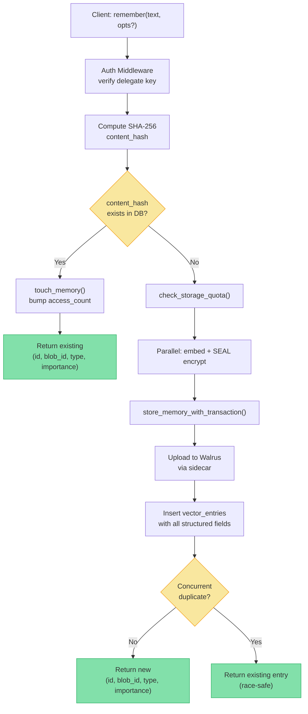
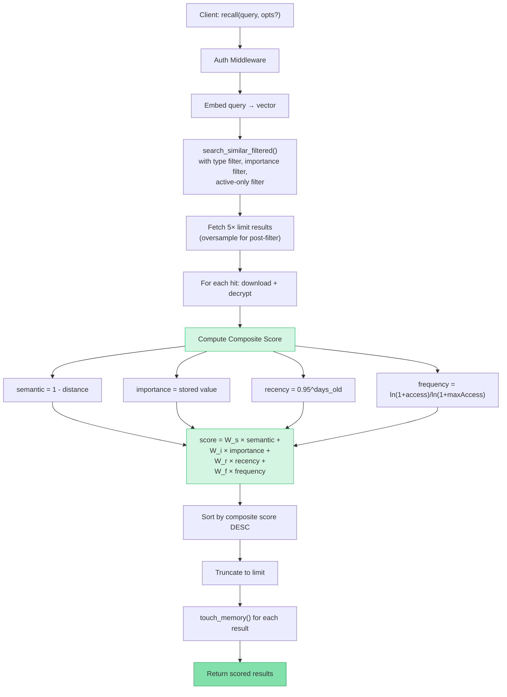
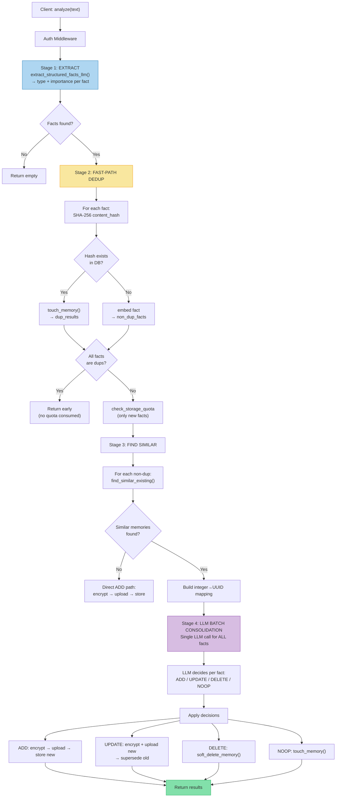
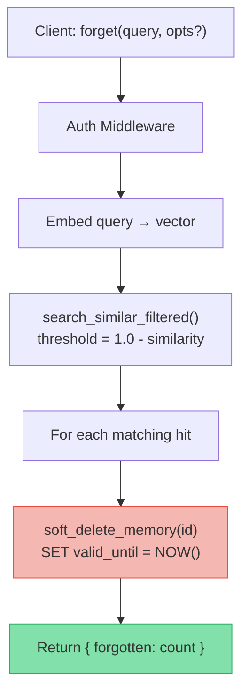
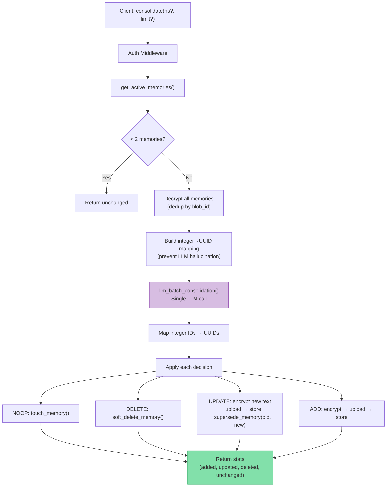
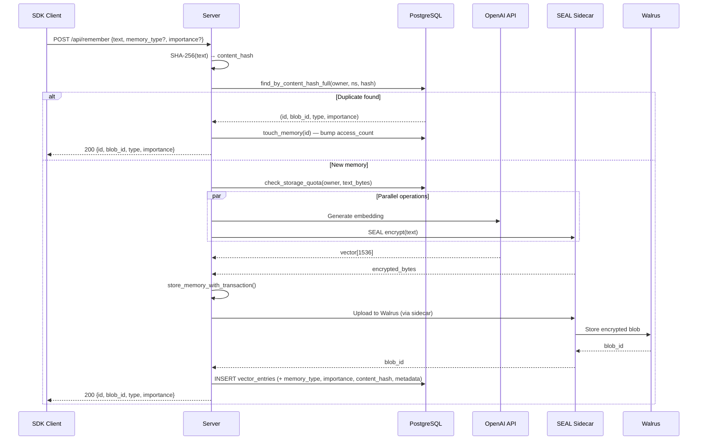
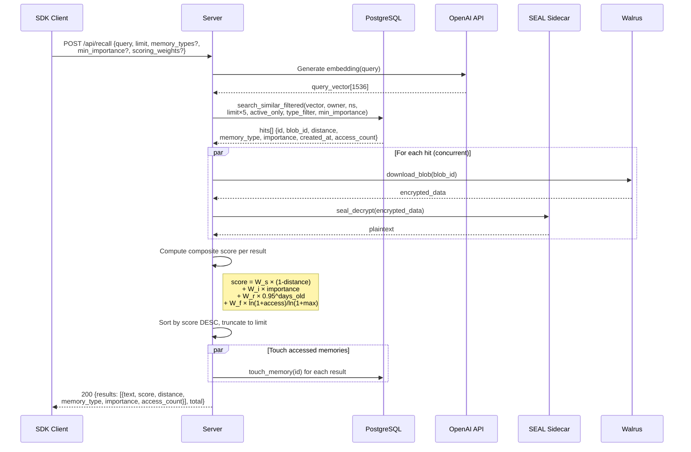
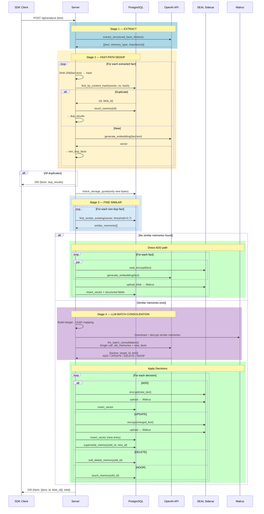
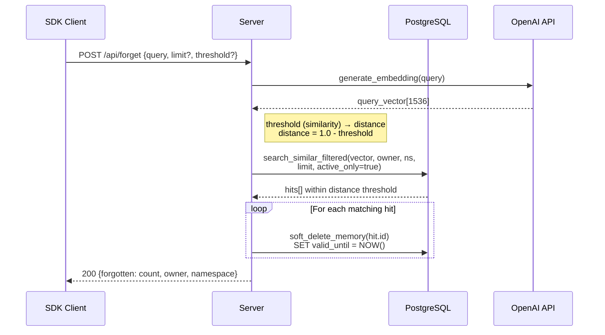
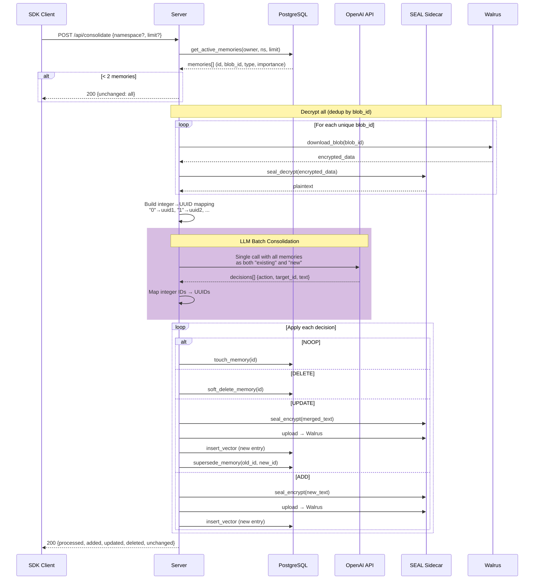

# MemWal Memory Architecture

## 1. Overview

MemWal is a **structured memory layer** for AI agents with privacy-first design. Memories are typed, scored, temporally-aware, and encrypted end-to-end via SEAL + Walrus.

### Core Components

| Component | Role |
|---|---|
| **SDK (TypeScript)** | Client library — `remember()`, `recall()`, `forget()`, `stats()`, `consolidate()` |
| **Server (Rust/Axum)** | API server — auth, embedding, encryption orchestration, vector search |
| **PostgreSQL + pgvector** | Vector DB — stores embeddings, metadata, structured fields |
| **SEAL Sidecar** | Encryption/decryption proxy (threshold encryption) |
| **Walrus** | Decentralized blob storage for encrypted memory payloads |
| **OpenAI API** | Embedding generation + LLM fact extraction/consolidation |

### Memory Schema

| Field | Type | Description |
|---|---|---|
| `id` | `UUID` | Unique memory identifier |
| `owner` | `TEXT` | Sui wallet address (derived from delegate key) |
| `namespace` | `TEXT` | Memory isolation scope (default: `"default"`) |
| `blob_id` | `TEXT` | Walrus blob reference for encrypted payload |
| `embedding` | `VECTOR(1536)` | Semantic embedding vector |
| `memory_type` | `TEXT` | `fact` · `preference` · `episodic` · `procedural` · `biographical` |
| `importance` | `FLOAT` | 0.0 (trivial) → 1.0 (critical) |
| `source` | `TEXT` | `user` · `extracted` · `system` |
| `access_count` | `INTEGER` | Times this memory has been retrieved |
| `last_accessed_at` | `TIMESTAMPTZ` | Last retrieval timestamp |
| `content_hash` | `TEXT` | SHA-256 of plaintext (fast dedup without decrypting) |
| `metadata` | `JSONB` | Tags, context, arbitrary key-values |
| `superseded_by` | `TEXT` | Points to the newer memory that replaced this one |
| `valid_from` | `TIMESTAMPTZ` | When this fact became true |
| `valid_until` | `TIMESTAMPTZ` | When invalidated (NULL = still active) |

---

## 2. API Surface

| Endpoint | Method | Description |
|---|---|---|
| `/api/remember` | POST | Store a memory (auto: embed → encrypt → upload → store) |
| `/api/recall` | POST | Semantic search with composite scoring |
| `/api/analyze` | POST | Extract facts from text → dedup → consolidate → store |
| `/api/forget` | POST | Soft-delete memories by semantic query |
| `/api/consolidate` | POST | LLM-driven merge/dedup/cleanup of existing memories |
| `/api/stats` | POST | Memory statistics (counts, types, importance, storage) |
| `/api/remember/manual` | POST | Store pre-encrypted memory (SDK handles encryption) |
| `/api/recall/manual` | POST | Raw vector search (SDK handles decryption) |
| `/api/ask` | POST | RAG: recall relevant memories → LLM answer |
| `/api/restore` | POST | Restore memories from Walrus backup |
| `/health` | GET | Health check |

---

## 3. Flow Diagrams

### 3.1 Remember



### 3.2 Recall (with Composite Scoring)



### 3.3 Analyze (3-Stage Pipeline)



### 3.4 Forget



### 3.5 Consolidate



---

## 4. Sequence Diagrams

### 4.1 Remember



### 4.2 Recall



### 4.3 Analyze (3-Stage Pipeline)



### 4.4 Forget



### 4.5 Consolidate



---

## 5. Composite Scoring Formula

```
score = W_semantic × (1 - cosine_distance)
      + W_importance × importance
      + W_recency × 0.95^(days_old)
      + W_frequency × ln(1 + access_count) / ln(1 + max_access)
```

| Weight | Default | Meaning |
|---|---|---|
| `W_semantic` | 0.5 | Semantic similarity (primary signal) |
| `W_importance` | 0.2 | Assigned importance score |
| `W_recency` | 0.2 | Newer = higher score (5% decay per day) |
| `W_frequency` | 0.1 | Frequently accessed = more relevant |

---

## 6. SDK Usage

```typescript
// ── Remember ──
await memwal.remember("allergic to peanuts", "health")

await memwal.remember("User prefers dark mode", {
  memoryType: 'preference',
  importance: 0.8,
  tags: ['ui', 'settings'],
})

// ── Recall ──
await memwal.recall("food allergies", 10)

await memwal.recall("food allergies", {
  limit: 5,
  memoryTypes: ['fact', 'biographical'],
  minImportance: 0.3,
  scoringWeights: { semantic: 0.6, importance: 0.3, recency: 0.1 },
})

// ── Forget ──
await memwal.forget("peanut allergy")

// ── Stats ──
await memwal.stats()
// → { total, by_type, avg_importance, storage_bytes, ... }

// ── Consolidate ──
await memwal.consolidate()
// → merge duplicates, resolve conflicts across all memories
```

---

## 7. AI Middleware

The `withMemWal()` middleware automatically injects relevant memories into LLM prompts, grouped by type:

```
[Memory Context] The following are known facts about this user:

📌 Facts:
  ⚡ User is allergic to peanuts (score: 0.92)
  💡 User works at Google (score: 0.78)

⭐ Preferences:
  ⚡ User prefers dark mode (score: 0.85)

👤 Personal Info:
  💡 User's name is Duc, lives in Hanoi (score: 0.71)
```

- Memories are ranked by composite score (not just cosine distance)
- Importance icons: ⚡ (≥ 0.8), 💡 (≥ 0.5)
- Grouped by memory type for better LLM comprehension

---

## 8. Key Design Decisions

| Decision | Rationale |
|---|---|
| **Content hash dedup** | SHA-256 check before any LLM/network call — eliminates exact duplicates at zero cost |
| **Batch LLM consolidation** | 1 LLM call for ALL facts instead of per-fact — cost-efficient, cross-fact awareness |
| **Integer→UUID mapping** | LLM sees `"0","1","2"` instead of UUIDs — prevents hallucinated IDs |
| **Soft-delete** | `valid_until = NOW()` instead of DELETE — full audit trail, recoverable |
| **Supersede chain** | Old memory points to new via `superseded_by` — preserves history |
| **Deferred quota check** | Quota checked AFTER dedup — duplicates don't consume new storage |
| **5× oversampling** | Recall fetches 5× the requested limit, then post-filters by composite score |
| **Temporal validity** | `valid_from` / `valid_until` window — supports time-scoped queries |
