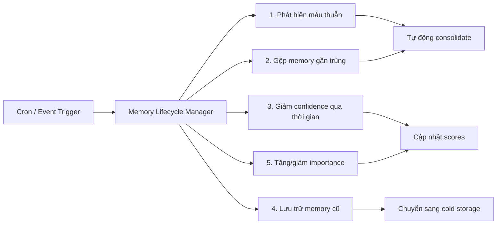
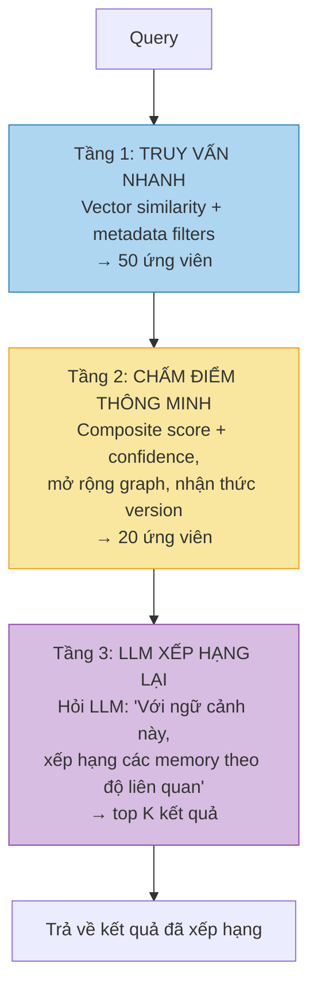

# MemWal: Đề xuất nâng cấp lên Memory Orchestration Layer

## Bối cảnh

MemWal hiện tại đã có **tầng lưu trữ** khá tốt: memory có type, importance, temporal validity, composite scoring, batch consolidation. Nhưng để trở thành **tầng điều phối memory** (orchestration layer) thực sự, còn nhiều thiếu sót về vòng đời memory, xử lý memory lỗi thời, versioning, và truy vấn thông minh.

Tài liệu này đề xuất các tính năng cụ thể để lấp khoảng trống đó.

---

## Hiện trạng vs. Mục tiêu

| Khả năng | Hiện tại | Mục tiêu |
|---|---|---|
| Lưu trữ | ✅ Mã hóa trên Walrus, đánh vector index | Giữ nguyên |
| Chống trùng | ✅ SHA-256 content hash | Giữ nguyên |
| Nhận diện thời gian | ⚠️ Có `valid_from`/`valid_until`, recency trong scoring | Chuỗi version theo thời gian, query được lịch sử |
| Xử lý memory lỗi thời | ⚠️ Recency decay đơn giản (0.95^ngày) | Decay chủ động + giảm độ tin cậy tự động |
| Hợp nhất memory | ✅ Consolidation theo yêu cầu (gọi thủ công) | + Tự động consolidation chạy nền |
| Quan hệ giữa các memory | ❌ Chưa có | Knowledge graph nhẹ |
| Versioning | ⚠️ Có `superseded_by` nhưng phẳng | Chuỗi version đầy đủ, query được lịch sử |
| Truy vấn thông minh | ⚠️ Composite scoring | Multi-stage retrieval + LLM reranking |
| Chính sách quản lý | ❌ Chưa có | User tự định nghĩa policy |
| Chủ động gợi nhớ | ❌ Chưa có | Inject memory dựa trên ngữ cảnh |

---

## Các tính năng đề xuất

---

### 1. Chuỗi Version Memory (giải quyết trực tiếp câu hỏi về timestamp)

**Vấn đề:** Khi user lưu "Tôi sống ở Hà Nội" (tháng 1) rồi lưu "Tôi chuyển vào Sài Gòn" (tháng 3), hệ thống cần hiểu đây là 2 phiên bản của cùng một chủ đề, không phải 2 fact độc lập.

**Thiếu sót hiện tại:** `superseded_by` chỉ được set khi consolidation. Không có lịch sử version có thể query.

**Giải pháp:** Thêm trường `topic_id` để nhóm các memory liên quan thành chuỗi version.

```
┌─────────────────────────────────────────────────────┐
│ topic_id: "user_location"                           │
│                                                     │
│  v1 (T1): "Sống ở Hà Nội"              [đã thay thế]│
│  v2 (T2): "Sống ở Hà Nội, Cầu Giấy"   [đã thay thế]│
│  v3 (T3): "Chuyển vào Sài Gòn"         [đang active]│
└─────────────────────────────────────────────────────┘
```

**Thay đổi DB:**
```sql
ALTER TABLE vector_entries ADD COLUMN topic_id TEXT;
ALTER TABLE vector_entries ADD COLUMN version INTEGER DEFAULT 1;
CREATE INDEX idx_ve_topic ON vector_entries (owner, namespace, topic_id);
```

**API mới:**
```typescript
// Xem toàn bộ lịch sử thay đổi của một chủ đề
await memwal.history("user_location")
// → [{v1: "Sống ở HN", created: T1}, {v2: ...}, {v3: ...}]

// Recall có nhận thức version
await memwal.recall("user sống ở đâu", {
  versionPolicy: 'latest',  // mặc định: chỉ version mới nhất
  // hoặc: 'all' — trả về toàn bộ chuỗi (để audit quyết định)
})
```

**Cách gán `topic_id`:**
- Khi `analyze()` Stage 4 (consolidation), LLM quyết định UPDATE → cả old và new đều nhận cùng `topic_id`
- Khi `remember()`, server chạy classifier nhẹ để phát hiện fact mới thuộc topic chain nào
- User có thể tự set `topicId` trong options

> **Khả thi không?** ✅ **Hoàn toàn khả thi.** Chỉ cần thêm 2 columns + update logic consolidation. Phần classifier nhẹ có thể dùng vector similarity (không cần LLM call thêm) — nếu new memory giống memory cũ >0.85 similarity thì tự gán cùng `topic_id`. Effort: **~2-3 ngày**.

---

### 2. Độ tin cậy Memory & Decay thông minh (vượt qua recency đơn giản)

**Vấn đề:** Recency hiện tại (0.95^ngày) xử lý tất cả memory giống nhau. Nhưng "User dị ứng đậu phộng" không bao giờ lỗi thời, còn "User đang làm dự án X" thì lỗi thời rất nhanh.

**Giải pháp:** Thêm `confidence` score, decay khác nhau tùy loại memory.

```
confidence = confidence_gốc × hệ_số_decay(loại_memory, tuổi)
```

| Loại Memory | Tốc độ Decay | Lý do |
|---|---|---|
| `fact` (sự thật) | Rất chậm (0.99^ngày) | Sự thật thường ổn định |
| `preference` (sở thích) | Chậm (0.98^ngày) | Sở thích thay đổi dần |
| `episodic` (sự kiện) | Trung bình (0.95^ngày) | Sự kiện cũ ít liên quan |
| `procedural` (quy trình) | Rất chậm (0.995^ngày) | Quy trình ít thay đổi |
| `biographical` (tiểu sử) | Gần như không (0.999^ngày) | Danh tính hiếm khi đổi |

**Tăng cường (Reinforcement):** Khi memory được truy cập hoặc xác nhận đúng → confidence reset về 1.0. Giống cơ chế [lặp lại ngắt quãng](https://vi.wikipedia.org/wiki/Lặp_lại_ngắt_quãng) — memory được truy cập đúng lúc sẽ trở nên bền vững.

**Thay đổi DB:**
```sql
ALTER TABLE vector_entries ADD COLUMN confidence FLOAT DEFAULT 1.0;
ALTER TABLE vector_entries ADD COLUMN last_confirmed_at TIMESTAMPTZ DEFAULT NOW();
```

**Scoring mới:**
```
score = W_semantic × similarity
      + W_importance × importance
      + W_confidence × confidence(loại, tuổi, pattern truy cập)
      + W_frequency × frequency_score
```

> **Khả thi không?** ✅ **Rất khả thi.** Chỉ cần thêm 2 columns + update hàm tính composite score trong `routes.rs`. Không cần thêm LLM call hay service mới. Effort: **~1-2 ngày**.

---

### 3. Quan hệ giữa các Memory (Knowledge Graph nhẹ)

**Vấn đề:** Các memory tồn tại độc lập. "User dị ứng đậu phộng" và "User gọi pad thái không đậu phộng tuần trước" rõ ràng liên quan nhưng hệ thống không biết.

**Giải pháp:** Thêm bảng `memory_edges` liên kết các memory liên quan.

```sql
CREATE TABLE memory_edges (
    id TEXT PRIMARY KEY,
    source_id TEXT REFERENCES vector_entries(id),
    target_id TEXT REFERENCES vector_entries(id),
    relation TEXT NOT NULL,  -- 'supports', 'contradicts', 'causes', 'version_of', 'related'
    strength FLOAT DEFAULT 0.5,
    created_at TIMESTAMPTZ DEFAULT NOW()
);
```

**Cách tạo edge:**
1. **Tự động khi consolidation** — khi LLM tìm thấy facts liên quan → tạo edge
2. **Tự động khi recall** — khi nhiều kết quả có overlap ngữ nghĩa → tạo edge yếu
3. **User tự set** — `await memwal.link(memoryA, memoryB, 'supports')`

**Truy vấn mở rộng bằng graph:**
```
Bước 1: Tìm top-K bằng composite score (như hiện tại)
Bước 2: Mở rộng 1 bước — lấy thêm memory liên kết qua edges
Bước 3: Rerank toàn bộ = score gốc + bonus từ relation
```

Biến MemWal thành **temporal knowledge graph** (lấy cảm hứng từ [Graphiti](https://github.com/getzep/graphiti)) nhưng vẫn giữ sự đơn giản của vector-first.

> **Khả thi không?** ⚠️ **Khả thi nhưng effort cao.** Cần bảng mới, logic tạo edge, query graph mở rộng. Nên để phase sau khi các tính năng cơ bản (1, 2) đã ổn định. Effort: **~5-7 ngày**.

---

### 4. Vòng đời Memory chủ động (chạy nền)

**Vấn đề:** Consolidation hiện tại chỉ chạy khi user gọi thủ công `consolidate()`. Memory lỗi thời tích tụ âm thầm.

**Giải pháp:** Background memory lifecycle manager chạy định kỳ hoặc theo event.



**Khi nào chạy:**
- **Theo thời gian:** Mỗi N giờ, quét memory lỗi thời/mâu thuẫn
- **Theo sự kiện:** Sau mỗi `remember()` hoặc `analyze()`, kiểm tra nhanh memory mới có mâu thuẫn với cái cũ không
- **Theo ngưỡng:** Khi số lượng memory vượt ngưỡng → tự consolidate

**Cách implement nhẹ nhàng — hook sau remember():**
```rust
// Sau mỗi remember(), kiểm tra nhanh mâu thuẫn:
async fn post_remember_hook(state: &AppState, new_memory_id: &str) {
    // 1. Tìm memory tương tự đã có (distance < 0.15)
    // 2. Nếu tìm thấy mà content_hash khác → đánh dấu cần review
    // 3. Nếu confidence memory cũ < 0.3 → tự supersede
}
```

> **Khả thi không?** ✅ **Khả thi theo từng bước.**
> - **Phase 1 (dễ):** Hook sau `remember()` để detect mâu thuẫn — chỉ thêm 1 function call. **~1 ngày.**
> - **Phase 2 (trung bình):** Cron job giảm confidence định kỳ — cần setup background task. **~2 ngày.**
> - **Phase 3 (phức tạp):** Full lifecycle manager — cần queue system. **~5 ngày.**

---

### 5. Pipeline truy vấn nhiều tầng

**Vấn đề:** Recall hiện tại: embed → vector search → decrypt → score → trả về. Tốt nhưng thiếu nhận thức ngữ cảnh.

**Giải pháp:** Pipeline 3 tầng.



Tầng 3 (LLM reranking) là **tùy chọn** — chỉ kích hoạt khi query quan trọng hoặc caller truyền `rerank: true`. Mặc định vẫn nhanh.

```typescript
await memwal.recall("nên tránh ăn gì", {
  rerank: true,  // bật Tầng 3
  context: "User đang lên kế hoạch ăn tối ở nhà hàng Thái",
})
```

> **Khả thi không?** ✅ **Khả thi.** Tầng 1+2 đã gần như có rồi (chỉ cần bổ sung confidence + graph nếu có). Tầng 3 chỉ cần thêm 1 LLM call optional. Effort: **~2-3 ngày** (không tính dependency từ feature 2, 3).

---

### 6. Chính sách Memory (User tự quản lý)

**Vấn đề:** Các use case khác nhau cần behavior memory khác nhau. Trợ lý y tế cần giữ hết lịch sử. Chatbot bình thường nên xóa mạnh tay.

**Giải pháp:** User tự định nghĩa policy cho từng namespace.

```typescript
await memwal.setPolicy("health", {
  retention: 'keep_all_versions',    // không bao giờ tự xóa
  conflictResolution: 'keep_both',   // đánh dấu nhưng không tự giải quyết
  decayEnabled: false,               // fact y tế không decay
  maxMemories: null,                 // không giới hạn
})

await memwal.setPolicy("casual", {
  retention: 'latest_only',          // tự supersede
  conflictResolution: 'newest_wins', // mới nhất thắng
  decayEnabled: true,
  maxMemories: 1000,                 // tự archive khi vượt
})
```

> **Khả thi không?** ✅ **Khả thi.** Chỉ cần 1 bảng `memory_policies` + logic đọc policy trước khi xử lý remember/recall/consolidate. Effort: **~3-4 ngày**.

---

### 7. Chủ động gợi nhớ Memory

**Vấn đề:** Hiện tại memory chỉ được lấy khi gọi `recall()`. Nhưng đôi khi hệ thống nên tự động inject memory liên quan.

**Đã giải quyết một phần** bởi middleware `withMemWal()` — nó recall memory mỗi tin nhắn user. Nhưng có thể thông minh hơn:

**Giải pháp: Injection dựa trên trigger**

```typescript
// Định nghĩa trigger
await memwal.setTrigger({
  condition: "user nhắc đến du lịch hoặc địa điểm",
  action: "inject memory tiểu sử về lịch sử di chuyển",
  namespace: "personal",
})

await memwal.setTrigger({
  condition: "user nói về đồ ăn hoặc nhà hàng",
  action: "inject memory dị ứng và sở thích ẩm thực",
  namespace: "health",
  priority: "critical",  // luôn inject dù score thấp
})
```

**Cách implement nhẹ:** Thay vì trigger engine phức tạp, nâng cấp middleware:
1. Phân loại intent tin nhắn user (LLM call nhanh hoặc keyword matching)
2. Dựa trên intent → chọn namespace/type ưu tiên
3. Boost importance của memory trùng khớp trong scoring

> **Khả thi không?** ⚠️ **Khả thi nhưng phức tạp.** Phần keyword matching thì dễ (~2 ngày), nhưng trigger engine đầy đủ cần thiết kế kỹ. Nên bắt đầu bằng cách nâng cấp middleware hiện tại trước. Effort: **~3-5 ngày** cho phiên bản cơ bản.

---

## Lộ trình ưu tiên

| Ưu tiên | Tính năng | Effort | Tác động | Phụ thuộc |
|---|---|---|---|---|
| **P0** | Confidence & Decay thông minh | 1-2 ngày | Cao | Chỉ migration DB |
| **P0** | Chuỗi Version (topic_id) | 2-3 ngày | Cao | Migration + update consolidation |
| **P1** | Vòng đời chủ động (hook sau remember) | 2-3 ngày | Cao | Cần feature 2 |
| **P1** | Pipeline truy vấn nhiều tầng | 2-3 ngày | Cao | LLM reranking endpoint |
| **P2** | Chính sách Memory | 3-4 ngày | Trung bình | Bảng policy mới |
| **P2** | Quan hệ Memory (edges/graph) | 5-7 ngày | Cao | Bảng mới + graph query |
| **P3** | Chủ động gợi nhớ (triggers) | 3-5 ngày | Trung bình | Nâng cấp middleware |

**Tổng effort ước tính: ~20-27 ngày** cho tất cả. Nhưng P0 (2 features quan trọng nhất) chỉ cần **~3-5 ngày**.

---

## Mapping câu hỏi từ team → tính năng

| Câu hỏi | Giải quyết bởi |
|---|---|
| "Memory B có show ở top không?" (yếu tố timestamp) | **Chuỗi Version** + **Confidence Decay** — version mới nhất thắng mặc định, nhưng version cũ vẫn lưu và query được |
| "User muốn track các phiên bản memory khác nhau" | **Chuỗi Version** — xem lịch sử qua `memwal.history(topic)` |
| "Bao nhiêu yếu tố quan trọng ngoài embedding?" | **Multi-factor scoring** — semantic, importance, confidence, recency, frequency, graph proximity |
| "Memory orchestration, không chỉ là storage" | **Vòng đời chủ động** — tự phát hiện mâu thuẫn, auto-consolidate, decay confidence |
| "Xử lý memory lỗi thời" | **Confidence Decay** với curve riêng từng loại + **Vòng đời chủ động** tự archive |
| "Query hiệu quả và liên quan với ngữ cảnh" | **Pipeline nhiều tầng** với LLM reranking tùy chọn |
| "Tạo, cấu trúc, quản lý, hợp nhất memory" | **Chính sách Memory** theo namespace + **Chuỗi Version** + **Vòng đời chủ động** |
| "Quy trình memory của Claude rất tốt" | **Tất cả tính năng trên** — Claude về cơ bản là: capture theo trigger → LLM curation → lưu có version → retrieval theo ngữ cảnh |

---

## Tham khảo: Claude làm Memory như thế nào

Để so sánh, hệ thống memory của Claude (phân tích từ behavior):

1. **Capture:** Phát hiện thời điểm cần ghi nhớ trong hội thoại (không phải mọi tin nhắn)
2. **Curation:** Merge với memory đã có, giải quyết mâu thuẫn, loại bỏ noise
3. **Lưu trữ:** Key-value phẳng theo category (không dùng vector)
4. **Retrieval:** Lấy TẤT CẢ memory khi bắt đầu hội thoại, rồi lọc theo liên quan
5. **Cập nhật:** Liên tục cập nhật trong hội thoại (không batch cuối cùng)

**MemWal có thể làm tốt hơn Claude ở đâu:**
- Bảo mật (SEAL encryption — Claude lưu plaintext trên server của họ)
- Phân tách namespace (Claude chỉ có 1 bộ nhớ toàn cục)
- User tự kiểm soát policy (Claude quyết định hết cho bạn)
- Lưu trữ phi tập trung (Walrus — Claude dùng infra tập trung)
- Composite scoring (Claude dùng keyword matching đơn giản)
