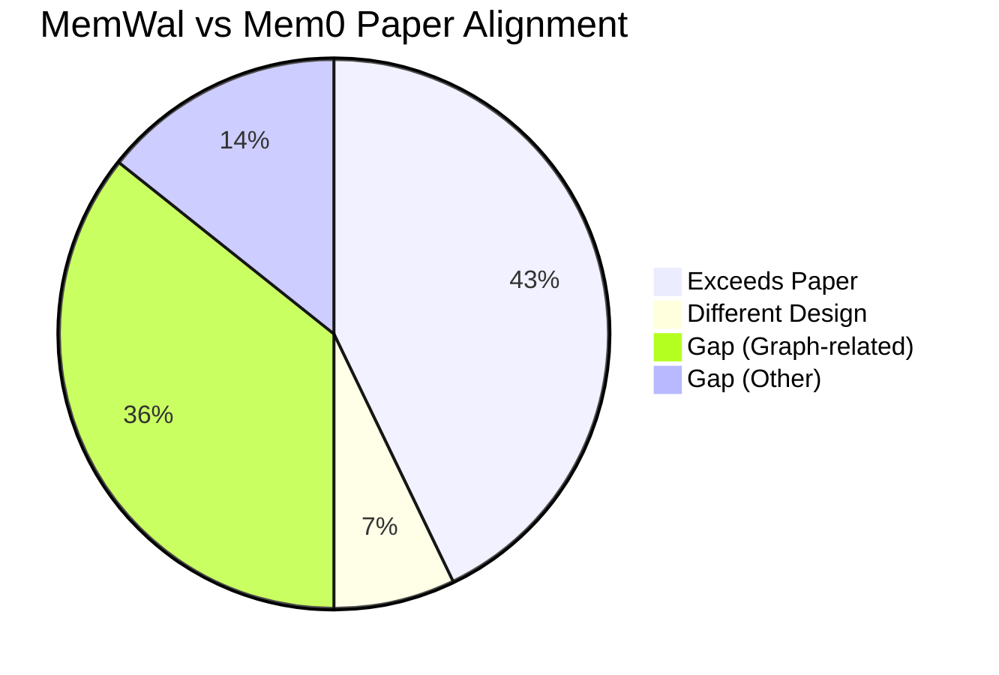
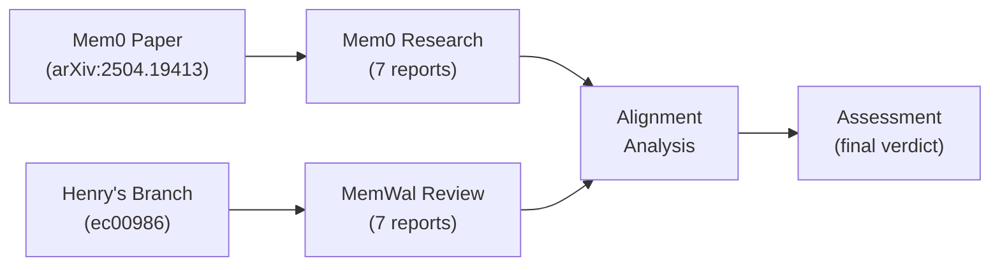

# Memory System Redesign

> **Team**: Daniel Lam (vision), Henry (implementation), Margo (research), Aaron (timestamp design)
>
> **Date**: April 2026
>
> **Status**: Research complete. Implementation under review.

---

## What This Is

MemWal is a long-term memory service for AI agents — it lets agents remember facts, preferences, and context across sessions using encrypted on-chain storage (Sui + Walrus) with vector-based retrieval. We are redesigning its memory system. This document set is the result of a research sprint that analyzed the Mem0 paper ([arXiv:2504.19413](https://arxiv.org/abs/2504.19413)), reviewed Henry's implementation against it, and produced a clear picture of where we stand — what's strong, what's missing, and what to do next.

## The Four Pillars

The redesign targets four areas (from the [original breakdown](./memory-redesign-breakdown.md)):

1. **Memory Lifecycle** — How memories are created, updated, and retired
2. **Memory History & Archival** — Versioning memories over time, tracking how knowledge evolves
3. **Memory Linking** — Connecting related memories into a knowledge graph
4. **Memory Retrieval** — Efficiently extracting memories based on context, recency, and relevance

## Document Structure

```
review/
│
├── README.md                          ← You are here
├── memory-redesign-breakdown.md       ← Original requirements
│
├── mem0-research/                     ← Mem0 paper deep dive (pure research)
│   ├── 00-index.md                    ← System overview & reading guide
│   ├── 01-memory-structure.md         ← Dense text vs graph schemas
│   ├── 02-context-management.md       ← Extraction prompt, summary, sliding window
│   ├── 03-memory-operations.md        ← ADD/UPDATE/DELETE/NOOP lifecycle
│   ├── 04-deduplication-conflict.md   ← Similarity detection, soft deletion
│   ├── 05-retrieval.md                ← Vector search, graph traversal, ranking
│   ├── 06-component-interactions.md   ← End-to-end pipeline, failure modes
│   └── mem0-paper.pdf                 ← Downloaded paper
│
├── memwal-architecture-review/        ← MemWal implementation review
│   ├── 00-index.md                    ← Review index & relationship diagram
│   ├── 01-architecture-overview.md    ← Schema, API surface, flows, scoring
│   ├── 02-code-review.md             ← Commit ec00986 review (P0/P1/P2)
│   ├── 03-mem0-alignment.md           ← Component-by-component vs Mem0
│   ├── 04-gap-analysis.md             ← Gaps, severity, recommendations
│   ├── 05-external-evaluation.md      ← Cadru readiness experiment
│   ├── 06-features-and-quality.md     ← Feature comparison & graph question
│   └── 07-issues-and-actions.md       ← All issues + phased action plan
│
└── assessment/
    └── memory-structure-upgrade-assessment.md  ← Final verdict for the team
```

## How to Navigate

### If you have 5 minutes
Read the [Assessment](./assessment/memory-structure-upgrade-assessment.md). It's the decision doc — what's ready, what's blocking merge, what's deferred.

### If you have 30 minutes
1. [Assessment](./assessment/memory-structure-upgrade-assessment.md) — the verdict
2. [Features & Quality](./memwal-architecture-review/06-features-and-quality.md) — what we built vs Mem0, the graph question
3. [Issues & Action Plan](./memwal-architecture-review/07-issues-and-actions.md) — what needs fixing, phased timeline

### If you have 2 hours
1. [Mem0 System Overview](./mem0-research/00-index.md) — understand the theory first
2. [MemWal Architecture Overview](./memwal-architecture-review/01-architecture-overview.md) — understand our implementation
3. [Mem0 Alignment](./memwal-architecture-review/03-mem0-alignment.md) — where we match, exceed, or fall short
4. [Gap Analysis](./memwal-architecture-review/04-gap-analysis.md) — consolidated gaps
5. [Features & Quality](./memwal-architecture-review/06-features-and-quality.md) — the full comparison
6. [Issues & Action Plan](./memwal-architecture-review/07-issues-and-actions.md) — action items

### If you want the full deep dive
Read everything in order: Mem0 research (7 docs) → MemWal review (7 docs) → Assessment.

## Key Findings (TL;DR)



**Strong**: Memory typing, 3-stage dedup, composite scoring, universal soft deletion, batch consolidation, concurrency safety — all exceed the Mem0 paper.

**Blocking merge**: 2 P0 issues (SQL injection in `search_similar_filtered`, transaction held during Walrus upload).

**Main gap**: No graph memory (Mem0^g). This means relationship queries ("who works with whom?") are impossible. But the paper's own benchmarks show base wins 3/4 query types — graph only wins on temporal reasoning by a modest margin. **Recommendation: defer graph, validate with real query data first.**

## Research Flow


