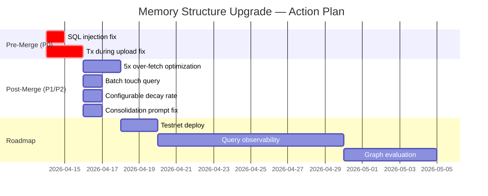

# Assessment: Memory Structure Upgrade

> **Branch**: `feat/memory-structure-upgrade` | **Commit**: ec00986 | **Author**: Henry (ducnmm)
>
> **Verdict**: Strong implementation. 2 issues must be fixed before merge.
>
> **Date**: April 2026

---

## Executive Summary

Henry's memory structure upgrade implements the Mem0 base architecture and **exceeds the paper** in 6 out of 14 areas. The implementation spans the full stack — SQL migration, Rust server (db, routes, types), and TypeScript SDK — with 2,445 lines of new code across 9 files.

**Merge status**: Blocked on 2 P0 issues. Estimated fix time: 1 day.

---

## What Was Built

### New Schema (`004_memory_structure.sql`)

| Column | Purpose |
|---|---|
| `memory_type` | 5 types: fact, preference, episodic, procedural, biographical |
| `importance` | 0.0–1.0 scoring per memory |
| `access_count` / `last_accessed_at` | Usage tracking for frequency scoring |
| `source` | Provenance: user, extracted, system |
| `content_hash` | SHA-256 for fast exact-duplicate detection |
| `superseded_by` | Points to the newer memory that replaced this one |
| `valid_from` / `valid_until` | Temporal validity window |
| `metadata` | JSONB for tags and arbitrary data |

All columns have defaults — fully backward compatible.

### New Endpoints

| Endpoint | Purpose |
|---|---|
| `POST /api/stats` | Memory statistics per owner/namespace |
| `POST /api/forget` | Semantic soft-deletion by query |
| `POST /api/consolidate` | On-demand memory dedup and conflict resolution |

### Upgraded Endpoints

| Endpoint | What Changed |
|---|---|
| `POST /api/remember` | Fast-path SHA-256 dedup, memory typing, importance, tags |
| `POST /api/recall` | Composite 4-signal scoring, type/importance filtering, expired memory inclusion |
| `POST /api/analyze` | 6-stage pipeline: extract → dedup → embed → consolidate → store → respond |

### SDK Changes

- `remember()` accepts `RememberOptions` (type, importance, metadata, tags)
- `recall()` accepts `RecallOptions` (type filter, importance threshold, scoring weights, expired inclusion)
- New methods: `stats()`, `forget()`, `consolidate()`
- All changes backward-compatible

---

## Where It Exceeds Mem0

| Innovation | Detail |
|---|---|
| **Memory typing** | 5 categories vs Mem0's untyped text. Enables filtered retrieval and grouped LLM context. |
| **3-stage dedup** | SHA-256 → vector similarity → LLM. Paper has 2 stages only (vector + LLM). |
| **Composite scoring** | `W_s(similarity) + W_i(importance) + W_r(0.95^days) + W_f(ln(access))` — paper uses pure cosine similarity. |
| **Universal soft delete** | All memories get `superseded_by` + `valid_from`/`valid_until`. Paper only soft-deletes graph edges. |
| **Batch consolidation** | 1 LLM call for all facts vs paper's per-fact approach. ~70% LLM cost reduction. |
| **Concurrency safety** | Advisory locks + ON CONFLICT + transactional inserts. Paper doesn't address this. |

---

## Merge Blockers (P0)

### 1. SQL Injection — `search_similar_filtered` (`db.rs`)

`memory_types` values are string-interpolated into SQL with manual quote escaping. Must use parameterized `ANY($N)` instead.

**Effort**: ~30 minutes.

### 2. Transaction Held During Walrus Upload — `store_memory_with_transaction`

Advisory lock + DB connection held for the entire Walrus upload (network I/O, 5–20 seconds). Under load: connection pool exhaustion, blocked writers.

**Fix**: Reserve row → commit → upload → update blob_id separately. Unique index already prevents duplicates.

**Effort**: ~2–4 hours.

---

## Should Fix Soon (P1)

| Issue | Impact | Effort |
|---|---|---|
| **5x over-fetch in recall** | Downloads/decrypts up to 5x requested results before truncating | 4 hours |
| **Sequential touch queries** | N individual UPDATEs instead of 1 batch | 30 min |
| **InsertMemoryMeta duplication** | Same struct built ~4 times with minor variations | 1 hour |

---

## The Graph Question

The Mem0 paper describes a graph variant (Mem0^g) that is **not implemented** in this commit. This is the main architecture gap.

**What it would enable**: Relationship queries ("who works with whom?"), temporal chains, entity dedup across conversations.

**What the paper's benchmarks say**: Base wins 3/4 query types. Graph only wins temporal reasoning by +2.62 J points. Graph costs 2x storage and 3x latency.

**What MemWal already compensates**: `valid_from`/`valid_until`/`superseded_by` + recency decay covers ~70% of temporal reasoning. Relationship queries remain at 0% — genuinely requires the graph.

**Recommendation**: Defer. Ship the base architecture, add query pattern observability, evaluate graph need from real data. Estimated graph effort: 4–8 weeks if validated.

---

## Action Plan

| Phase | Actions | Timeline |
|---|---|---|
| **Pre-merge** | Fix SQL injection, fix tx-during-upload | This week |
| **Post-merge** | 5x over-fetch, batch touch, configurable decay, consolidation prompt | Next 2 weeks |
| **Roadmap** | Deploy → observability → evaluate graph need | Next sprint+ |

---

## Detailed Reports

For the full analysis behind this assessment:

| Report Set | What It Covers | Where |
|---|---|---|
| **Mem0 Research** (7 reports) | Deep dive into the paper's architecture | [mem0-research/00-index.md](../mem0-research/00-index.md) |
| **MemWal Review** (7 reports) | Implementation review, alignment, gaps | [memwal-architecture-review/00-index.md](../memwal-architecture-review/00-index.md) |
| **Features & Quality** | Full MemWal vs Mem0 comparison | [06-features-and-quality.md](../memwal-architecture-review/06-features-and-quality.md) |
| **Issues & Action Plan** | All P0–P3 issues with fixes | [07-issues-and-actions.md](../memwal-architecture-review/07-issues-and-actions.md) |
