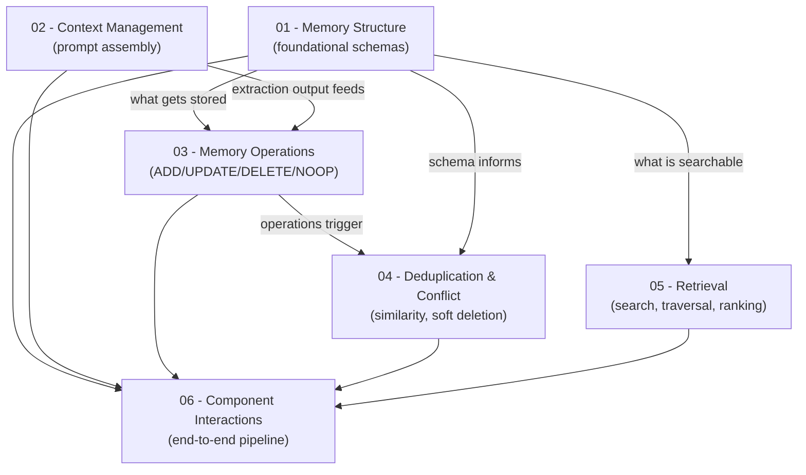
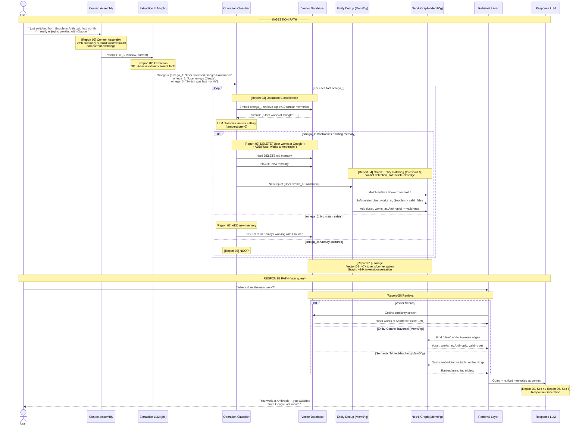
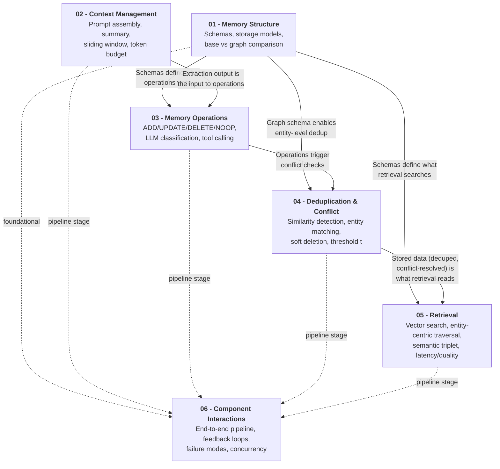

# 00b -- System Overview & Reading Guide

> **Paper**: Chhikara et al., "Mem0: Building Production-Ready AI Agents with Scalable Long-Term Memory" (arXiv:2504.19413, April 2025)
> **Purpose**: Navigate the six-report analysis set. Understand the full Mem0 pipeline before diving into details.

---

## 1. How to Read This Report Set

This analysis is split across six detailed reports, each covering one architectural concern of the Mem0 system. They are designed to be read independently, but certain reports assume familiarity with concepts introduced in others. This section provides reading order recommendations and a dependency map.

### 1.1 Report Index

| Report | Title | Core Question It Answers |
|--------|-------|--------------------------|
| [01-memory-structure.md](./01-memory-structure.md) | Memory Structure & Schema | What does a stored memory look like? |
| [02-context-management.md](./02-context-management.md) | Context Management Protocol | How is the extraction prompt assembled? |
| [03-memory-operations.md](./03-memory-operations.md) | Memory Operations (CRUD) | How are memories created, updated, and deleted? |
| [04-deduplication-conflict.md](./04-deduplication-conflict.md) | Deduplication & Conflict Resolution | How does the system detect duplicates and resolve contradictions? |
| [05-retrieval.md](./05-retrieval.md) | Retrieval Mechanisms | How are stored memories found and ranked at query time? |
| [06-component-interactions.md](./06-component-interactions.md) | Component Interactions | How do all the pieces fit together end-to-end? |

### 1.2 Dependency Graph

The following diagram shows which reports depend on understanding which others. An arrow from A to B means "reading A first helps you understand B."



### 1.3 Three Reading Paths

**Path A: Quick Overview (2 reports, ~30 minutes)**
For readers who need a high-level understanding of Mem0's architecture and performance characteristics.

1. [01-memory-structure.md](./01-memory-structure.md) -- Understand what memories are and how the two architectures differ.
2. [06-component-interactions.md](./06-component-interactions.md) -- See the full pipeline, data flow, feedback loops, and failure modes.

*Rationale*: Report 01 establishes the vocabulary (dense text memories, graph triplets, soft deletion). Report 06 shows how everything connects. Together, they provide a complete but compressed picture.

**Path B: Core Architecture (4 reports, ~90 minutes)**
For readers who need to understand the processing pipeline in detail, without the retrieval or deduplication deep dives.

1. [01-memory-structure.md](./01-memory-structure.md) -- Schemas and storage models.
2. [02-context-management.md](./02-context-management.md) -- How the extraction prompt is built.
3. [03-memory-operations.md](./03-memory-operations.md) -- The ADD/UPDATE/DELETE/NOOP lifecycle.
4. [06-component-interactions.md](./06-component-interactions.md) -- End-to-end integration.

*Rationale*: This path follows the ingestion pipeline from conversation to stored memory. Reports 04 and 05 (deduplication and retrieval) are important but are secondary to understanding the core write path.

**Path C: Full Deep Dive (all 6 reports, ~3 hours)**
For researchers, implementors, or anyone building on or evaluating the Mem0 architecture.

1. [01-memory-structure.md](./01-memory-structure.md) -- Start with schemas. Everything builds on this.
2. [02-context-management.md](./02-context-management.md) -- How input is prepared.
3. [03-memory-operations.md](./03-memory-operations.md) -- How decisions are made.
4. [04-deduplication-conflict.md](./04-deduplication-conflict.md) -- How conflicts are detected and resolved.
5. [05-retrieval.md](./05-retrieval.md) -- How memories are found at query time.
6. [06-component-interactions.md](./06-component-interactions.md) -- Tie everything together. Read last for maximum context.

*Rationale*: Reports 01 through 05 each cover one concern in isolation. Report 06 synthesizes the interactions between all components. Reading it last means every reference in Report 06 maps to something already understood.

---

## 2. The Mem0 Pipeline: A Narrative Walkthrough

This section traces a single message through the entire Mem0 system, from arrival to response. The goal is to show *how the parts connect* before the detailed reports explain *how each part works internally*.

### 2.1 The Scenario

A user is in an ongoing conversation with an AI assistant. The system already has some stored memories, including:

> Existing memory: "User works at Google"

The user sends this message:

> "I just switched from Google to Anthropic last month. I'm really enjoying working with Claude."

Here is what happens.

### 2.2 Stage 1: Context Assembly

**What happens**: The system prepares the input for the extraction LLM. It fetches the current conversation summary `S` from the database (this summary was generated asynchronously and may be slightly stale). It builds a sliding window of the most recent `m=10` messages. It adds the current message exchange `(m_{t-1}, m_t)`. These three layers are combined into the extraction prompt `P`.

```
P = (S, {m_{t-10}, ..., m_{t-2}}, m_{t-1}, m_t)
```

The three layers provide complementary coverage:
- **Summary S** captures themes from earlier in the conversation that have scrolled past the window.
- **Sliding window** provides local conversational coherence -- the last 10 messages.
- **Current exchange** contains the new information to be processed.

The estimated token budget for this prompt is approximately 3,000--8,300 tokens, compared to the ~26,000-token average for full LOCOMO conversations. This represents a 68--88% token reduction per extraction call.

**Covered in detail**: [02-context-management.md](./02-context-management.md), Sections 1--3.

### 2.3 Stage 2: Extraction

**What happens**: The extraction LLM (GPT-4o-mini) processes prompt `P` and identifies salient facts -- discrete, self-contained statements of information worth remembering. This is the extraction function `phi`:

```
phi(P) = Omega = {omega_1, omega_2, omega_3}
```

For our example message, the extracted facts might be:

| Fact | Content |
|------|---------|
| omega_1 | "User switched from Google to Anthropic" |
| omega_2 | "User enjoys working with Claude" |
| omega_3 | "The switch happened last month" |

Each fact is a distilled piece of information, not a raw conversation chunk. This distillation is what distinguishes Mem0 from RAG systems that store raw text.

**Covered in detail**: [02-context-management.md](./02-context-management.md), Sections 1 and 5.

### 2.4 Stage 3: Operation Classification

**What happens**: Each extracted fact is processed independently. For each fact omega_i, the system:

1. Embeds the fact using `text-embedding-3-small`.
2. Retrieves the top `s=10` most similar existing memories from the vector database.
3. Presents the fact and similar memories to the classification LLM via a tool-calling interface.
4. The LLM classifies the appropriate operation: ADD, UPDATE, DELETE, or NOOP.

For our example, when omega_1 ("User switched from Google to Anthropic") is classified:
- The vector search retrieves the existing memory "User works at Google" as a similar memory.
- The LLM recognizes a contradiction: the user no longer works at Google.
- Classification result: **DELETE** the old memory ("User works at Google") and **ADD** the new fact ("User works at Anthropic").

For omega_2 ("User enjoys working with Claude"):
- No semantically equivalent memory exists.
- Classification result: **ADD** as a new memory.

For omega_3 ("The switch happened last month"):
- This temporal detail may augment omega_1, or the system may classify it as **NOOP** if the temporal context is already captured in the omega_1 memory.

All classification decisions are made by the LLM at `temperature=0` for deterministic behavior. The actual prompts used for classification are not published in the paper.

**Covered in detail**: [03-memory-operations.md](./03-memory-operations.md), Sections 1--3.

### 2.5 Stage 4: Deduplication and Conflict Resolution

**What happens**: In base Mem0, deduplication is embedded in the operation classification stage (Stage 3 above) -- the LLM decides whether a fact is redundant (NOOP), additive (UPDATE), or contradictory (DELETE + ADD).

In the graph variant (Mem0^g), an additional layer of entity-level deduplication occurs:

1. **Entity matching**: For the new triplet `(User, works_at, Anthropic)`, the system computes embeddings for both source ("User") and destination ("Anthropic") entities. It searches existing graph nodes for matches above the configurable similarity threshold `t`.
2. **Node reuse or creation**: "User" already exists as a node. "Anthropic" may or may not exist -- if not, a new node is created with type "Organization."
3. **Conflict detection**: The system queries existing edges from the "User" node with the "works_at" relationship. It finds `(User, works_at, Google, valid=true)`.
4. **Conflict resolution**: The LLM-based update resolver evaluates whether this is a genuine contradiction. Since most people have one employer, it determines this is a conflict. The old edge is **soft-deleted** -- marked `valid: false` with an `invalidated_at` timestamp -- and the new edge `(User, works_at, Anthropic, valid=true)` is added.

The critical difference: base Mem0 performs a **hard delete** (the old memory is permanently removed from the vector database), while Mem0^g preserves the old relationship as an invalidated edge, enabling temporal queries and audit trails.

**Covered in detail**: [04-deduplication-conflict.md](./04-deduplication-conflict.md), Sections 1--3.

### 2.6 Stage 5: Storage

**What happens**: The classified operations are executed against the storage backends.

**In base Mem0** (vector database):
- The old memory "User works at Google" is deleted from the vector database (hard delete -- permanently gone).
- A new memory "User works at Anthropic" is inserted with a fresh embedding, timestamp, and metadata.
- A new memory "User enjoys working with Claude" is inserted.

The dense text memory schema stores: a unique ID, natural language content, a dense vector embedding (`text-embedding-3-small`), and metadata (created_at, updated_at, source reference).

**In Mem0^g** (Neo4j graph + vector database):
- The edge `(User, works_at, Google)` is marked `valid: false` with `invalidated_at: 2025-03`.
- A new edge `(User, works_at, Anthropic)` is created with `valid: true`, `created_at: 2025-03`.
- A new edge `(User, enjoys, Claude)` is created with `valid: true`.
- Entity nodes are reused where they already exist; new nodes are created where they do not.

The graph stores entities as nodes (with name, type, embedding, timestamp) and relationships as directed labeled edges (with the triplet, validity flag, and timestamps). Average storage footprint per conversation is approximately 7,000 tokens for base Mem0 and approximately 14,000 tokens for Mem0^g.

**Covered in detail**: [01-memory-structure.md](./01-memory-structure.md), Sections 1--3.

### 2.7 Stage 6: Retrieval (Later, When a Query Arrives)

**What happens**: Some time later, the user (or another part of the system) asks: "Where does the user work?"

**In base Mem0**: The query is embedded, and a cosine similarity search is performed against all stored memory embeddings. The memory "User works at Anthropic" scores highly (similarity ~0.91) and is returned. The old memory "User works at Google" is gone -- it was hard-deleted and cannot be retrieved.

**In Mem0^g**: Three retrieval methods are available:
1. **Entity-centric traversal**: The system extracts "user" from the query, finds the matching "User" node, and traverses its edges. It finds `(User, works_at, Anthropic, valid=true)` and `(User, works_at, Google, valid=false)`. Filtering by validity, it surfaces the current answer.
2. **Semantic triplet matching**: The query embedding is compared against all triplet embeddings. The triplet "User works_at Anthropic" scores highly.
3. **Vector similarity search**: Same as base -- the dense text memory is also searched.

Results are ranked and formatted as context for the response LLM. The paper describes memories formatted as "Memories for user {speaker_id}" blocks injected into the response prompt.

**Covered in detail**: [05-retrieval.md](./05-retrieval.md), Sections 1--4.

### 2.8 Stage 7: Response Generation

**What happens**: The retrieved memories are injected into the response generation prompt alongside the user's query. The response LLM generates an answer grounded in the stored memories:

> "You work at Anthropic -- you switched from Google last month."

This is the only stage where the user sees output. All prior stages (extraction, classification, deduplication, storage, retrieval) are internal.

**Covered in detail**: [02-context-management.md](./02-context-management.md), Section 4; [05-retrieval.md](./05-retrieval.md), Section 5.

### 2.9 Full Pipeline Sequence Diagram



---

## 3. Data Transformation Chain

This section tracks how data changes form as it moves through the pipeline. Each transformation corresponds to a specific system stage and a specific report.

```
Raw conversation text
  "I just switched from Google to Anthropic last month.
   I'm really enjoying working with Claude."
        |
        | [Context Assembly -- Report 02, Sections 1-3]
        | Fetch summary S (async, possibly stale)
        | Build sliding window of m=10 recent messages
        | Combine with current exchange (m_{t-1}, m_t)
        v
Extraction prompt P = (S, window, current)
  ~3,000-8,300 tokens (vs ~26,000 for full context)
        |
        | [Extraction -- Report 02, Sections 1 and 5]
        | GPT-4o-mini processes P
        | Identifies salient facts (not raw chunks)
        v
Salient facts Omega = {omega_1, omega_2, omega_3}
  omega_1: "User switched from Google to Anthropic"
  omega_2: "User enjoys working with Claude"
  omega_3: "The switch happened last month"
        |
        | [Classification -- Report 03, Sections 1-3]
        | Each fact embedded (text-embedding-3-small)
        | Top s=10 similar memories retrieved
        | LLM classifies via tool calling (temp=0)
        v
Operations per fact:
  omega_1: DELETE("User works at Google") + ADD("User works at Anthropic")
  omega_2: ADD("User enjoys working with Claude")
  omega_3: NOOP (temporal detail already captured)
        |
        | [Dedup & Conflict -- Report 04, Sections 1-3]
        | Base: two-stage detection (vector + LLM)
        | Graph: entity matching (threshold t), conflict detection,
        |        soft-delete old edge, add new edge
        v
Graph state (Mem0^g):
  (User, works_at, Google)     valid=false, invalidated_at=2025-03
  (User, works_at, Anthropic)  valid=true,  created_at=2025-03
  (User, enjoys, Claude)       valid=true,  created_at=2025-03
        |
        | [Storage -- Report 01, Sections 1-2]
        | Vector DB: dense text memory record
        |   {id, content, embedding, metadata{created_at, updated_at, source}}
        | Neo4j: entity nodes + relationship edges
        |   Nodes: {entity_name, entity_type, embedding, metadata}
        |   Edges: {triplet, relationship, embedding, valid, metadata}
        v
Stored state:
  Vector DB: "User works at Anthropic"  (embedding, timestamps)
             "User enjoys working with Claude"  (embedding, timestamps)
  Neo4j:     [User]--works_at(valid)-->[Anthropic]
             [User]--works_at(invalid)-->[Google]
             [User]--enjoys(valid)-->[Claude]
        |
        | [Retrieval -- Report 05, Sections 1-4]
        | Query: "Where does the user work?"
        | Vector search: cosine similarity against all memories
        | Entity-centric: traverse from [User] node
        | Semantic triplet: query embedding vs triplet embeddings
        | Results ranked by similarity score
        v
Ranked memory list for LLM context:
  1. "User works at Anthropic"                    (sim: 0.91)
  2. (User, works_at, Anthropic, valid=true)      (graph context)
  3. "User enjoys working with Claude"            (sim: 0.72)
        |
        | [Response Generation -- Report 02, Sec 4 / Report 05, Sec 5]
        | Memories formatted as "Memories for user {id}"
        | Injected into response prompt alongside query
        v
User-facing answer grounded in memories:
  "You work at Anthropic -- you switched from Google last month."
```

---

## 4. Component Relationship Map

This diagram shows how the six *reports* relate to each other -- not the Mem0 architecture itself, but the structure of the analysis. Understanding this helps readers navigate between reports when following a specific concern.



**Reading the diagram**:
- **Solid arrows** show conceptual dependencies between reports. "01 -> 03" means understanding memory schemas (Report 01) helps you understand what the operations (Report 03) are writing.
- **Dashed arrows** show that all reports feed into Report 06, which synthesizes the full pipeline view.
- **Report 01** (Memory Structure) is foundational -- it defines the data model that every other component reads or writes.
- **Report 02** (Context Management) explains the input side -- how the extraction prompt is assembled. Its output (extracted facts) is the input to Report 03.
- **Report 03** (Operations) and **Report 04** (Deduplication & Conflict) are tightly coupled -- operations trigger deduplication checks, and conflict resolution determines the final stored state.
- **Report 05** (Retrieval) reads from the stored state produced by Reports 03 and 04, structured according to the schemas in Report 01.
- **Report 06** (Component Interactions) ties everything together and is best read after the individual reports.

---

## 5. The Two Architectures at a Glance

Mem0 offers two variants: a base system using dense text memories in a vector database, and a graph-enhanced variant (Mem0^g) that adds a Neo4j knowledge graph. The following table consolidates the key differences that are spread across multiple reports into a single comparative view.

| Dimension | Mem0 Base | Mem0^g (Graph) | Report(s) |
|-----------|-----------|---------------|-----------|
| **Storage model** | Flat list of natural language facts in a vector database | Directed labeled graph `G = (V, E, L)` in Neo4j + vector DB | [01](./01-memory-structure.md), Sec 1-2 |
| **What a "memory" is** | A distilled salient fact (single sentence) | An entity node + relationship edge (semantic triplet) | [01](./01-memory-structure.md), Sec 1.1, 2.1 |
| **Deduplication approach** | Vector similarity (top s=10) + LLM judgment | Entity embedding threshold `t` + LLM update resolver | [04](./04-deduplication-conflict.md), Sec 1-2 |
| **Conflict resolution** | LLM classifies as DELETE + ADD (hard delete of old memory) | LLM-based update resolver soft-deletes old edge, adds new edge | [04](./04-deduplication-conflict.md), Sec 3 |
| **History preservation** | None -- hard DELETE permanently removes old memories | Full -- soft deletion preserves invalidated edges with timestamps | [03](./03-memory-operations.md), Sec 4.2; [04](./04-deduplication-conflict.md), Sec 3.3 |
| **Temporal support** | Timestamps in metadata only; no validity flags | Timestamps on nodes AND edges; `valid` boolean + `invalidated_at` field | [01](./01-memory-structure.md), Sec 2.3, 4.3 |
| **Retrieval methods** | Vector similarity search only | Vector search + entity-centric traversal + semantic triplet matching | [05](./05-retrieval.md), Sec 1-3 |
| **Storage cost** | ~7,000 tokens per conversation (~3.7x compression) | ~14,000 tokens per conversation (~1.9x compression) | [01](./01-memory-structure.md), Sec 1.3, 2.5 |
| **Search latency (p50)** | 0.148s | 0.476s | [05](./05-retrieval.md), Sec 6.2 |
| **Total latency (p95)** | 1.440s | 2.590s | [05](./05-retrieval.md), Sec 6.2 |
| **Token cost per query** | ~7k tokens | ~14k tokens | [05](./05-retrieval.md), Sec 6.3 |
| **Quality (aggregate J)** | 66.88% | 66.29% | [05](./05-retrieval.md), Sec 4.3 |
| **Best query type** | Single-hop (J=67.13), multi-hop (J=51.15), open-domain (J=75.71) | Temporal queries (J=58.13) | [05](./05-retrieval.md), Sec 4.3 |
| **LLM calls per message** | 1 + n (1 extraction + n classification calls, n = facts extracted) | 3 + c (extraction + entity extraction + relationship generation + c conflict resolutions) | [06](./06-component-interactions.md), Sec 3 |
| **Graph database required** | No | Yes (Neo4j) | [01](./01-memory-structure.md), Sec 2.5 |

**Key takeaway**: Mem0 Base is faster, cheaper, and simpler, with marginally higher aggregate quality. Mem0^g adds temporal reasoning, history preservation, and structured relationship querying at roughly 2x the cost and latency. The graph variant's clear advantage is limited to temporal queries (J=58.13 vs 55.51). For systems where temporal queries are not a primary use case, the added complexity may not be justified.

---

## 6. Key Concepts Glossary

Quick-reference definitions for terminology used across the report set. Each entry references the report where the concept is covered in depth.

| Term | Definition | Report |
|------|-----------|--------|
| **Salient fact (omega, omega_i)** | A discrete, self-contained piece of information extracted from conversation by the LLM. Not a raw text chunk but a distilled statement (e.g., "User prefers TypeScript over JavaScript"). The set of facts extracted from one message is denoted Omega = {omega_1, omega_2, ..., omega_n}. | [02](./02-context-management.md), Sec 1; [03](./03-memory-operations.md), Sec 1 |
| **Extraction function (phi)** | The LLM-based function that transforms the extraction prompt P into a set of salient facts Omega. Implemented using GPT-4o-mini. phi(P) = Omega. | [02](./02-context-management.md), Sec 1 |
| **Conversation summary (S)** | A compressed representation of the full conversation history, generated asynchronously and refreshed periodically. Provides global thematic context that the sliding window cannot capture. Included as the first layer of the extraction prompt P. | [02](./02-context-management.md), Sec 2 |
| **Sliding window (m=10)** | The 10 most recent messages preceding the current exchange, included in the extraction prompt to provide local conversational coherence. The value m=10 is the configuration used for LOCOMO benchmark evaluation. | [02](./02-context-management.md), Sec 3 |
| **Similar memories (s=10)** | The top 10 most semantically similar existing memories retrieved via vector search when classifying a new fact. These are presented to the classification LLM alongside the new fact to determine the appropriate operation. | [03](./03-memory-operations.md), Sec 2.1 |
| **Threshold t (entity matching)** | A configurable similarity threshold used in Mem0^g for entity-level deduplication. When a new entity's embedding has cosine similarity above t with an existing node, the existing node is reused rather than creating a duplicate. The paper does not specify a recommended value. | [04](./04-deduplication-conflict.md), Sec 2.1-2.3 |
| **Soft deletion / validity flags** | The graph variant's approach to handling superseded information. Old relationship edges are marked `valid: false` with an `invalidated_at` timestamp rather than being physically removed. This preserves history and enables temporal queries. Contrast with hard deletion in base Mem0. | [04](./04-deduplication-conflict.md), Sec 3.3-3.4; [01](./01-memory-structure.md), Sec 4.2 |
| **Semantic triplet** | A structured representation of a relationship: (source_entity, relationship, destination_entity). For example, ("Alice", "works_at", "Anthropic"). Stored as directed labeled edges in the Neo4j graph. Each triplet is also encoded as text and embedded for semantic search. | [01](./01-memory-structure.md), Sec 2.3; [05](./05-retrieval.md), Sec 3 |
| **LOCOMO benchmark** | The evaluation benchmark used in the paper. Contains multi-session conversations averaging approximately 26,000 tokens each. Evaluates single-hop recall, multi-hop reasoning, temporal reasoning, and open-domain questions. | [05](./05-retrieval.md), Sec 4.3; [01](./01-memory-structure.md), Sec 1.3 |
| **LLM-as-Judge (J metric)** | The primary quality metric used in the paper's evaluation. An LLM (serving as judge) scores the system's responses. J scores range from 0-100 and measure response quality against ground truth. Full-context achieves J=72.90%; Mem0 Base achieves J=66.88%. | [05](./05-retrieval.md), Sec 4.3, 6.3 |
| **ADD / UPDATE / DELETE / NOOP** | The four atomic memory operations. ADD creates a new memory. UPDATE merges new information into an existing memory. DELETE removes a contradicted memory (hard delete in base, soft delete in graph). NOOP skips when information is already captured. All decisions are made by the LLM via tool calling at temperature=0. | [03](./03-memory-operations.md), Sec 1 |

---

## 7. Open Questions & Gaps

This section consolidates all observations about unspecified details, missing mechanisms, and architectural limitations identified across the six reports. These are not criticisms of the paper -- they are implementation-relevant gaps that any system building on this design must resolve.

### 7.1 Unspecified Parameters

| Gap | Why It Matters | Identified In |
|-----|---------------|---------------|
| **Summary refresh frequency** | Determines how stale S can become relative to the conversation. Too infrequent means the extraction prompt includes outdated global context. | [02](./02-context-management.md), Sec 2.4, 6.1 |
| **Summary generation prompt** | Controls what information the summary preserves vs discards. Different prompts would produce fundamentally different summaries. | [02](./02-context-management.md), Sec 2.4, 6.1 |
| **Maximum summary length** | Directly impacts the token budget available for other prompt components (window, current exchange, similar memories). | [02](./02-context-management.md), Sec 2.4, 6.1 |
| **Summary append vs regenerate strategy** | Append-only is cheaper but accumulates drift; full regeneration is costlier but self-correcting. | [02](./02-context-management.md), Sec 6.1 |
| **Entity matching threshold t value** | Controls entity deduplication precision/recall trade-off. No recommended value or calibration methodology provided. | [04](./04-deduplication-conflict.md), Sec 2.3, 6.4 |
| **Graph traversal depth limit** | Determines how far entity-centric retrieval explores from anchor nodes. Unbounded traversal risks noise and latency explosion in dense graphs. | [05](./05-retrieval.md), Sec 8.3 |
| **Number of memories injected at response time** | The maximum count or token budget of memories included in the response prompt is not specified. | [02](./02-context-management.md), Sec 6.5 |
| **Memory ranking/ordering in response prompt** | How retrieved memories are ordered within the formatted "Memories for user" block is not described. | [02](./02-context-management.md), Sec 6.5 |

### 7.2 Missing Mechanisms

| Gap | Description | Identified In |
|-----|-------------|---------------|
| **Cascading invalidation** | When a relationship is soft-deleted, logically dependent edges are not automatically re-evaluated. If "Alice works at Google" is invalidated, "Alice manages Google Team X" remains valid despite depending on the now-invalid premise. | [04](./04-deduplication-conflict.md), Sec 5.2, 6.5 |
| **Entity merge undo** | Once two entities are incorrectly merged through threshold-based matching, there is no mechanism to split them apart. The problem grows harder as more relationships accumulate on the merged node. | [04](./04-deduplication-conflict.md), Sec 5.3, 6.6 |
| **Temporal decay in retrieval** | No mechanism for recency-weighted scoring. A valid memory from one year ago ranks the same as one from today, given equal similarity scores. | [04](./04-deduplication-conflict.md), Sec 6.2; [05](./05-retrieval.md), Sec 7, 8.2 |
| **Retrieval method routing** | No automatic mechanism to select which retrieval method (vector search, entity-centric, semantic triplet) to invoke for a given query type. | [05](./05-retrieval.md), Sec 8.1 |
| **Confidence scoring for conflict resolution** | The LLM update resolver makes binary decisions (conflict vs coexistence) with no associated confidence score. Low-certainty decisions cannot be flagged for human review. | [04](./04-deduplication-conflict.md), Sec 6.7 |
| **Vicious cycle detection in summary-extraction feedback** | No mechanism to detect or break the feedback loop where poor early extractions produce poor summaries, which bias future extractions. | [02](./02-context-management.md), Sec 6.2; [06](./06-component-interactions.md), Sec 10.4 |
| **Batch consolidation across facts** | Facts are processed individually. There is no stage where multiple facts are evaluated together, meaning cross-fact dependencies (where fact A + fact B together imply something neither states alone) are never detected. | [03](./03-memory-operations.md), Sec 7.2, 7.6 |

### 7.3 Architectural Limitations

| Limitation | Description | Identified In |
|------------|-------------|---------------|
| **Hard DELETE in base Mem0** | Permanently removes contradicted memories from the vector database with no recovery path. Cannot answer temporal queries, maintain audit trails, or recover from misclassified deletions. The single most significant architectural difference from Mem0^g. | [03](./03-memory-operations.md), Sec 4.2, 7.4 |
| **No cross-fact dependencies** | Per-fact processing means the system cannot detect that "User started a new job at Company X" and "User moved to San Francisco" together imply a relocation for work. Each fact is classified in isolation. | [03](./03-memory-operations.md), Sec 7.2 |
| **No user feedback loop** | Users cannot flag incorrect, outdated, or irrelevant memories. The system has no signal for whether its extractions are useful and no adaptation mechanism over time. | [06](./06-component-interactions.md), Sec 4.3, 10.2 |
| **No explicit memory type classification** | Neither representation includes a type system for memories. Preferences, biographical facts, and temporal events share the same schema. Downstream systems must infer memory type from content. | [01](./01-memory-structure.md), Sec 4.4 |
| **Edge-level-only temporal metadata in graph** | Validity flags and timestamps exist only on edges, not on nodes. The system can track relationship changes but not entity-level changes (e.g., entity renaming or merging). | [01](./01-memory-structure.md), Sec 4.3 |
| **LLM as dominant single point of failure** | GPT-4o-mini participates in at least six distinct pipeline roles (extraction, classification, entity extraction, relationship generation, conflict resolution, response generation). An outage simultaneously breaks ingestion, maintenance, and response. | [06](./06-component-interactions.md), Sec 9, 10.1 |
| **No human-in-the-loop** | All operations (including destructive DELETE and content-modifying UPDATE) execute automatically without user review. A misclassified contradiction can silently destroy a correct memory. | [03](./03-memory-operations.md), Sec 7.3 |
| **Quality ceiling below full context** | Full-context processing achieves J=72.90%. Mem0 Base achieves J=66.88%. The system trades approximately 6 percentage points of quality for dramatically lower token cost and latency. This is the explicit design trade-off, not a flaw. | [06](./06-component-interactions.md), Sec 10.7; [05](./05-retrieval.md), Sec 8.5 |

### 7.4 Reproducibility Concerns

| Concern | Description | Identified In |
|---------|-------------|---------------|
| **Classification prompts not published** | The system and user prompts supplied to the LLM during operation classification are not provided. Edge-case behavior cannot be independently reproduced. | [03](./03-memory-operations.md), Sec 2.2, 7.1, 7.5 |
| **Operation frequency data not provided** | The paper evaluates operation quality but does not report the frequency distribution of ADD/UPDATE/DELETE/NOOP across the benchmark. | [03](./03-memory-operations.md), Sec 5, 7.5 |
| **Exact tool schemas not provided** | The paper describes the tool-calling mechanism conceptually but does not publish the JSON schemas provided to the LLM. | [03](./03-memory-operations.md), Sec 7.5 |
| **Edge-case handling not discussed** | Partial contradictions, ambiguous augmentation, and context-dependent redundancy are not addressed in the paper. | [03](./03-memory-operations.md), Sec 7.5; [04](./04-deduplication-conflict.md), Sec 5.1 |
| **Graph formatting at response time** | Whether graph context (for Mem0^g) is formatted differently from flat memories in the response prompt is not specified. | [02](./02-context-management.md), Sec 6.5 |
| **Race condition handling** | Concurrent message processing, write ordering conflicts, and graph locking strategies are not addressed. | [06](./06-component-interactions.md), Sec 5.3, 10.3 |

---

## References

- Chhikara et al., "Mem0: Building Production-Ready AI Agents with Scalable Long-Term Memory," arXiv:2504.19413, April 2025.
- All section and table references point to the arXiv paper unless otherwise noted.
- Report cross-references use relative links to files in this directory.
