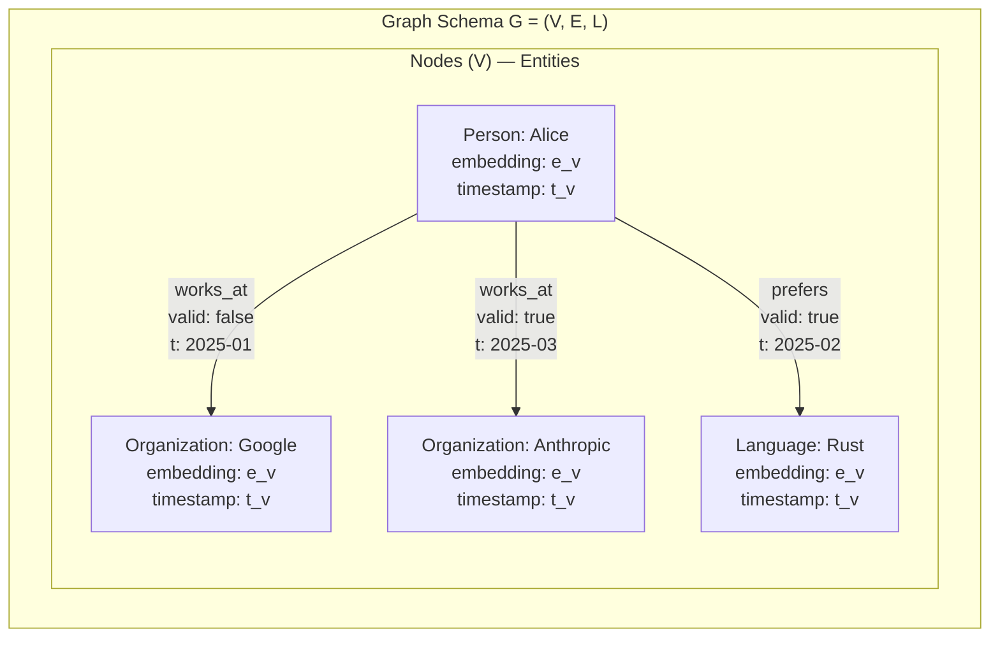
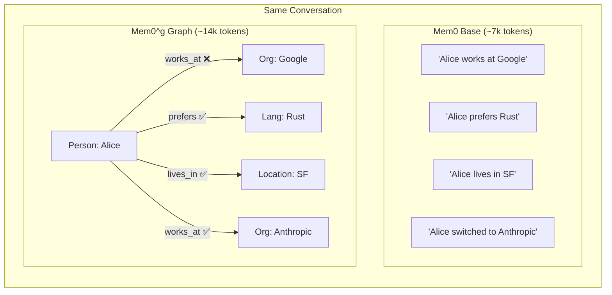

# 01 — Memory Structure & Schema

> **Part of**: [Mem0 Core Design Report Set](./00-index.md)
> **Paper Reference**: Sections 3.1, 3.2, 4.3, 5 (arXiv:2504.19413)

---

### Navigation

| | |
|---|---|
| **Prerequisites** | None — this is the foundational report |
| **Feeds Into** | [03 — Memory Operations](./03-memory-operations.md) (what gets stored after ADD/UPDATE), [04 — Deduplication](./04-deduplication-conflict.md) (schema informs conflict resolution), [05 — Retrieval](./05-retrieval.md) (what is searchable) |
| **Overview** | [System Overview & Reading Guide](./00-index.md) |

### Where This Fits in the Pipeline

This report covers **Stage 5 (Storage)** of the Mem0 pipeline — the data structures that hold memories after extraction, classification, and conflict resolution have completed. Understanding these schemas is a prerequisite for all other reports: the operations in [Report 03](./03-memory-operations.md) write to these structures, the deduplication in [Report 04](./04-deduplication-conflict.md) queries them for conflicts, and the retrieval in [Report 05](./05-retrieval.md) searches them at query time. The [Context Management](./02-context-management.md) protocol determines what enters these structures, while [Component Interactions](./06-component-interactions.md) shows how all the pieces connect end-to-end.

---

## Overview

Mem0 implements **two distinct memory representations** that serve different use cases. Understanding their schemas is foundational — every other component (extraction, operations, retrieval) reads from and writes to these structures.

The paper evaluates these representations against the LOCOMO benchmark, where conversations average approximately **26,000 tokens** each (Paper, Section 4.1), making efficient memory compression a central design concern.

---

## 1. Mem0 Base: Dense Text Memories

### 1.1 What Is a "Memory"?

A memory in base Mem0 is **not** a raw conversation chunk. It is a **distilled salient fact** (see [02 — Context Management, Section 1](./02-context-management.md#1-the-extraction-prompt) for the extraction process that produces these facts) — a natural language statement that captures a specific piece of information extracted by an LLM from conversation.

> "By converting the conversation history into concise, structured representations, Mem0 [...] mitigate noise and surface more precise cues to the LLM." (Paper, Section 5)

This is the critical distinction from RAG systems, which store raw text chunks (128–8,192 tokens). Mem0 stores *meaning*, not *text*.

### 1.2 Schema

```
┌─────────────────────────────────────────────────────┐
│  Dense Text Memory Record                            │
├─────────────────────────────────────────────────────┤
│  id:         unique identifier (string/UUID)         │
│  content:    natural language fact (string)           │
│              e.g., "User prefers TypeScript over JS"  │
│  embedding:  dense vector                            │
│              model: text-embedding-3-small            │
│  metadata:                                           │
│    ├── created_at:  timestamp of creation            │
│    ├── updated_at:  timestamp of last modification   │
│    └── source:      conversation/message reference   │
│  summary_ref: link to conversation summary S         │
└─────────────────────────────────────────────────────┘
```

### 1.3 Storage Characteristics

| Property | Value | Reference |
|----------|-------|-----------|
| Average footprint per conversation | ~7,000 tokens | Paper, Section 4.3 |
| Embedding model | OpenAI `text-embedding-3-small` | Paper, Section 3.1 |
| Storage backend | Vector database | Paper, Section 3.1 |
| Encoding | cl100k_base (tiktoken) | Paper, Section 4.1 |

### 1.4 Example Memories

The paper does not provide concrete examples, but based on the architecture description, memories would look like:

```
Memory 1: "User is allergic to peanuts"
Memory 2: "User prefers dark mode in all applications"
Memory 3: "User works at Acme Corp as a senior engineer"
Memory 4: "User discussed project Alpha on 2025-03-01"
```

Each is a self-contained fact, not a conversation excerpt. Notably, Mem0 does not impose an explicit type classification on these memories — they are untyped natural language strings. Whether a memory represents a preference, a biographical fact, or an event is not structurally distinguished.

---

## 2. Mem0^g: Graph-Based Memory

### 2.1 Graph Model

Memories are represented as a **directed labeled graph** `G = (V, E, L)`:



### 2.2 Node Schema (Entities)

```
┌─────────────────────────────────────────────────────┐
│  Graph Node (Entity)                                 │
├─────────────────────────────────────────────────────┤
│  entity_name:  string                                │
│               e.g., "Alice", "Google", "Rust"        │
│  entity_type:  classification label from L           │
│               Person | Location | Organization |     │
│               Event | Concept | Attribute | Object   │
│  embedding:    dense vector (e_v)                    │
│               for semantic similarity matching       │
│  metadata:                                           │
│    ├── created_at:  creation timestamp (t_v)         │
│    └── attributes:  additional entity properties     │
└─────────────────────────────────────────────────────┘
```

> "Entities represent the key information elements in conversations — including people, locations, objects, concepts, events, and attributes that merit representation in the memory graph." (Paper, Section 3.2)

### 2.3 Edge Schema (Relationships)

```
┌─────────────────────────────────────────────────────┐
│  Graph Edge (Relationship)                           │
├─────────────────────────────────────────────────────┤
│  triplet:     (v_source, relationship, v_dest)       │
│               e.g., ("Alice", "works_at", "Google")  │
│  relationship: semantic label (string)               │
│               e.g., "works_at", "prefers",           │
│               "discussed_with", "happened_on"        │
│  embedding:    dense vector of triplet text          │
│               used for semantic triplet retrieval     │
│  valid:        boolean                               │
│               true = current, false = soft-deleted    │
│  metadata:                                           │
│    ├── created_at:  timestamp                        │
│    └── invalidated_at: timestamp (if valid=false)    │
└─────────────────────────────────────────────────────┘
```

### 2.4 Labels (L)

Labels assign semantic types to entities. The paper mentions these categories:

- **Person** — individual people
- **Location** — places, regions
- **Organization** — companies, teams
- **Event** — occurrences, meetings, incidents
- **Concept** — abstract ideas, topics
- **Attribute** — properties, preferences
- **Object** — physical or digital things

### 2.5 Storage Characteristics

| Property | Value | Reference |
|----------|-------|-----------|
| Average footprint per conversation | ~14,000 tokens | Paper, Section 4.3 |
| Graph database | Neo4j | Paper, Section 3.2 |
| Construction time | < 1 minute worst-case | Paper, Section 4.3 |
| Entity extraction LLM | GPT-4o-mini | Paper, Section 3.2 |
| Relationship extraction | GPT-4o-mini via function calling | Paper, Section 3.2 |

---

## 3. Base vs Graph: Structural Comparison



| Dimension | Base | Graph |
|-----------|------|-------|
| **Data model** | Flat list of text facts | Nodes + edges + labels |
| **Relationships** | Implicit (in text) | Explicit (edges) |
| **History** | Overwritten on UPDATE (see [Report 03, Section 4.2](./03-memory-operations.md#42-key-difference-soft-delete-vs-hard-delete) for the operational difference) | Preserved via soft deletion |
| **Deduplication** | Vector similarity + LLM judgment (detailed in [Report 04](./04-deduplication-conflict.md#1-deduplication-in-base-mem0)) | Entity matching threshold `t` |
| **Temporal awareness** | Timestamps in metadata only | Timestamps on nodes AND edges, validity flags |
| **Storage cost** | 1x (~7k tokens) | 2x (~14k tokens) |
| **Query speed** | Faster (p50: 0.148s) (benchmarked in [Report 05, Section 6](./05-retrieval.md#6-latency--efficiency)) | Slower (p50: 0.476s) |

---

## 4. Analysis & Research Observations

### 4.1 Dense Text vs Graph Representation Trade-offs

The two memory representations expose a fundamental trade-off in memory system design. Dense text memories are simpler, cheaper to store (roughly half the token cost), and faster to query. They compress an entire conversation — averaging 26,000 tokens in the LOCOMO benchmark (Paper, Section 4.1) — down to approximately 7,000 tokens of distilled facts. Graph memories achieve a different kind of compression: rather than isolated facts, they produce a structured knowledge graph that makes relationships between entities explicit and traversable. This comes at roughly 2x the storage cost (~14,000 tokens per conversation) and slower query latency.

The choice between these representations depends on the nature of the queries a system must answer. For simple recall ("What does the user prefer?"), dense text is sufficient and more efficient. For relational or temporal queries ("Who did the user work with before changing companies?"), graph structure provides edges and paths that flat text cannot.

### 4.2 History Preservation: UPDATE Semantics

A significant structural difference lies in how each representation handles updates to existing knowledge.

In base Mem0, when an existing memory is updated (e.g., a user changes jobs), the previous content is **overwritten**. The old fact is replaced by the new one. This means the system cannot answer questions about prior states — it has no record that the user previously worked somewhere else.

In Mem0^g, updates are handled through **soft deletion**: the old edge is marked `valid: false` with an `invalidated_at` timestamp, and a new edge is created with `valid: true`. Both the old and new relationships persist in the graph. This enables temporal queries and historical reasoning, but at the cost of accumulating invalidated edges over time.

### 4.3 Temporal Query Support: Edge-Level Only

The graph's validity flags and timestamps provide a mechanism for temporal reasoning — determining what was true at a given point in time. However, this temporal metadata exists **only at the edge level**, not at the node level. Nodes (entities) carry a creation timestamp but no validity flag or update history.

This means the system can track that a relationship changed (e.g., "Alice works_at Google" became invalid and "Alice works_at Anthropic" became valid), but it cannot track changes to the entity itself (e.g., if "Alice" were renamed or merged with another entity node). Node-level versioning would require additional schema support beyond what the current design provides.

### 4.4 Lack of Explicit Memory Type Classification

Neither representation includes an explicit type system for memories. In the base model, all memories are untyped natural language strings — a preference ("User prefers dark mode"), a biographical fact ("User works at Acme Corp"), and a temporal event ("User discussed project Alpha on 2025-03-01") all share the same schema. There is no structural field that distinguishes memory category.

In the graph model, entity types (Person, Organization, Concept, etc.) classify the **nodes**, and relationship labels classify the **edges**, but the triplets themselves are not categorized by memory function (e.g., "preference" vs "fact" vs "event"). This means any downstream system that needs to treat different memory types differently — prioritizing recent events over stable preferences, for example — must infer the type from the content rather than reading it from a schema field.

### 4.5 Compression Ratio and Information Density

The paper's conclusion emphasizes the core value proposition:

> "By converting the conversation history into concise, structured representations, Mem0 [...] mitigate noise and surface more precise cues to the LLM." (Paper, Section 5)

Given that LOCOMO conversations average ~26,000 tokens (Paper, Section 4.1), base Mem0 achieves roughly a **3.7x compression ratio** (26,000 to ~7,000 tokens), while the graph achieves roughly **1.9x** (26,000 to ~14,000 tokens). Both are substantial reductions compared to full-context or naive RAG approaches, but the base model is clearly more token-efficient when measured purely by storage footprint per conversation.
