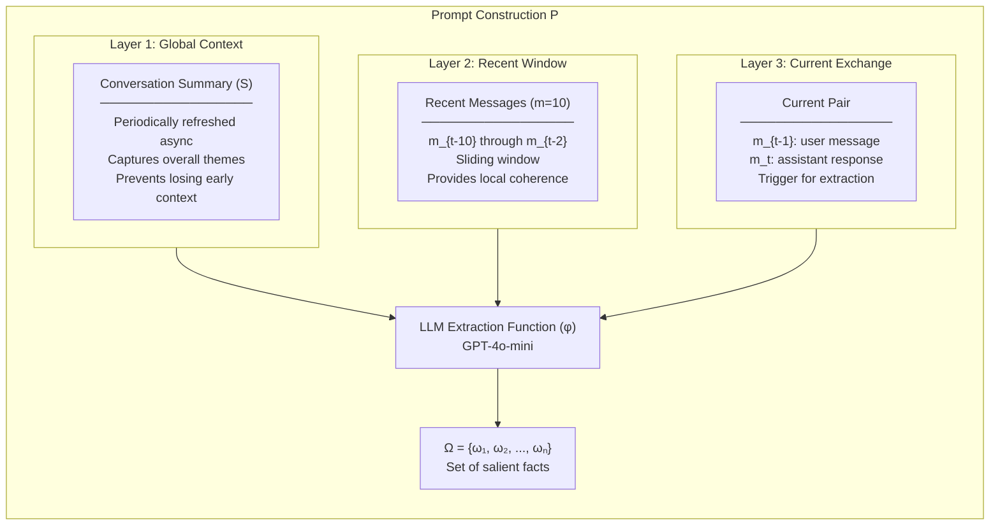
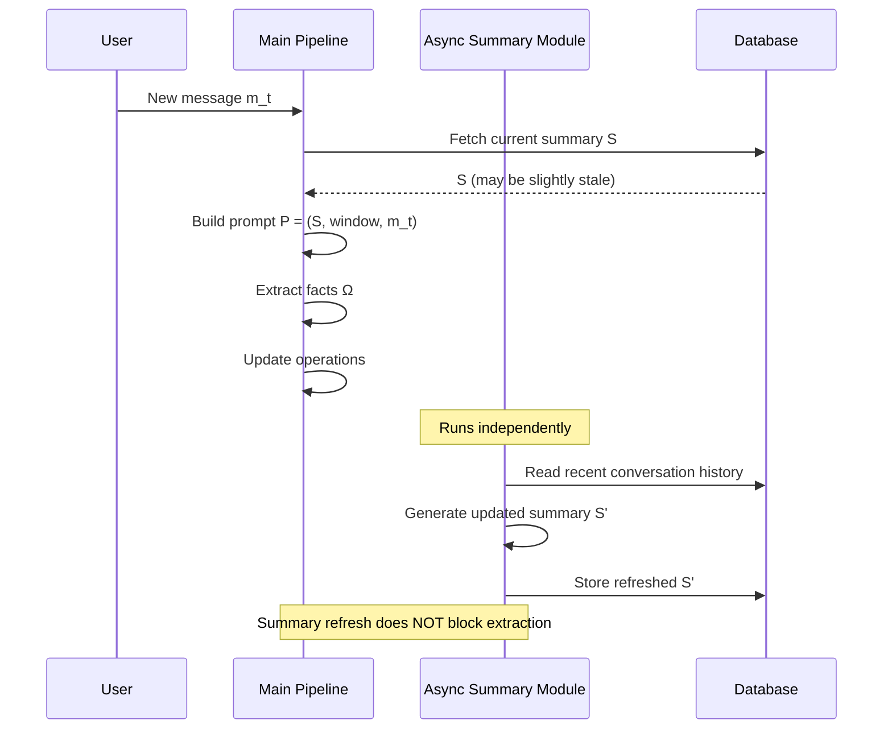
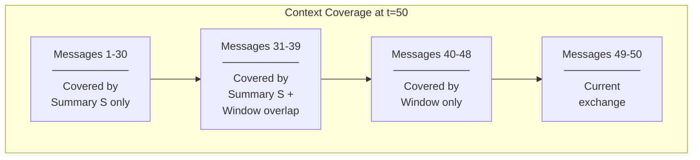
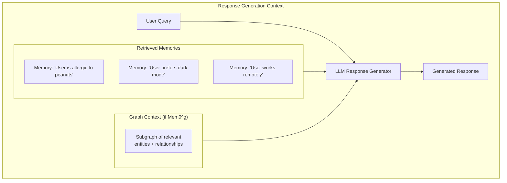

# 02 — Context Management Protocol

> **Part of**: [Mem0 Core Design Report Set](./00-index.md)
> **Paper Reference**: arXiv:2504.19413, Sections 3.1, 3.2, Appendix A

---

### Navigation

| | |
|---|---|
| **Prerequisites** | [01 — Memory Structure](./01-memory-structure.md) (helpful for understanding what extraction produces) |
| **Feeds Into** | [03 — Memory Operations](./03-memory-operations.md) (extracted facts become input to classification) |
| **Overview** | [System Overview & Reading Guide](./00-index.md) |

### Where This Fits in the Pipeline

This report covers **Stages 1–2 (Context Assembly and Extraction)** and **Stage 7 (Response Generation context)** of the Mem0 pipeline. It is the entry point of the ingestion path — before any memory operations, deduplication, or storage can occur, the system must first construct the extraction prompt and identify salient facts. The facts extracted here flow directly into the operation classification process described in [Report 03](./03-memory-operations.md). At query time, this report also covers how retrieved memories (from [Report 05](./05-retrieval.md)) are formatted and injected into the response generation prompt.

---

## Overview

Context management determines **what information the extraction LLM sees** when processing new messages. The quality of extracted memories depends entirely on how the context window is composed. Mem0 uses a layered approach combining global summaries, recent messages, and the current exchange.

---

## 1. The Extraction Prompt

### 1.1 Formal Definition

When a new message pair `(m_{t-1}, m_t)` arrives, the system constructs prompt `P`:

```
P = (S, {m_{t-m}, ..., m_{t-2}}, m_{t-1}, m_t)
```

Where:
- `S` = Conversation summary from database
- `{m_{t-m}, ..., m_{t-2}}` = Sliding window of recent messages
- `m_{t-1}` = Previous message in current exchange
- `m_t` = Current message

(Paper, Section 3.1)

### 1.2 Visual Breakdown



Each fact in Ω is then processed through the operation classification pipeline (see [Report 03](./03-memory-operations.md#1-the-four-operations)).

### 1.3 Why Three Layers?

Each layer solves a specific problem:

| Layer | Problem It Solves | Without It |
|-------|-------------------|------------|
| **Summary (S)** | Long-range context loss | System forgets early conversation topics as window slides |
| **Recent Window (m=10)** | Local coherence | Extraction lacks conversational flow context |
| **Current Exchange** | Trigger identification | System doesn't know what's new vs already processed |

---

## 2. Conversation Summary (S)

### 2.1 Purpose

The summary provides **global thematic context** that the 10-message sliding window cannot capture. In a 600-turn conversation (~26,000 tokens in LOCOMO; Paper, Section 4.1), the window only covers the last 10 messages — the summary ensures the first 590 turns are not invisible.

### 2.2 Async Generation

> "The extraction phase integrates an asynchronous summary generation module that periodically refreshes the conversation summary [...] without introducing processing delays." (Paper, Section 3.1)



### 2.3 Key Properties

- **Non-blocking**: Summary refresh runs asynchronously, never delays the extraction pipeline (Paper, Section 3.1)
- **Periodic**: Not generated on every message — refreshed at intervals (frequency not specified in paper)
- **Cumulative**: Each refresh builds on prior conversation, maintaining continuity
- **Implicit feedback loop**: Extracted memories inform future summaries, which inform future extractions

### 2.4 What the Paper Does NOT Specify

The paper leaves these details unspecified:
- Refresh frequency / trigger condition
- Summary generation prompt
- Maximum summary length
- Whether the summary is append-only or fully regenerated each time

---

## 3. Sliding Message Window

### 3.1 Configuration

| Parameter | Value | Reference |
|-----------|-------|-----------|
| Window size (`m`) | 10 messages | Paper, Section 3.1 |
| Window contents | `{m_{t-m}, ..., m_{t-2}}` | Paper, Section 3.1 |
| Excludes | Current exchange `(m_{t-1}, m_t)` — handled separately | Paper, Section 3.1 |

Note: The window size of 10 is the value used for the LOCOMO benchmark evaluation (Paper, Section 4.1). The paper does not prescribe this as a universal constant.

### 3.2 How the Window Slides

```
Conversation:  [m1] [m2] [m3] [m4] [m5] [m6] [m7] [m8] [m9] [m10] [m11] [m12] [m13]

At t=13:
  Summary S:    covers m1 through ~m10 (async, may lag)
  Window:       [m3] [m4] [m5] [m6] [m7] [m8] [m9] [m10] [m11] [m12]  (m=10)
  Current:      [m12, m13]  (the exchange being processed)
  
At t=14:
  Summary S:    covers m1 through ~m12 (refreshed async)
  Window:       [m4] [m5] [m6] [m7] [m8] [m9] [m10] [m11] [m12] [m13]  (shifted)
  Current:      [m13, m14]
```

### 3.3 The Summary-Window Overlap

There is an intentional overlap between what the summary covers and what the window contains. This provides **redundancy** — if the summary is slightly stale (due to async refresh), the window still provides recent context. If the window misses something from earlier, the summary captures it.



---

## 4. Context at Retrieval Time (Response Generation)

When answering queries (not extracting memories), the system constructs a different context:

> Retrieved memories are formatted as "Memories for user {speaker_1_user_id}" and "Memories for user {speaker_2_user_id}" which are substituted into response generation prompts. (Paper, Appendix A)



The retrieval mechanisms that produce these memories are covered in [Report 05](./05-retrieval.md). The memory schemas that determine what fields are available for formatting are defined in [Report 01](./01-memory-structure.md).

---

## 5. Context Budget Analysis

Understanding token allocation helps clarify the efficiency trade-offs of the Mem0 approach:

```
Extraction Prompt Token Budget (estimated):
┌─────────────────────────────────┬──────────────┐
│ Component                       │ Est. Tokens  │
├─────────────────────────────────┼──────────────┤
│ System prompt + instructions    │ ~500         │
│ Conversation summary (S)        │ ~500-2000    │
│ Recent messages (m=10)          │ ~1000-3000   │
│ Current exchange (m_{t-1}, m_t) │ ~200-1000    │
│ Similar memories (s=10)         │ ~500-1500    │
│ Tool definitions                │ ~300         │
├─────────────────────────────────┼──────────────┤
│ Total input                     │ ~3000-8300   │
│ Output (extracted facts)        │ ~200-800     │
└─────────────────────────────────┴──────────────┘

Compare to full-context approach: ~26,000 tokens average (LOCOMO; Paper, Section 4.1)
Mem0 extraction input: ~3,000-8,300 tokens (68-88% reduction)
```

Note: The "Similar memories (s=10)" component is retrieved via the vector similarity search described in [Report 05, Section 1](./05-retrieval.md#1-base-mem0-vector-similarity-retrieval).

---

## 6. Analysis and Research Observations

This section collects observations about what the paper specifies, what it leaves open, and what the design choices imply for researchers and implementors working on memory-augmented LLM systems.

### 6.1 Open Research Questions from Unspecified Details

The paper defines the high-level protocol for context management (Section 3.1) but leaves several implementation-critical details unspecified. Each represents an open design decision:

| Unspecified Detail | Why It Matters | Possible Approaches |
|--------------------|----------------|---------------------|
| **Summary refresh frequency** | Determines how stale `S` can become relative to the conversation | Every N messages, on topic change detection, on memory conflict, on a time interval |
| **Summary generation prompt** | Controls what information the summary preserves vs discards | Abstractive summarization, structured extraction, key-topic enumeration |
| **Maximum summary length** | Directly impacts the token budget and what can fit alongside the window | Fixed cap (e.g., 500 tokens), proportional to conversation length, adaptive |
| **Append vs regenerate** | Affects whether old summary errors compound or get corrected | Append-only is cheaper but accumulates drift; full regeneration is costlier but self-correcting |

These are not oversights. The paper focuses on the memory extraction and update protocol rather than the summarization subsystem, and different deployment contexts may reasonably choose different strategies. However, any implementation must resolve each of these to achieve consistent behavior.

### 6.2 Implicit Feedback Loop Risk

The context management protocol creates an implicit feedback loop that the paper does not discuss explicitly:

```
Summary S (reflects prior extractions)
    ↓
Extraction prompt P = (S, window, current)
    ↓
Extracted facts Ω
    ↓
Updated memory store
    ↓
Future summaries incorporate Ω
    ↓
Future S reflects prior extraction decisions
    ↓
(cycle repeats)
```

**The risk**: If early extractions are poor (missing key facts, extracting noise), the summary built from those extractions will reflect that bias. Future extraction prompts that include the biased summary may then compound the problem — missing the same kinds of facts or over-weighting the same noise patterns.

This is analogous to model drift in online learning systems. Possible mitigations include:

- Periodically regenerating summaries from raw conversation history rather than from extracted memories
- Using the summary and the memory store as independent signals rather than having one feed the other
- Introducing human-in-the-loop checkpoints for long conversations

The paper's use of an asynchronous summary module (Section 3.1) makes this loop less direct than it would be in a synchronous design, but does not eliminate it.

### 6.3 Summary-Window Overlap as Fault Tolerance

The overlap between the summary's coverage and the sliding window's coverage (Section 3.3 above) appears to be intentional redundancy rather than an inefficiency. This serves as a fault tolerance mechanism:

- **If the summary is stale** (common, since refresh is async and periodic), the window provides accurate recent context as a fallback.
- **If the window misses a relevant earlier message** (inevitable, since it only holds 10 messages), the summary preserves that context.
- **If both cover the same messages**, the extraction LLM sees the same information from two different representations (compressed summary vs raw messages), which may improve extraction quality through signal reinforcement.

This is a deliberate trade-off: a small amount of token budget is spent on redundant coverage in exchange for robustness against the staleness inherent in async summary generation.

### 6.4 Token Budget Comparison

The estimated extraction input of ~3,000-8,300 tokens (Section 5 above) compared to a full-context approach averaging ~26,000 tokens (the LOCOMO benchmark average; Paper, Section 4.1) represents a 68-88% token reduction per extraction call. Several observations follow:

- **Cost scaling**: In a 600-turn conversation, a full-context approach would require the LLM to process ~26k tokens on every turn. Mem0's approach caps input at ~8k regardless of conversation length, making cost sublinear in conversation length.
- **Latency**: Smaller input means faster inference. For real-time conversational systems, this is a practical requirement, not just a cost optimization.
- **Information loss**: The 68-88% reduction necessarily discards information. The three-layer design (summary + window + current) is the paper's answer to the question of what to keep — but the paper does not evaluate extraction quality as a function of window size or summary quality in isolation.
- **Extraction output is small**: The output (~200-800 tokens of extracted facts) is a further compression. The overall pipeline compresses a ~26k-token conversation into a set of discrete memory facts, each on the order of a single sentence.

### 6.5 Response-Time Memory Formatting

The paper provides minimal detail on how retrieved memories are formatted and injected into response generation prompts. Appendix A states that memories are formatted as "Memories for user {speaker_1_user_id}" and "Memories for user {speaker_2_user_id}", but does not specify:

- **How many memories** are injected into a response prompt
- **How memories are ranked or ordered** within the formatted block
- **Whether graph context** (for Mem0^g) is formatted differently from flat memories
- **What the maximum token budget** is for injected memories at response time
- **Whether memory formatting changes** based on query type or conversation phase

This gap is significant because the response generation step is where memory quality directly affects user-visible output. A system could have high-quality extraction and storage but still produce poor responses if the retrieval-and-formatting step is not well designed. The paper's evaluation uses LOCOMO benchmark scores (Paper, Section 4.1) which measure end-to-end quality, so the formatting approach used in evaluation is implicitly validated by the results, but it is not described in enough detail to reproduce independently.

---

## References

- arXiv:2504.19413, Section 3.1 — Extraction phase, prompt construction, async summary generation
- arXiv:2504.19413, Section 3.2 — Memory update operations
- arXiv:2504.19413, Section 4.1 — LOCOMO benchmark parameters (conversation length, window size)
- arXiv:2504.19413, Appendix A — Response generation prompt formatting
