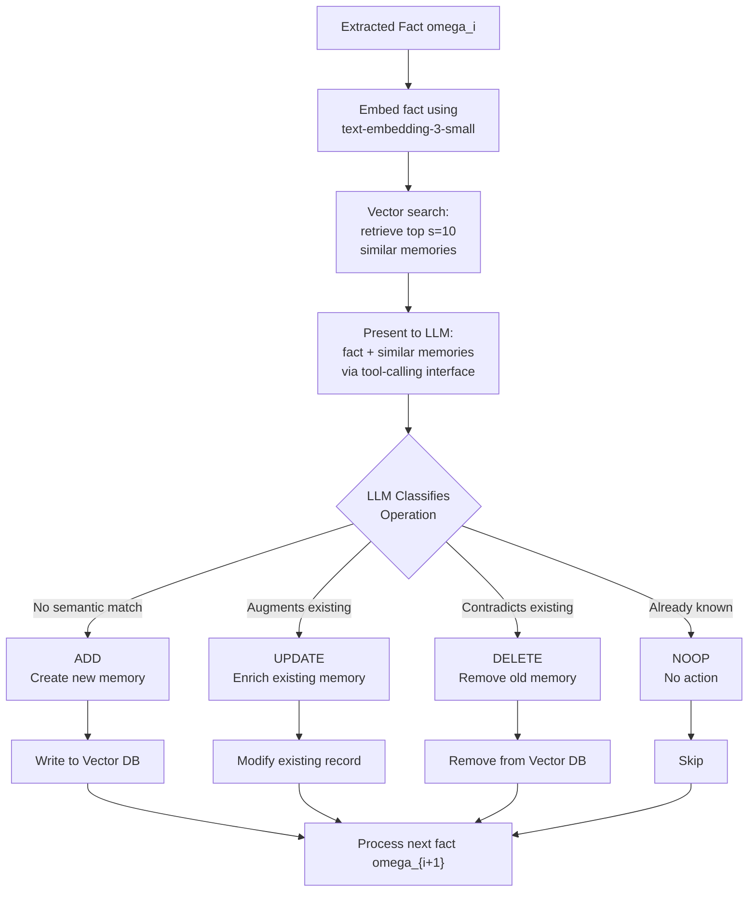
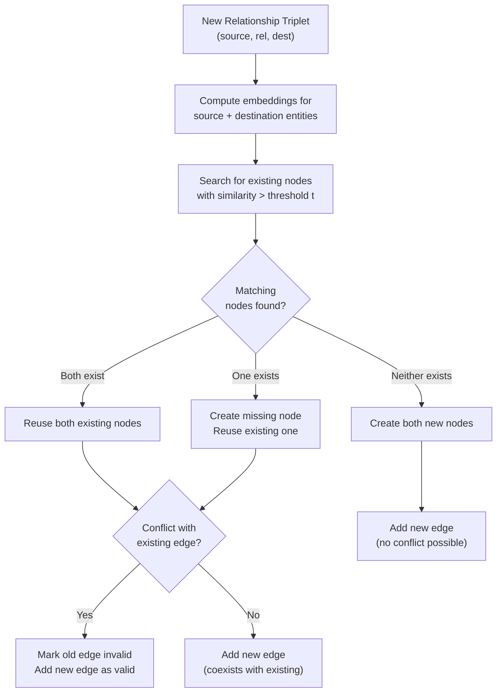
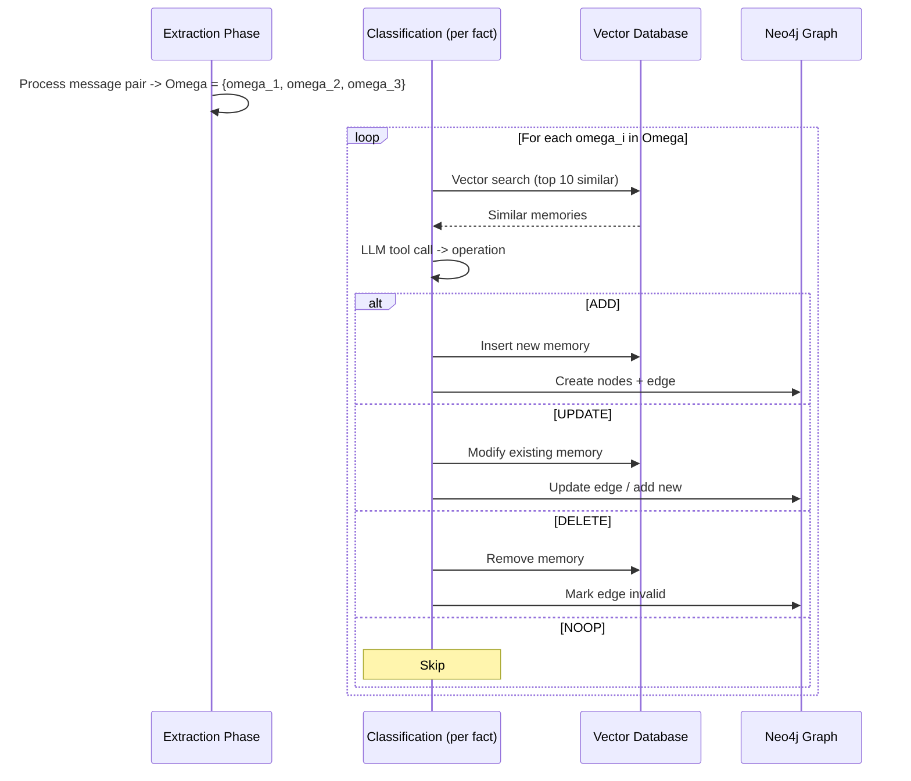

# 03 -- Memory Operations (CRUD)

> **Part of**: [Mem0 Core Design Report Set](./00-index.md)
> **Paper Reference**: arXiv:2504.19413, Sections 3.1, 3.2, 4.1, Appendix B

---

### Navigation

| | |
|---|---|
| **Prerequisites** | [01 — Memory Structure](./01-memory-structure.md) (what gets stored), [02 — Context Management](./02-context-management.md) (extraction produces the facts that enter this stage) |
| **Feeds Into** | [04 — Deduplication & Conflict](./04-deduplication-conflict.md) (operations trigger conflict resolution in graph variant), [01 — Memory Structure](./01-memory-structure.md) (operations write to storage) |
| **Overview** | [System Overview & Reading Guide](./00-index.md) |

### Where This Fits in the Pipeline

This report covers **Stage 3 (Operation Classification)** of the Mem0 pipeline — the decision engine that determines what happens to each extracted fact. It sits between extraction ([Report 02](./02-context-management.md)) and storage ([Report 01](./01-memory-structure.md)). Each fact produced by the extraction phase is evaluated against existing memories and classified as ADD, UPDATE, DELETE, or NOOP. In the graph variant (Mem0^g), these operations trigger the conflict resolution mechanisms detailed in [Report 04](./04-deduplication-conflict.md). The retrieval phase ([Report 05](./05-retrieval.md)) provides the similar-memory search used during classification.

---

## Overview

Mem0's memory lifecycle is governed by **four atomic operations** -- ADD, UPDATE, DELETE, and NOOP -- executed via LLM tool calling. This is not a traditional CRUD layer with hardcoded rules; the LLM itself acts as the decision engine, evaluating semantic relationships between new facts and existing memories.

The classification LLM is called with `temperature=0` to ensure deterministic, reproducible outputs (Section 4.1).

---

## 1. The Four Operations

### 1.1 Definition Table

| Operation | Trigger Condition | Action | Semantic Meaning |
|-----------|-------------------|--------|------------------|
| **ADD** | No semantically equivalent memory exists | Create new memory record | "This is genuinely new information" |
| **UPDATE** | New fact augments/enriches an existing memory | Modify existing memory content | "This adds to something I already know" |
| **DELETE** | New fact contradicts an existing memory | Remove contradicted memory | "This replaces something I thought was true" |
| **NOOP** | Fact is redundant or already captured | No modification | "I already know this" |

(Paper, Section 3.1)

### 1.2 Operation Flow



The embedding step uses text-embedding-3-small (the same embedding model used for retrieval; see [Report 05, Section 1](./05-retrieval.md#1-base-mem0-vector-similarity-retrieval)).

---

## 2. Classification Algorithm

### 2.1 Pseudocode (Paper, Appendix B -- Algorithm 1)

```
Algorithm: ClassifyMemoryOperation
----------------------------------------------
Input:  
  fact f          -- newly extracted salient fact
  memory_store M  -- existing memory database
  s = 10          -- number of similar memories to retrieve

Output: 
  operation in {ADD, UPDATE, DELETE, NOOP}

Procedure:
  1. embedding <- Embed(f)
  2. similar_memories <- VectorSearch(embedding, M, top_k=s)
  
  3. IF similar_memories is empty OR
     NOT SemanticallySimilar(f, similar_memories):
       RETURN ADD(f)
  
  4. FOR EACH m in similar_memories:
     4a. IF Contradicts(f, m):
           RETURN DELETE(m), then ADD(f)
     4b. IF Augments(f, m):
           RETURN UPDATE(m, merge(m, f))
  
  5. RETURN NOOP
```

Note: The paper provides Algorithm 1 in Appendix B. The functions `SemanticallySimilar()`, `Contradicts()`, and `Augments()` are LLM judgments, not threshold-based functions. The actual prompts used to drive these judgments are not published in the paper.

### 2.2 Key Observations

- **Contradiction triggers both DELETE and ADD**: When a fact contradicts an existing memory, the old memory is deleted and the new fact is added. This is a replacement, not just a removal.
- **Augmentation merges content**: The UPDATE operation does not just append -- it produces a merged memory that combines old and new information.
- **NOOP is the default**: If no special condition is met, the system assumes the information is already captured.
- **All decisions are LLM-driven**: `SemanticallySimilar()`, `Contradicts()`, and `Augments()` are not threshold functions -- they are LLM judgments made via tool calling at `temperature=0` (Section 4.1).
- **Classification prompts are unpublished**: The paper describes the decision logic but does not provide the actual system or user prompts supplied to the LLM during classification. This means the quality and edge-case behavior of the classification cannot be independently reproduced from the paper alone.

---

## 3. LLM Tool-Calling Interface

### 3.1 Mechanism

The operations are exposed as **LLM function calls** (tool use), not as programmatic rules:

> "Rather than employing a separate classifier, the system leverages the LLM's reasoning capabilities to directly select the appropriate operation based on the semantic relationship between the candidate fact and existing memories." (Paper, Section 3.1)

### 3.2 Conceptual Tool Schema

The paper does not publish exact schemas, but based on the architecture description:

```json
{
  "tools": [
    {
      "name": "add_memory",
      "description": "Store a new memory when no semantically equivalent memory exists in the database",
      "parameters": {
        "type": "object",
        "properties": {
          "content": {
            "type": "string",
            "description": "The salient fact to store as a new memory"
          }
        },
        "required": ["content"]
      }
    },
    {
      "name": "update_memory",
      "description": "Augment an existing memory with complementary new information",
      "parameters": {
        "type": "object",
        "properties": {
          "memory_id": {
            "type": "string",
            "description": "ID of the existing memory to update"
          },
          "updated_content": {
            "type": "string",
            "description": "The merged content combining old and new information"
          }
        },
        "required": ["memory_id", "updated_content"]
      }
    },
    {
      "name": "delete_memory",
      "description": "Remove a memory that has been contradicted by new information",
      "parameters": {
        "type": "object",
        "properties": {
          "memory_id": {
            "type": "string",
            "description": "ID of the contradicted memory to remove"
          }
        },
        "required": ["memory_id"]
      }
    },
    {
      "name": "noop",
      "description": "No action needed -- the information is already captured in existing memories",
      "parameters": {
        "type": "object",
        "properties": {}
      }
    }
  ]
}
```

### 3.3 What the LLM Sees

```
+-----------------------------------------------------------+
|  LLM Input for Operation Classification                    |
+-----------------------------------------------------------+
|                                                            |
|  System: You are a memory manager. Given a new fact        |
|  and existing similar memories, determine the correct      |
|  operation to perform.                                     |
|                                                            |
|  New Fact: "User switched from Python to Rust"             |
|                                                            |
|  Existing Similar Memories:                                |
|    [id: mem_001] "User prefers Python for backend dev"     |
|    [id: mem_002] "User is learning systems programming"    |
|    [id: mem_003] "User works with multiple languages"      |
|                                                            |
|  Available Tools: add_memory, update_memory,               |
|                   delete_memory, noop                      |
|                                                            |
+-----------------------------------------------------------+
|  LLM Output:                                               |
|  Tool Call: delete_memory(memory_id="mem_001")             |
|  Tool Call: add_memory(content="User switched from         |
|             Python to Rust for backend development")       |
|                                                            |
|  Reasoning: mem_001 states user prefers Python, but        |
|  new fact contradicts this -- user has switched to Rust.   |
|  mem_002 and mem_003 are not contradicted.                 |
+-----------------------------------------------------------+
```

Note: The above system prompt is illustrative. The paper does not publish the actual prompts used for operation classification.

---

## 4. Operations in Graph Memory (Mem0^g)

The graph variant uses a **different but parallel operation set** at the relationship level:

### 4.1 Graph-Specific Operations



This soft deletion mechanism is analyzed in detail in [Report 04, Section 3](./04-deduplication-conflict.md#3-conflict-resolution-graph).

### 4.2 Key Difference: Soft Delete vs Hard Delete

| Aspect | Base Mem0 | Mem0^g Graph |
|--------|-----------|--------------|
| **DELETE action** | Hard delete -- memory removed from vector DB | Soft delete -- edge marked `valid: false` |
| **History preservation** | Lost on delete | Preserved with timestamp |
| **Temporal queries** | Not possible for deleted memories | Possible via invalid edges |
| **Storage cost** | Lower (deleted data freed) | Higher (all versions retained) |

This is the **most architecturally significant difference** between the two systems. Hard DELETE in base Mem0 permanently destroys information with no recovery path, while the graph variant preserves a complete audit trail. The consequences of this design choice are discussed further in Section 7 below.

The structural implications of this difference — what data is preserved or lost in each schema — are covered in [Report 01, Section 3](./01-memory-structure.md#3-base-vs-graph-structural-comparison).

---

## 5. Operation Frequency Analysis

The paper does not provide operation frequency statistics. The following distribution is speculative and based on assumed conversation characteristics -- it is not drawn from empirical data:

```
Estimated Operation Distribution (speculative -- not from paper):
+---------------------------------------------+
|                                              |
|  NOOP:    ~40-50%  (most facts already       |
|                     known or redundant)      |
|  ADD:     ~30-40%  (new facts from new       |
|                     conversation topics)     |
|  UPDATE:  ~10-20%  (refinements to           |
|                     existing knowledge)      |
|  DELETE:  ~5-10%   (contradictions are        |
|                     relatively rare)         |
|                                              |
+---------------------------------------------+
```

Actual distributions would depend heavily on the domain, user behavior patterns, and conversation length. The paper's evaluation (Section 4) measures quality of operations but not their frequency breakdown.

---

## 6. Per-Fact Processing

Each extraction can yield **multiple facts** (Omega = {omega_1, omega_2, ..., omega_n}), and each fact is processed independently through the classification pipeline. The paper describes per-fact processing, not batch classification -- each fact is classified individually against the memory store:



Note: Some open-source implementations of Mem0 add batch-level optimizations (processing multiple facts in a single LLM call). This is an implementation-level optimization, not part of the design described in the paper.

---

## 7. Analysis and Research Observations

This section collects analytical observations about the memory operations design. These are notes from studying the paper and its open-source implementation, not claims made by the paper itself.

### 7.1 LLM-as-Classifier: Flexibility and Risks

The decision to use the LLM as the classification engine -- rather than rule-based heuristics or a separate trained model -- is central to Mem0's design. This approach is more flexible than threshold-based rules: it can handle nuanced semantic relationships (partial contradictions, soft augmentation, context-dependent redundancy) without pre-defining every case.

However, this flexibility is entirely dependent on prompt engineering quality. The LLM's behavior is shaped by the system prompt and the way facts and candidate memories are presented. The paper does not publish the actual prompts used for classification (noted in our analysis of Section 3.1 and Appendix B). This means:

- The quality of ADD/UPDATE/DELETE/NOOP decisions cannot be independently reproduced from the paper alone.
- Prompt wording likely has significant impact on edge cases (e.g., when a fact partially contradicts one memory and partially augments another).
- Different LLMs may respond differently to the same prompt structure, making the approach model-dependent.

### 7.2 Independent Fact Processing and Cross-Fact Dependencies

The paper describes a strictly per-fact processing model: each extracted fact omega_i is classified independently against the memory store. There is no stage where multiple facts are evaluated together before operations are committed.

This design does not address **cross-fact dependencies** -- situations where fact A and fact B together imply something that neither states alone. For example:

- Fact A: "User started a new job at Company X"
- Fact B: "User moved to San Francisco"
- Together these might imply: "User relocated for work" -- but this inference is never made because each fact is processed in isolation.

Similarly, the order in which facts are processed can matter. If fact omega_1 causes a DELETE that removes a memory, fact omega_2 may classify differently than it would have if that memory still existed.

### 7.3 No Human-in-the-Loop

The system is fully automatic. There are no confirmation gates for any operation, including DELETE and UPDATE, which permanently modify or destroy existing knowledge. The LLM decides and the system executes without user review.

For a personal memory system, this means:

- A misclassified contradiction can silently destroy a correct memory.
- An incorrectly merged UPDATE can corrupt a memory without the user ever knowing what it said before.
- The user has no opportunity to intervene between classification and execution.

This is a deliberate design choice that favors low-latency, seamless operation over user control.

### 7.4 Hard DELETE as the Most Significant Architectural Limitation

In base Mem0, DELETE is a hard delete: the memory is removed from the vector database with no preserved history. Once deleted, the previous memory content is unrecoverable.

This is the single most significant architectural limitation compared to the graph variant (Mem0^g), which uses soft deletion (marking edges as `valid: false` while retaining the data). The consequences include:

- No audit trail for what the system previously believed.
- No ability to answer temporal queries ("What did the system think about X last month?").
- No recovery path if a DELETE was triggered by a misclassification.
- No way to detect patterns in belief changes over time.

The graph variant's soft deletion addresses all of these, but only for graph-stored relationships -- the vector store memories in Mem0^g still undergo hard deletion.

### 7.5 Paper Omissions Relevant to Reproducibility

Several details that would be needed for full reproducibility are absent from the paper:

| Detail | Status | Reference |
|--------|--------|-----------|
| Classification prompts (system + user) | Not published | Section 3.1, Appendix B |
| Operation frequency statistics | Not provided | Section 4 evaluates quality, not frequency |
| Exact tool schemas | Not provided | Section 3.1 describes the mechanism conceptually |
| Edge-case handling (partial contradictions, ambiguous augmentation) | Not discussed | -- |
| LLM temperature for classification | Stated: `temperature=0` | Section 4.1 |
| Algorithm pseudocode | Provided | Appendix B, Algorithm 1 |
| Embedding model | Stated: `text-embedding-3-small` | Section 3.2 |
| Top-k retrieval count | Stated: `s=10` | Section 3.2 |

### 7.6 Batch Consolidation is Not in the Paper

The paper describes per-fact processing as the core design. Some open-source implementations and downstream systems add batch consolidation -- classifying multiple facts in a single LLM call for efficiency. This is a practical optimization but introduces different trade-offs:

- Batch processing may allow the LLM to see cross-fact relationships (partially addressing 7.2).
- It changes the prompt structure and may affect classification quality.
- It is not evaluated in the paper's benchmarks, so performance claims do not apply to batch variants.

Any analysis of batch approaches should be evaluated independently, not assumed to inherit the paper's results.

---

## References

- arXiv:2504.19413, Section 3.1 -- Memory operation definitions and LLM tool-calling mechanism
- arXiv:2504.19413, Section 3.2 -- Embedding and retrieval parameters (text-embedding-3-small, s=10)
- arXiv:2504.19413, Section 4.1 -- Experimental setup, temperature=0 for reproducibility
- arXiv:2504.19413, Appendix B -- Algorithm 1 (classification pseudocode)
