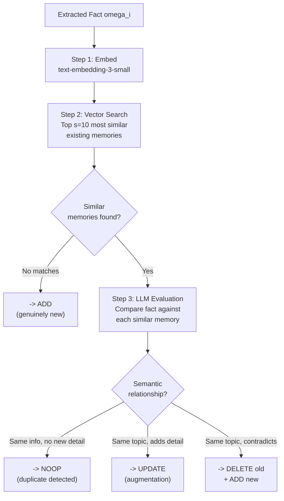
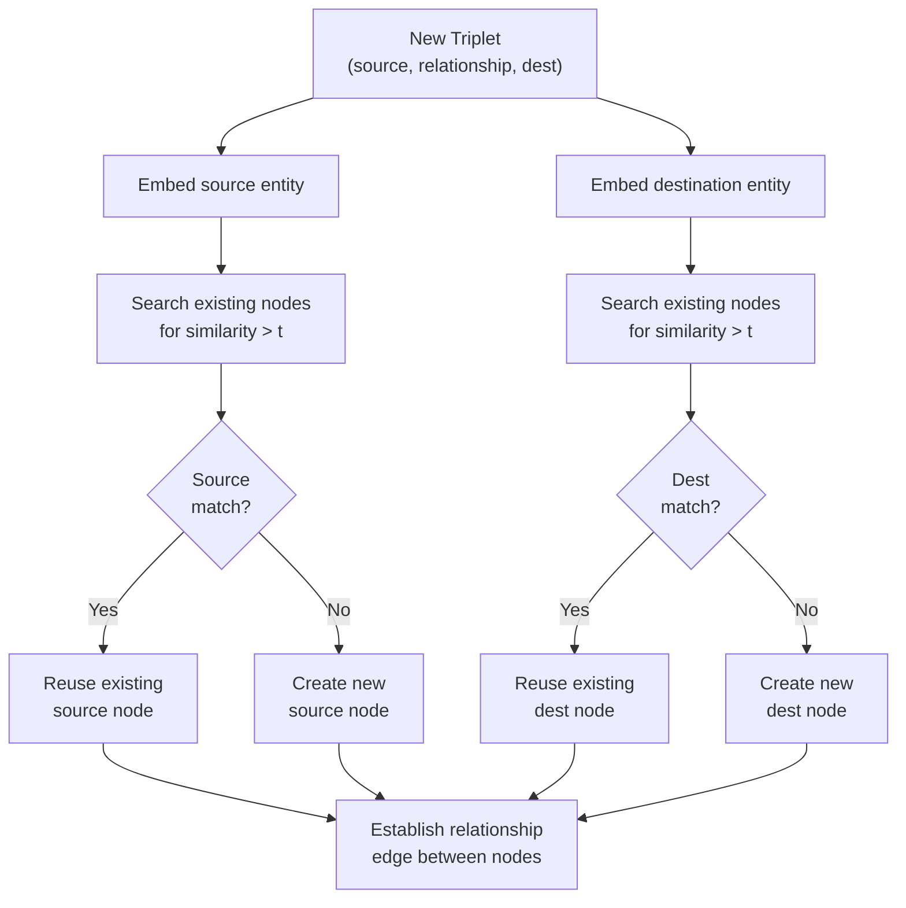
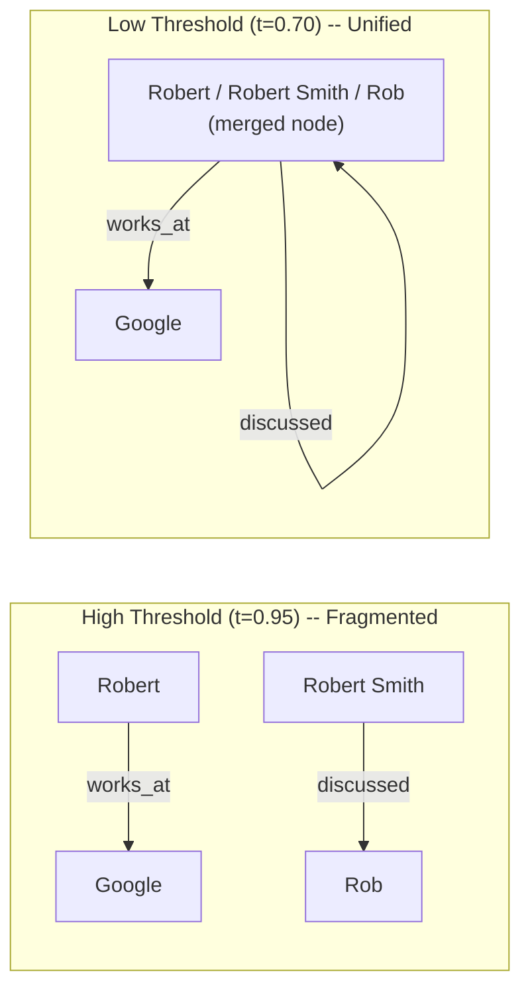
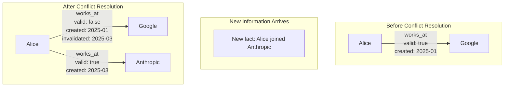
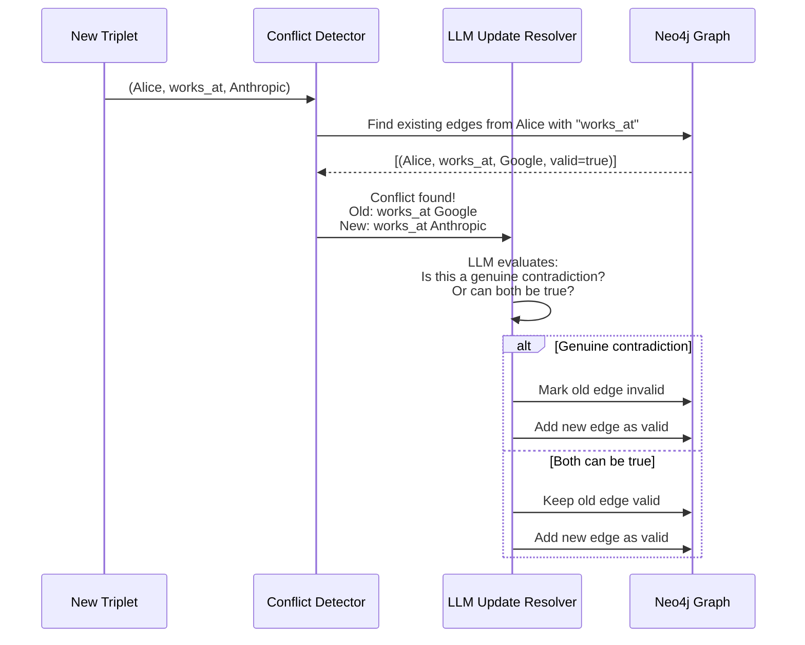
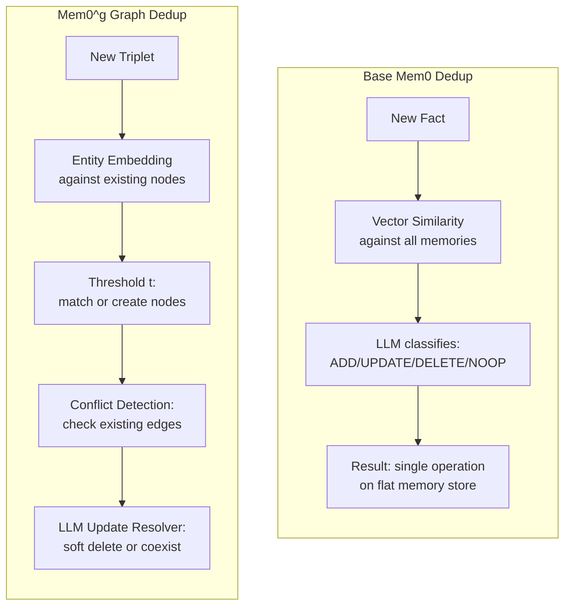

# 04 -- Deduplication & Conflict Resolution

> **Part of**: [Mem0 Core Design Report Set](./00-index.md)
> **Paper Reference**: Sections 3.1, 3.2 (arXiv:2504.19413)

---

### Navigation

| | |
|---|---|
| **Prerequisites** | [01 — Memory Structure](./01-memory-structure.md) (graph schema for entity/edge understanding), [03 — Memory Operations](./03-memory-operations.md) (operations that trigger deduplication) |
| **Feeds Into** | [01 — Memory Structure](./01-memory-structure.md) (soft deletion modifies stored state), [06 — Component Interactions](./06-component-interactions.md) (conflict resolution in the full pipeline) |
| **Overview** | [System Overview & Reading Guide](./00-index.md) |

### Where This Fits in the Pipeline

This report covers **Stage 4 (Deduplication and Conflict Resolution)** of the Mem0 pipeline. In base Mem0, deduplication is embedded within the operation classification stage ([Report 03](./03-memory-operations.md)) — the LLM decides if a fact is redundant during classification. In the graph variant (Mem0^g), an additional entity-level deduplication layer operates on the graph schema defined in [Report 01](./01-memory-structure.md). Conflict resolution here determines whether existing graph edges are soft-deleted or preserved, directly affecting what the retrieval mechanisms in [Report 05](./05-retrieval.md) can surface at query time.

---

## Overview

Deduplication and conflict resolution are **not separate modules** in Mem0 -- they are embedded into the update phase. Every extracted fact passes through a similarity-detection pipeline that determines whether it is novel, redundant, complementary, or contradictory to existing memories. The graph variant adds an additional layer of entity-level deduplication with a configurable similarity threshold.

---

## 1. Deduplication in Base Mem0

### 1.1 Pipeline



Step 2 (Vector Search, top s=10 most similar existing memories) is the same vector search mechanism used at retrieval time; see [Report 05, Section 1](./05-retrieval.md#1-base-mem0-vector-similarity-retrieval).

### 1.2 Two-Stage Detection

Deduplication uses a **two-stage approach**:

| Stage | Method | Purpose | Handles |
|-------|--------|---------|---------|
| **Stage 1: Vector Similarity** | Embedding cosine similarity | Fast candidate retrieval | Topical overlap detection |
| **Stage 2: LLM Judgment** | Semantic reasoning via tool calling | Fine-grained classification | Contradiction vs augmentation vs redundancy |

Stage 2 (LLM Judgment, semantic reasoning via tool calling) uses the tool-calling interface detailed in [Report 03, Section 3](./03-memory-operations.md#3-llm-tool-calling-interface).

> "The system first retrieves the top s semantically similar memories using vector embeddings from the database. These retrieved memories, along with the candidate fact, are then presented to the LLM through a function-calling interface." (Paper, Section 3.1)

### 1.3 Why Two Stages?

Pure vector similarity **cannot distinguish** between these scenarios:

```
Existing memory:  "Alice works at Google"
New fact A:       "Alice works at Google as a senior engineer"  -> AUGMENTS (UPDATE)
New fact B:       "Alice left Google for Anthropic"             -> CONTRADICTS (DELETE)
New fact C:       "Alice is employed at Google"                 -> REDUNDANT (NOOP)
```

All three new facts would have **high vector similarity** with the existing memory. Only the LLM can determine the semantic relationship -- is it the same info restated, additional detail, or a contradiction?

---

## 2. Entity-Level Deduplication in Mem0^g (Graph)

### 2.1 The Threshold `t`

The graph variant adds entity-level deduplication using a configurable similarity threshold:

> "For each new relationship triple, we compute embeddings for both source and destination entities, then search for existing nodes with semantic similarity above a defined threshold t." (Paper, Section 3.2)

### 2.2 Entity Matching Flow



### 2.3 Threshold Sensitivity

The threshold `t` controls the trade-off between **precision and recall** of entity matching:

```
High threshold (e.g., t = 0.95):
  |-- Fewer matches -> more distinct nodes created
  |-- "Robert" and "Robert Smith" might NOT match
  |-- Risk: entity fragmentation (same person = multiple nodes)
  +-- Benefit: no false merges

Low threshold (e.g., t = 0.70):
  |-- More matches -> fewer nodes, denser connections
  |-- "Robert" and "Robert Smith" WILL match
  |-- Risk: merging distinct entities ("Paris" city vs "Paris" person)
  +-- Benefit: unified knowledge per entity
```



### 2.4 Node Creation Outcomes

Based on entity matching results, three outcomes are possible:

| Source Match | Dest Match | Action |
|-------------|------------|--------|
| Exists | Exists | Reuse both nodes, add edge only |
| Exists | New | Reuse source, create dest node, add edge |
| New | New | Create both nodes, add edge |

(Paper, Section 3.2)

---

## 3. Conflict Resolution (Graph)

### 3.1 Conflict Detection

When a new relationship is established between existing nodes, the system checks for **conflicting existing relationships**:

> "The system implements a conflict detection mechanism that identifies potentially conflicting existing relationships when new information arrives." (Paper, Section 3.2)

### 3.2 Conflict Types

```
Type 1: Direct Contradiction
  Existing:  (Alice, works_at, Google)
  New:       (Alice, works_at, Anthropic)
  -> Conflict: same source + same relationship type + different destination

Type 2: Attribute Override  
  Existing:  (Alice, prefers, Python)
  New:       (Alice, prefers, Rust)
  -> Conflict: preference changed

Type 3: No Conflict (Coexistence)
  Existing:  (Alice, works_at, Google)
  New:       (Alice, lives_in, SF)
  -> No conflict: different relationship types
```

### 3.3 Soft Deletion Mechanism

When a conflict is detected, the old relationship is **marked invalid, not physically deleted**:



The validity flags and timestamps shown here correspond to the edge schema defined in [Report 01, Section 2.3](./01-memory-structure.md#23-edge-schema-relationships). At retrieval time, these flags determine which edges are surfaced by default (see [Report 05, Section 2](./05-retrieval.md#2-mem0g-entity-centric-retrieval)).

### 3.4 Why Soft Deletion?

> Obsolete relationships are "marked as invalid rather than physically removing them, enabling temporal reasoning and maintaining historical context." (Paper, Section 3.2)

Benefits:
1. **Temporal queries**: "Where did Alice used to work?" -- traverse invalid edges
2. **Audit trail**: Full history of how knowledge evolved
3. **Rollback capability**: If new information turns out to be wrong, old edges can be revalidated
4. **Memory versioning**: Natural version history through the chain of valid/invalid edges over time

### 3.5 Update Resolver

The **LLM-based update resolver** makes the conflict resolution decision:

> "An LLM-based update resolver determines if certain relationships should be obsolete, marking them as invalid." (Paper, Section 3.2)



The resolver does NOT simply check for matching relationship labels -- it uses **semantic reasoning** to determine if two facts genuinely conflict. For example:
- "Alice works at Google" + "Alice works at Anthropic" -- likely conflict (most people have one employer)
- "Alice speaks English" + "Alice speaks French" -- NOT a conflict (people can speak multiple languages)

---

## 4. Deduplication Comparison: Base vs Graph



| Aspect | Base Mem0 | Mem0^g Graph |
|--------|-----------|--------------|
| **Dedup unit** | Entire fact (text) | Individual entities + relationships |
| **Detection method** | Vector similarity + LLM | Entity embedding threshold + LLM |
| **Configurable threshold** | No (LLM decides) | Yes (`t` for entity matching) |
| **Resolution** | Hard delete / overwrite | Soft delete with validity flags |
| **History preserved** | No | Yes |
| **Granularity** | Coarse (whole memory) | Fine (per entity, per relationship) |
| **False positive risk** | LLM misclassification | Threshold `t` miscalibration |

---

## 5. Edge Cases & Limitations

The paper does **not** address these edge cases, which are important for production systems:

### 5.1 Ambiguous Contradictions
```
Existing: "Alice prefers Python for data science"
New:      "Alice prefers Rust for systems programming"
-> Are these contradictory? (different contexts)
-> LLM must infer domain scope -- fragile
```

### 5.2 Cascading Invalidations
```
Edge 1: (Alice, works_at, Google)       -> invalidated
Edge 2: (Alice, manages, Google_Team_X) -> should this also be invalidated?
Edge 3: (Alice, located_at, Google_MTV) -> should this also be invalidated?
-> Paper does not discuss cascading conflict resolution
```

### 5.3 Entity Merge Errors
```
t = 0.75
"Paris" (city in France) matched with "Paris" (person's name)
-> All relationships incorrectly merged
-> No undo mechanism described
```

### 5.4 Temporal Ambiguity
```
Existing: (Alice, works_at, Google) created 2025-01
New:      (Alice, works_at, Google) created 2025-03
-> Same fact restated -- is this a NOOP or does it refresh the timestamp?
-> Paper does not specify
```

---

## 6. Analysis & Research Observations

### 6.1 Soft Deletion as an Architectural Pattern

The soft deletion mechanism described in Mem0's graph layer represents a broadly applicable architectural pattern for any temporal memory system. Rather than destroying superseded knowledge, marking edges or records as invalid while retaining them enables temporal queries, audit trails, and rollback. This pattern is not unique to knowledge graphs -- it generalizes to any memory store where historical context has value. Systems that hard-delete outdated memories lose the ability to answer questions like "what did the user believe six months ago?" or to recover from incorrect updates.

### 6.2 Absence of Temporal Decay

The paper describes no mechanism for temporal decay in retrieval ranking. A valid memory created six months ago carries the same retrieval weight as one created one day ago. In practice, recency is a strong signal of relevance -- a user's current preferences, recent projects, and latest statements are more likely to matter than older ones. The absence of a decay function or recency boost in the retrieval pipeline is a notable gap. Any system building on this design would need to introduce time-weighted scoring to avoid stale but technically valid memories dominating retrieval results.

### 6.3 Implicit Memory Linking Through Entity Reuse

Entity-level deduplication with threshold `t` creates an implicit linking mechanism across conversations. When "Robert" in conversation A matches "Robert" in conversation B above the threshold, all relationships from both conversations become connected through that shared node. This is not explicit user-created linking -- it is an emergent property of the entity matching pipeline. The result is that the graph naturally accumulates cross-conversation knowledge about entities without any dedicated linking module. The strength of this linking is directly governed by the threshold value: lower thresholds produce more aggressive linking, higher thresholds produce more isolated conversation subgraphs.

### 6.4 Threshold `t` as an Unspecified Hyperparameter

The paper introduces the entity similarity threshold `t` as a core parameter of the graph deduplication pipeline but does not specify its value. This is a configurable hyperparameter that requires domain-specific tuning. Person names may need different thresholds than organization names or technical terms. A single global threshold risks either over-merging (false entity unification) or under-merging (entity fragmentation). The paper provides no guidance on calibration methodology, adaptive thresholds per entity type, or empirical results for different threshold values.

### 6.5 No Cascading Invalidation Mechanism

When a relationship is soft-deleted, related edges that logically depend on it are not automatically re-evaluated. If "Alice works at Google" is invalidated, edges like "Alice manages Google Team X" and "Alice is located at Google MTV" remain valid despite being implicitly dependent on the now-invalid employment relationship. The paper describes no propagation strategy for cascading invalidation. In a production system, this gap could lead to internally inconsistent graph states where derived facts outlive the premises they depend on.

### 6.6 No Entity Merge Undo Mechanism

Once two entities are merged through the threshold-based matching process, the paper describes no mechanism to split them apart. If "Paris" the city is incorrectly merged with "Paris" a person's name at `t = 0.75`, all relationships from both entities become entangled in a single node. Reversing this requires identifying which edges belong to which original entity -- a problem that grows harder as more relationships accumulate on the merged node over time.

### 6.7 Conflict Resolution Without Confidence Scoring

The LLM-based update resolver makes binary decisions (genuine contradiction vs. coexistence) with no associated confidence score. The system treats a high-certainty conflict ("Alice quit Google" vs. "Alice works at Google") identically to an ambiguous one ("Alice prefers Python" vs. "Alice prefers Rust" in potentially different contexts). Without confidence scoring, there is no mechanism to flag low-confidence decisions for human review, no way to prioritize uncertain resolutions for later re-evaluation, and no audit signal indicating which conflict resolutions are most likely to be incorrect.
