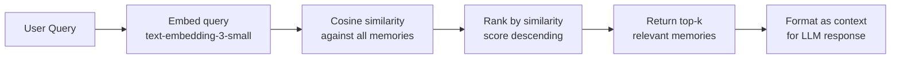
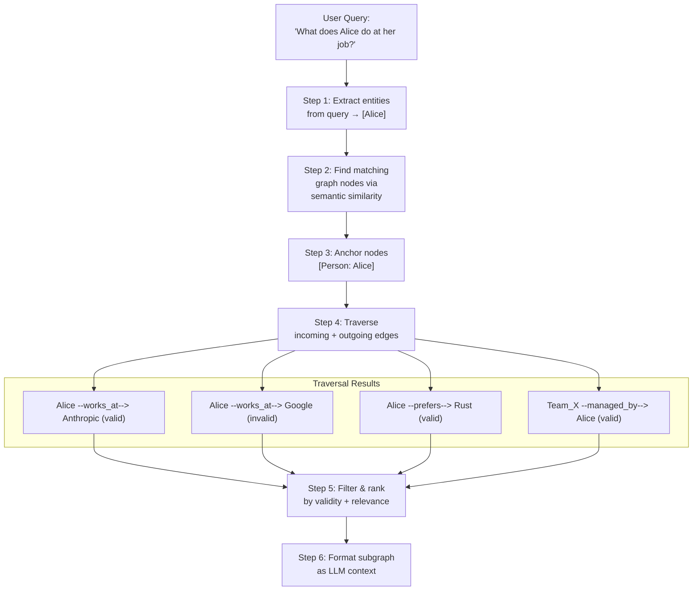
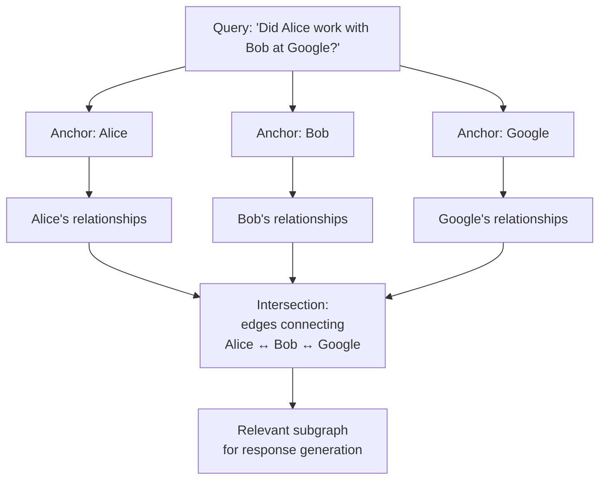
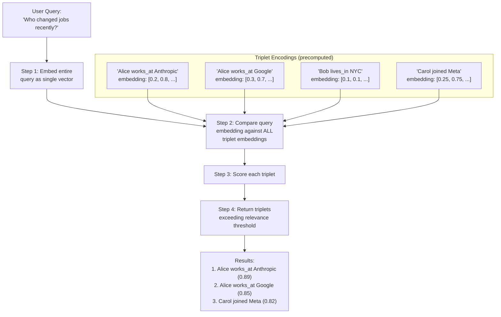
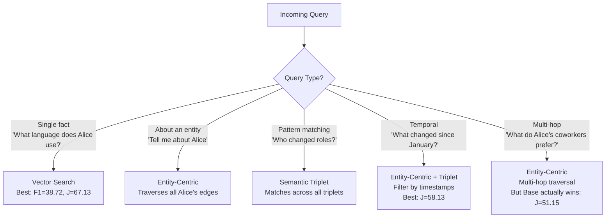
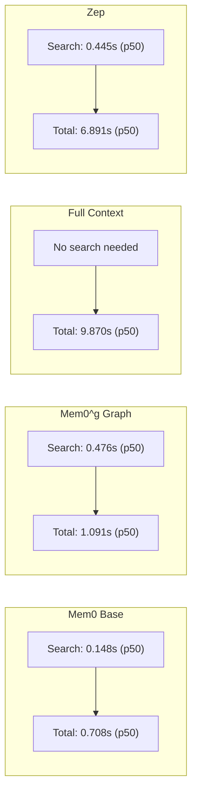

# 05 — Retrieval Mechanisms

> **Part of**: [Mem0 Core Design Report Set](./00-index.md)
> **Paper Reference**: Sections 3.1, 3.2, 4.2, 4.3, Appendix A, Tables 1 and 2 (arXiv:2504.19413)

---

### Navigation

| | |
|---|---|
| **Prerequisites** | [01 — Memory Structure](./01-memory-structure.md) (what is searchable — schemas for dense text and graph) |
| **Feeds Into** | [02 — Context Management](./02-context-management.md) (retrieved memories are formatted for response generation), [03 — Memory Operations](./03-memory-operations.md) (similar-memory retrieval is used during classification) |
| **Overview** | [System Overview & Reading Guide](./00-index.md) |

### Where This Fits in the Pipeline

This report covers **Stage 6 (Retrieval)** of the Mem0 pipeline — the read path that surfaces relevant memories when a query arrives. Retrieval operates over the storage structures defined in [Report 01](./01-memory-structure.md): vector similarity search queries the dense text memory store, while entity-centric traversal and semantic triplet matching query the Neo4j graph. The same vector search mechanism is also used during the ingestion path — [Report 03](./03-memory-operations.md) uses it to find similar existing memories for operation classification, and [Report 04](./04-deduplication-conflict.md) uses entity matching for deduplication. Retrieved results are formatted and injected into the response generation prompt as described in [Report 02, Section 4](./02-context-management.md#4-context-at-retrieval-time-response-generation).

---

## Overview

Retrieval is where memory meets the user's query. Mem0 implements **three retrieval strategies** — vector similarity search (base), entity-centric graph traversal, and semantic triplet matching (both graph). Each excels at different query types, and the system can combine them for comprehensive coverage.

---

## 1. Base Mem0: Vector Similarity Retrieval

### 1.1 Mechanism

The simplest retrieval path: embed the query, search the vector database, return top-k most similar memories.



### 1.2 Characteristics

| Property | Detail |
|----------|--------|
| **Speed** | Fastest — p50: 0.148s, p95: 0.200s (Paper, Table 2) |
| **Mechanism** | Dense embedding cosine similarity |
| **Ranking** | Pure similarity score |

Note that this same similarity search is reused during the ingestion path for operation classification (see [Report 03, Section 1.2](./03-memory-operations.md#12-operation-flow)) and deduplication (see [Report 04, Section 1.1](./04-deduplication-conflict.md#11-pipeline)).

| **Temporal awareness** | None — recent and old memories ranked equally by similarity |
| **Relationship awareness** | None — memories are flat text, relationships are implicit |

### 1.3 Strengths & Weaknesses

```
Strengths:
  + Extremely fast (sub-200ms p95)
  + Simple to implement and debug
  + Works well for direct factual recall
  + Best F1 on single-hop questions (38.72)
  + Best J on multi-hop questions (51.15)

Weaknesses:
  - No temporal ranking — can't answer "most recent" queries
  - No relationship traversal — can't follow chains of facts
  - Similarity does not equal relevance — topically similar but outdated memories rank high
  - No structure — all memories equally flat
```

---

## 2. Mem0^g: Entity-Centric Retrieval

### 2.1 Mechanism

Start from entities mentioned in the query, find matching nodes in the graph, then **traverse relationships** to build a relevant subgraph.

> "First identifies key entities within a query, then leverages semantic similarity to locate corresponding nodes in the knowledge graph. It systematically explores both incoming and outgoing relationships from these anchor nodes." (Paper, Section 3.2)

The node and edge structures being traversed are defined in [Report 01, Sections 2.2–2.3](./01-memory-structure.md#22-node-schema-entities). Edges marked as invalid via soft deletion (see [Report 04, Section 3.3](./04-deduplication-conflict.md#33-soft-deletion-mechanism)) are still traversable but can be filtered by validity.



### 2.2 Traversal Detail

The traversal explores **both directions** from anchor nodes:

```
Given anchor node: [Alice]

Outgoing edges (Alice → ?):
  Alice --works_at--> Anthropic     ← Alice does something
  Alice --prefers--> Rust           ← Alice has a property
  Alice --lives_in--> SF            ← Alice's location

Incoming edges (? → Alice):
  Team_X --managed_by--> Alice      ← something relates TO Alice
  Project_Y --assigned_to--> Alice  ← Alice receives assignment
```

Bidirectional traversal ensures the system captures both what Alice *does* and what *involves* Alice.

### 2.3 Multi-Entity Queries

For queries mentioning multiple entities, the system anchors on **all of them** and explores the intersection:



---

## 3. Mem0^g: Semantic Triplet Matching

### 3.1 Mechanism

Instead of starting from entities, this method treats the **entire query as a single embedding** and matches it against all relationship triplets in the graph.

> "Encodes the entire query as a dense embedding vector. This query representation is then matched against textual encodings of each relationship triplet in the knowledge graph. The system calculates fine-grained similarity scores between the query and all available triplets, returning only those that exceed a configurable relevance threshold." (Paper, Section 3.2)



### 3.2 Triplet Text Encoding

Each relationship is encoded as a **text string** before embedding:

```
Triplet: (Alice, works_at, Anthropic)
Text encoding: "Alice works_at Anthropic"
Embedding: text-embedding-3-small("Alice works_at Anthropic")
```

This means the similarity search considers the **full semantic meaning** of the relationship, not just the entity names or the relationship label individually.

---

## 4. Comparison of Retrieval Methods

### 4.1 Method Properties

| Property | Vector Search (Base) | Entity-Centric (Graph) | Semantic Triplet (Graph) |
|----------|---------------------|----------------------|------------------------|
| **Input** | Query text | Extracted entities | Query embedding |
| **Searches against** | Memory embeddings | Graph nodes then edge traversal | Triplet embeddings |
| **Structure-aware** | No | Yes (follows graph edges) | Partially (matches triplet structure) |
| **Temporal-aware** | No | Yes (validity flags visible) | Yes (can filter by validity) |
| **Multi-hop capable** | No | Yes (traverse multiple edges) | No (single-hop matching) |
| **Speed** | Fastest | Medium | Medium |
| **Best for** | Direct factual recall | "Tell me about X" | "Who did what?" patterns |

### 4.2 Query Type to Method Mapping



### 4.3 Performance by Query Type

| Query Type | Mem0 Base (J) | Mem0^g (J) | Winner | Why |
|------------|---------------|------------|--------|-----|
| **Single-hop** | **67.13** | 65.71 | Base | Direct similarity is sufficient; graph adds latency without benefit |
| **Multi-hop** | **51.15** | 48.23 | Base | Surprising — natural language captures multi-hop context well; graph traversal may over-constrain |
| **Temporal** | 55.51 | **58.13** | Graph | Validity flags + timestamps enable temporal reasoning |
| **Open-domain** | 75.71 | 75.09 | Base (marginal) | External knowledge integration doesn't benefit from graph structure |

(Paper, Table 1)

---

## 5. Retrieval Result Formatting

### 5.1 Context Injection for Response Generation

Retrieved memories are formatted and injected into the response generation prompt:

> Retrieved memories appear as "Memories for user {speaker_1_user_id}" and "Memories for user {speaker_2_user_id}" which are substituted into response generation prompts. (Paper, Appendix A)

```
Response Generation Prompt
──────────────────────────────────────────────────────

  Context:
  ─────────
  Memories for user_alice:
  - Alice works at Anthropic (current)
  - Alice prefers Rust for systems programming
  - Alice previously worked at Google

  Memories for user_bob:
  - Bob is Alice's project lead
  - Bob specializes in distributed systems

  [Graph context if Mem0^g]:
  - Alice --works_at--> Anthropic (valid, 2025-03)
  - Alice --reports_to--> Bob (valid, 2025-03)

  Question: {user_query}

  Instructions: Answer based on the provided memories.
```

The full context assembly protocol — including how retrieved memories combine with conversation summaries and recent messages — is covered in [Report 02](./02-context-management.md#4-context-at-retrieval-time-response-generation).

---

## 6. Latency & Efficiency

### 6.1 Latency Breakdown



### 6.2 Detailed Numbers

| System | Search p50 | Search p95 | Total p50 | Total p95 | Tokens Used |
|--------|-----------|-----------|-----------|-----------|-------------|
| **Mem0 Base** | **0.148s** | **0.200s** | **0.708s** | **1.440s** | ~7k |
| Mem0^g | 0.476s | 0.657s | 1.091s | 2.590s | ~14k |
| Full-Context | — | — | 9.870s | 17.117s | ~26k |
| Zep | 0.445s | 0.756s | 6.891s | 12.561s | 600k+ |
| LangMem | 17.99s | 59.82s | 18.09s | 60.12s | ~28k |

(Paper, Table 2)

### 6.3 Cost-Quality Trade-off

```
Quality (J score) vs Efficiency:

Full-Context:  J=72.90%  |  26k tokens  |  17.1s p95
Mem0 Base:     J=66.88%  |  7k tokens   |  1.4s p95
Mem0^g:        J=66.29%  |  14k tokens  |  2.6s p95

Mem0 Base achieves 92% of full-context quality
at 27% of token cost and 8% of latency.
```

---

## 7. Scoring Function Discussion

### 7.1 Current Approach: Pure Semantic Similarity

The paper's retrieval scoring relies exclusively on cosine similarity between query and memory embeddings. Expressed formally, the current scoring function is:

```
score(memory, query) = alpha * semantic_similarity(memory, query)
```

Where `alpha = 1.0` and all other potential ranking signals are absent. This is true for both the base vector search and the semantic triplet matching method. Entity-centric retrieval uses semantic similarity for node matching but then returns all traversed edges without a composite ranking score.

### 7.2 Toward a More Complete Scoring Function

A richer scoring function would incorporate multiple ranking signals:

```
score(memory, query) =
    alpha * semantic_similarity(memory, query)     # topical relevance
  + beta  * temporal_recency(memory.timestamp)     # prefer recent
  + gamma * validity_weight(memory.valid)          # prefer valid/current
  + delta * relationship_depth(memory, query)      # prefer direct connections
```

Where `alpha`, `beta`, `gamma`, and `delta` are tunable weights. The paper operates at `alpha = 1.0`, `beta = gamma = delta = 0`.

**Temporal recency** could follow an exponential decay model, where a memory's recency score diminishes with age:

```
temporal_recency(timestamp) = exp(-lambda * age_in_days)
```

The decay constant `lambda` would control how aggressively older memories are down-ranked relative to newer ones.

**Validity weight** would distinguish between currently valid and invalidated memories. Invalidated memories (e.g., "Alice works at Google" after she moved to Anthropic) still exist in the store and can still match on similarity. A validity weight of 0 for invalid memories or a reduced weight would prevent stale facts from surfacing.

**Relationship depth** would penalize memories found through longer traversal chains, reflecting the intuition that directly connected information is more likely relevant than information three hops away.

### 7.3 Open Questions

The paper does not explore multi-signal scoring. Key unknowns include:

- How to set the weight parameters across different application domains
- Whether learned weights (via user feedback or click-through data) would outperform fixed heuristics
- How temporal decay interacts with memory validity (an old but still-valid memory vs. a recent but invalidated one)
- Whether different query types demand different weight configurations

---

## 8. Analysis & Research Observations

### 8.1 Hybrid Retrieval Coverage and Routing

Hybrid retrieval — combining vector search, entity-centric traversal, and semantic triplet matching — provides the best coverage across query types. Each method has clear strengths for particular query patterns (see Section 4.3). However, the paper does not describe an **automatic routing mechanism** that selects the appropriate retrieval method for a given query. The evaluation tests each method independently, and it is unclear how a production system would decide which retrieval path (or combination of paths) to invoke without manual configuration or an external query classifier.

This is a meaningful gap. Without automatic routing, a system must either run all three methods on every query (incurring the latency and token cost of the slowest path) or rely on heuristics that the paper does not specify.

### 8.2 Absence of Temporal Ranking Signals

Neither the base vector search nor the graph retrieval methods use **timestamp as a ranking signal**. A valid memory from one year ago ranks the same as one from today, provided the semantic similarity score is equal. The graph methods expose validity flags (allowing a memory to be marked as current or superseded), but validity is a binary state, not a recency gradient.

This is a significant gap for temporal relevance. In most conversational and personal assistant applications, more recent information is more likely to be relevant. A user asking "What am I working on?" almost certainly wants current context, not a semantically similar memory from months ago. The scoring function discussion in Section 7 outlines what a temporal signal could look like, but the paper does not implement or evaluate one.

### 8.3 Unspecified Graph Traversal Depth

The paper describes entity-centric retrieval as exploring "both incoming and outgoing relationships from anchor nodes" (Section 3.2) but does not specify **traversal depth limits**. It is unclear whether the system performs 1-hop traversal (only direct neighbors), 2-hop traversal, or unbounded traversal.

This matters for both performance and relevance. Deeper traversal returns more context but increases latency and introduces noise from loosely related facts. In a densely connected graph, even 2-hop traversal from a popular entity could return hundreds of triplets. The absence of a stated depth policy makes it difficult to reason about the method's scalability characteristics or to reproduce the paper's results.

### 8.4 Base Mem0 Outperforming Graph on Multi-Hop Queries

One of the most surprising results in the paper is that base Mem0 outperforms the graph-enhanced variant on multi-hop queries (J=51.15 vs. J=48.23). Multi-hop questions — those requiring the system to chain together multiple facts ("What do Alice's coworkers prefer?") — are precisely the query type where graph traversal should have a structural advantage.

The likely explanation is that **natural language memory representations capture multi-hop context more effectively than structured graph traversal** for this benchmark. When a memory is stored as "Alice's coworker Bob prefers Python," a single vector similarity match retrieves the full chain. Graph traversal, by contrast, must correctly identify the anchor entity, traverse to the coworker node, then traverse again to the preference — and any error at any hop compounds. Graph traversal may also over-constrain results by following only edges that exist in the graph, missing implicit relationships that natural language captures through co-occurrence.

This result suggests that the value of graph structure lies primarily in temporal reasoning (where graph wins with J=58.13 vs. 55.51) rather than in multi-hop inference.

### 8.5 Efficiency-Quality Trade-off

Mem0 Base achieves **92% of full-context quality** (J=66.88 vs. J=72.90) at **27% of the token cost** (~7k vs. ~26k tokens) and **8% of the latency** (1.4s vs. 17.1s at p95). This is a compelling efficiency-quality trade-off that demonstrates the core value proposition of memory-augmented retrieval over naive full-context approaches.

The graph-enhanced variant (Mem0^g) does not meaningfully improve quality over base (J=66.29 vs. J=66.88) while doubling both token cost (~14k) and latency (2.6s p95). The graph's advantage is narrow: only temporal queries show a clear benefit (J=58.13 vs. J=55.51). For systems where temporal queries are not a primary use case, the added complexity and cost of graph retrieval may not be justified.

### 8.6 Competitor Practicality Concerns

**Zep** uses 600k+ tokens per query and requires multi-hour graph construction delays before the system becomes operational. Despite this overhead, Zep's aggregate J score (63.75) is lower than both Mem0 variants. The extreme token consumption — roughly 85x that of Mem0 Base — makes Zep impractical for cost-sensitive or latency-sensitive deployments, even where its quality were competitive.

**LangMem** presents a different practicality problem. Its p50 search latency of 17.99 seconds (p95: 59.82 seconds) renders it **unusable for interactive applications**. Users in conversational settings expect sub-second response initiation. A system that takes 18 seconds just to search memories — before any response generation occurs — cannot support real-time interaction. LangMem's total p50 of 18.09 seconds confirms that nearly all its latency is in the search phase itself, suggesting a fundamental architectural limitation rather than an optimization opportunity.

These competitor results contextualize Mem0's design decisions. By keeping retrieval simple (dense vector search) and fast (sub-200ms p50 search), Mem0 avoids the scalability and usability pitfalls that affect more complex memory architectures.
