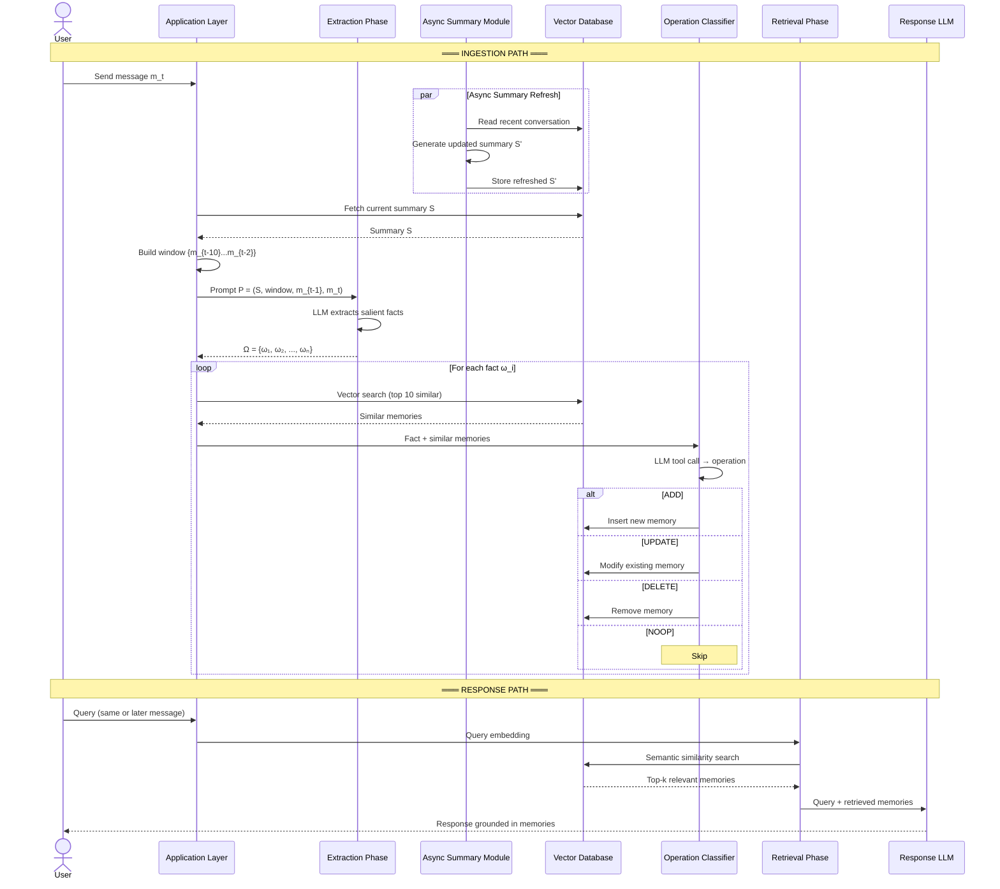
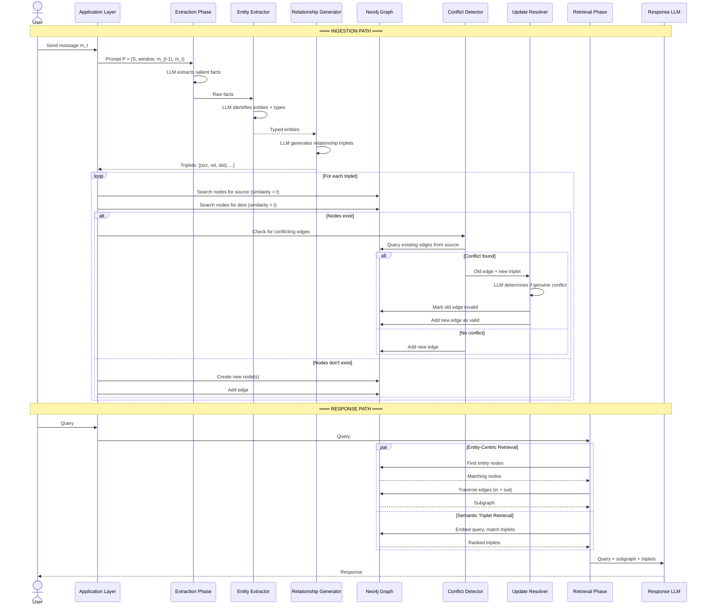
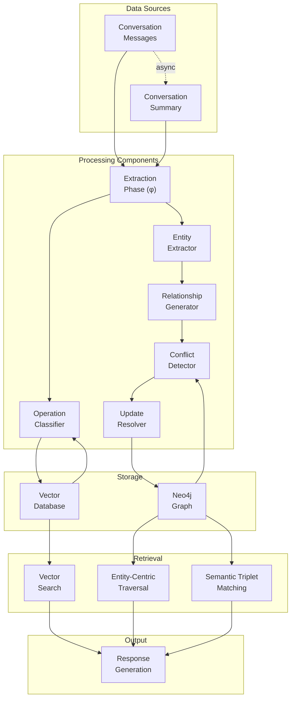
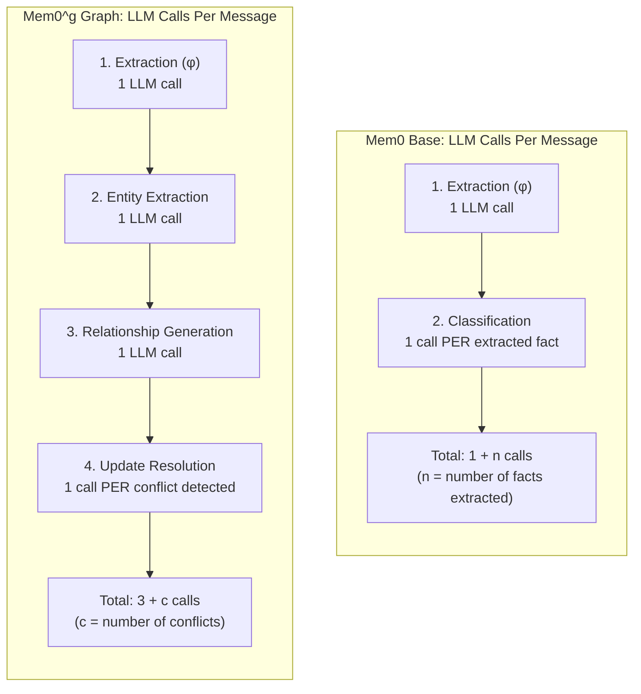
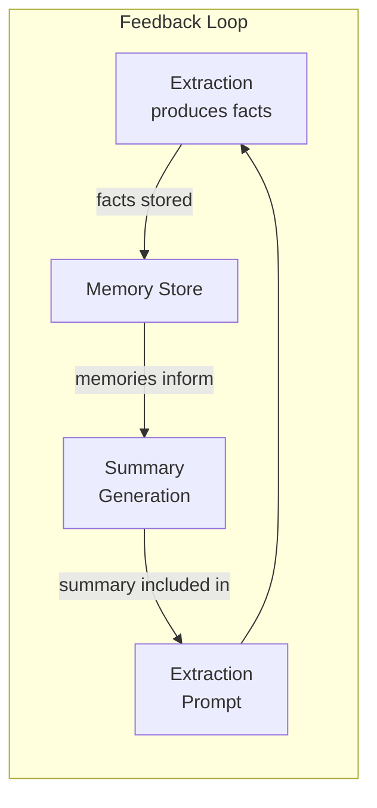
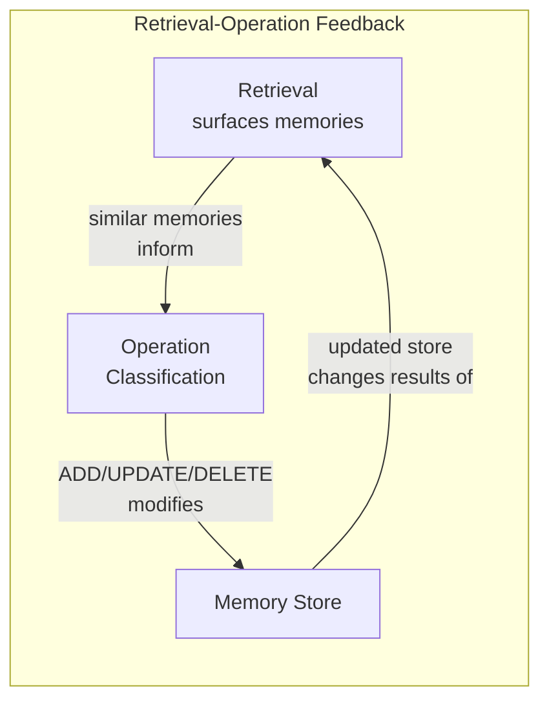
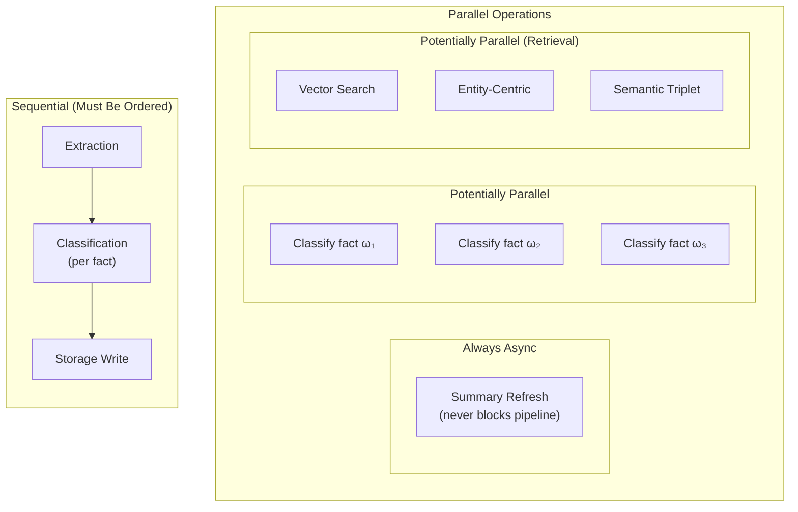
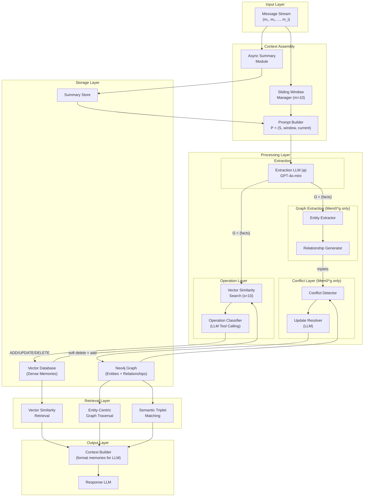
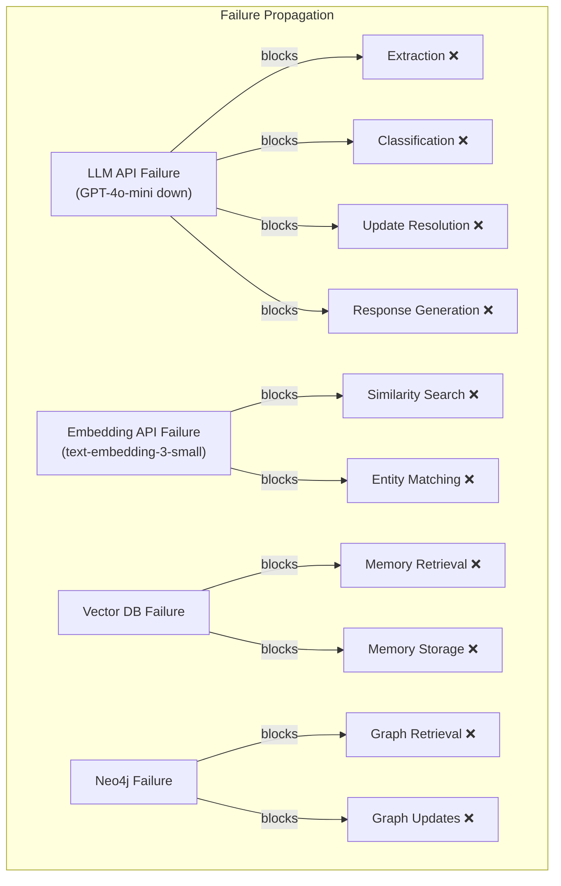

# 06 — Component Interactions

> **Part of**: [Mem0 Core Design Report Set](./00-index.md)
> **Paper Reference**: Sections 3.1, 3.2, 4.2, 4.3, 5 (arXiv:2504.19413)

---

### Navigation

| | |
|---|---|
| **Prerequisites** | All other reports — this report synthesizes interactions across all components. Best read last. |
| **Feeds Into** | This is the synthesis report. It ties together all other reports. |
| **Overview** | [System Overview & Reading Guide](./00-index.md) |

### Where This Fits in the Report Set

This report covers the **end-to-end pipeline** — how all components interact across the full ingestion and response paths. It is best read after the five component reports, as it references concepts from each:
- **Context assembly and extraction** from [Report 02](./02-context-management.md)
- **Memory schemas and storage** from [Report 01](./01-memory-structure.md)
- **Operation classification** from [Report 03](./03-memory-operations.md)
- **Deduplication and conflict resolution** from [Report 04](./04-deduplication-conflict.md)
- **Retrieval mechanisms** from [Report 05](./05-retrieval.md)

Where the other reports examine each component in isolation, this report focuses on data flow between components, feedback loops, concurrency constraints, LLM call budgets, and failure modes.

---

## Overview

This report maps how every component connects — the data flow between extraction, operations, storage, and retrieval. Understanding component interactions is critical for evaluating the system's architectural coherence, identifying bottlenecks, and assessing production readiness.

---

## 1. End-to-End Pipeline: Single Message Processing

### 1.1 Complete Flow (Base Mem0)



### 1.2 Complete Flow (Mem0^g Graph)



---

## 2. Component Dependency Map

### 2.1 Which Components Depend on Which



### 2.2 Dependency Table

| Component | Reads From | Writes To | LLM Required |
|-----------|-----------|----------|--------------|
| **Extraction (phi)** | Conversation, Summary, Recent window | Outputs fact set Omega | Yes (GPT-4o-mini) |
| **Async Summary** | Conversation history | Summary store | Yes |
| **Operation Classifier** | Extracted facts, Similar memories (VDB) | Vector Database | Yes (tool calling) |
| **Entity Extractor** | Extracted facts | Outputs typed entities | Yes |
| **Relationship Generator** | Typed entities, Conversation context | Outputs triplets | Yes |
| **Conflict Detector** | New triplets, Existing graph edges | Flags conflicts | No (rule-based query) |
| **Update Resolver** | Conflicting edges | Graph (soft delete + add) | Yes |
| **Vector Search** | Query embedding, Vector DB | Outputs ranked memories | No |
| **Entity-Centric** | Query entities, Graph nodes + edges | Outputs subgraph | No |
| **Semantic Triplet** | Query embedding, Triplet embeddings | Outputs ranked triplets | No |
| **Response Generator** | Retrieved memories/subgraph, Query | User response | Yes |

Each component in this table is analyzed in depth in its own report. The extraction function (phi) is covered in [Report 02](./02-context-management.md), the operation classifier in [Report 03](./03-memory-operations.md), entity extraction and conflict resolution in [Report 04](./04-deduplication-conflict.md), and all retrieval methods in [Report 05](./05-retrieval.md).

---

## 3. LLM Call Analysis

### 3.1 LLM Calls Per Message (Ingestion)

Understanding the number of LLM calls is critical for cost and latency:



### 3.2 Estimated Call Budget

```
Per message pair processing:

Base Mem0:
  ├── Extraction:     1 call  (~500-1000 output tokens)
  ├── Classification: n calls (~100-200 output tokens each)
  │   (assume n ≈ 3-5 facts per message)
  ├── Async Summary:  amortized ~0.1 calls (runs periodically, not per message)
  └── Total:          ~4-6 LLM calls per message

Mem0^g Graph:
  ├── Extraction:     1 call
  ├── Entity Extract: 1 call
  ├── Rel Generation: 1 call
  ├── Update Resolve: c calls (c ≈ 0-2 conflicts per message)
  └── Total:          ~3-5 LLM calls per message

Per query (retrieval + response):
  ├── Retrieval:      0 LLM calls (embedding + search only)
  └── Response:       1 LLM call
  Total:              1 LLM call per query
```

---

## 4. Feedback Loops

### 4.1 Implicit Feedback Loop: Summary <-> Extraction



> "The extraction phase integrates an asynchronous summary generation module that periodically refreshes the conversation summary [...] ensuring that memory extraction consistently benefits from up-to-date contextual information." (Paper, Section 3.1)

This creates a **virtuous cycle**: better extracted memories lead to better summaries, which provide better context for future extraction, which yields even better memories.

But it also creates a **risk**: if early extractions are poor, the summary will reflect poor understanding, which may bias future extractions — a vicious cycle.

### 4.2 Implicit Feedback Loop: Retrieval <-> Operations



The operation classifier uses **retrieved similar memories** to decide whether to ADD, UPDATE, or DELETE. This means retrieval quality directly affects memory quality, which in turn affects future retrieval quality.

### 4.3 No Explicit Feedback

The paper describes **no explicit feedback mechanisms**:
- No user feedback on memory quality
- No retrieval quality scoring that feeds back into extraction
- No automated evaluation of whether memories are useful
- No learning/adaptation of extraction or classification behavior over time

---

## 5. Concurrency Model

### 5.1 What Runs in Parallel



### 5.2 Ordering Constraints

| Operation | Can Parallelize? | Why / Why Not |
|-----------|-----------------|---------------|
| Summary refresh | Yes (async) | Independent of extraction pipeline |
| Fact extraction | No | Single LLM call produces all facts |
| Fact classification | Maybe | Facts could be classified in parallel IF no cross-dependencies |
| Storage writes | Depends | ADD operations can be parallel; UPDATE/DELETE need ordering to avoid conflicts |
| Retrieval methods | Yes | Vector search + entity-centric + triplet can run concurrently |
| Response generation | No | Must wait for all retrieval results |

### 5.3 What the Paper Does NOT Address

- **Race conditions**: What if two messages arrive simultaneously and extract conflicting facts?
- **Write ordering**: What if fact omega-1 triggers DELETE of memory M, but omega-2 triggers UPDATE of the same M?
- **Consistency model**: Is the system eventually consistent or strongly consistent?
- **Graph locking**: How does Neo4j handle concurrent node/edge modifications?

---

## 6. System-Level Architecture Diagram



---

## 7. Data Transformation Chain

Tracking how data transforms as it flows through the system:

```
Input:
  Raw conversation text
  "Hey, I just switched from Google to Anthropic last month"

  ↓ [Extraction Phase]

Extracted Facts (Omega):
  omega-1: "User switched from Google to Anthropic"
  omega-2: "The switch happened last month"

  ↓ [Entity Extraction — Mem0^g only]

Typed Entities:
  [Person: User]
  [Organization: Google]
  [Organization: Anthropic]
  [Time: last month]

  ↓ [Relationship Generation — Mem0^g only]

Triplets:
  (User, previously_worked_at, Google)
  (User, currently_works_at, Anthropic)
  (User, switched_jobs, last month)

  ↓ [Operation Classification / Conflict Resolution]

Operations Executed:
  Base: DELETE("User works at Google") + ADD("User works at Anthropic")
  Graph: Soft-delete (User, works_at, Google) + Add (User, works_at, Anthropic)

  ↓ [Storage]

Stored State:
  Vector DB: "User switched from Google to Anthropic recently"
  Graph: [User] --works_at (invalid)--> [Google]
         [User] --works_at (valid)--> [Anthropic]

  ↓ [Retrieval — triggered by future query]

Query: "Where does the user work?"
Retrieved:
  Vector: "User switched from Google to Anthropic recently" (similarity: 0.91)
  Graph: (User, works_at, Anthropic, valid=true, 2025-03) 

  ↓ [Response Generation]

Response: "You work at Anthropic — you switched from Google last month."
```

This chain maps directly to the pipeline stages in the [System Overview](./00-index.md#2-the-mem0-pipeline-a-narrative-walkthrough), which walks through the same transformation with a concrete example.

---

## 8. Component Interaction Matrix

Which components communicate directly:

```
                Extract  Summary  Classify  EntityExt  RelGen  Conflict  Resolver  VecDB  Neo4j  VecSearch  EntSearch  TripSearch  Response
Extract           —       reads    writes     writes     —       —         —        —      —       —          —          —          —
Summary          —         —        —          —        —       —         —        reads   —       —          —          —          —
Classify         reads     —        —          —        —       —         —        r/w     —       —          —          —          —
EntityExt        reads     —        —          —       writes   —         —        —       —       —          —          —          —
RelGen            —        —        —         reads      —     writes     —        —       —       —          —          —          —
Conflict          —        —        —          —       reads     —       writes    —      reads    —          —          —          —
Resolver          —        —        —          —        —      reads      —        —      writes   —          —          —          —
VecDB             —        —        —          —        —       —         —        —       —      provides   —          —          —
Neo4j             —        —        —          —        —       —         —        —       —       —        provides   provides     —
VecSearch         —        —        —          —        —       —         —       reads    —       —          —          —         provides
EntSearch         —        —        —          —        —       —         —        —      reads    —          —          —         provides
TripSearch        —        —        —          —        —       —         —        —      reads    —          —          —         provides
Response          —        —        —          —        —       —         —        —       —      reads     reads      reads        —
```

---

## 9. Failure Mode Analysis

### 9.1 Single Points of Failure



**Critical observation**: The LLM (GPT-4o-mini) is the **biggest single point of failure** — it is used in extraction, classification, entity extraction, relationship generation, update resolution, AND response generation. If it goes down, the entire system stops.

The LLM call budget analysis in [Section 3](#3-llm-call-analysis) quantifies this dependency: 4-6 LLM calls per message in base Mem0, each of which fails if the API is unavailable.

### 9.2 Degradation Modes

| Failure | Impact | Possible Degradation |
|---------|--------|---------------------|
| LLM down | Total system failure | Fall back to keyword search + cached responses |
| Embedding API down | No similarity search | Fall back to exact text matching |
| Vector DB down | No memory read/write | Operate without memory (full-context mode) |
| Neo4j down | No graph operations | Fall back to base Mem0 only |
| Summary stale | Reduced extraction quality | Window of m=10 still provides local context |

### 9.3 What the Paper Acknowledges

> "Full-context approach achieves highest J score (73%) despite efficiency penalties." (Paper, Section 4.2)

This implies the system **always underperforms** full-context processing on quality — the trade-off is efficiency, not superiority.

---

## 10. Analysis & Research Observations

This section consolidates cross-cutting observations that emerge from examining the component interactions as a whole. These are not criticisms of the paper's contributions but rather open questions and optimization opportunities relevant to production deployment and future research.

### 10.1 LLM as the Dominant Single Point of Failure

The GPT-4o-mini model is not merely one dependency among many — it is the single component whose failure renders the entire system inoperable. It participates in at least six distinct roles:

1. **Fact extraction** from conversation context
2. **Operation classification** (ADD / UPDATE / DELETE / NOOP) via tool calling
3. **Entity extraction** with type assignment
4. **Relationship triplet generation** from typed entities
5. **Update resolution** when conflicting edges are detected
6. **Response generation** grounded in retrieved memories

No other component in the architecture touches as many pipeline stages. The embedding model (text-embedding-3-small) is the second most critical dependency, but it serves only two stages (similarity search and entity matching). The concentration of responsibility in a single hosted LLM creates correlated failure risk: a rate limit, outage, or degradation at the LLM provider simultaneously breaks ingestion, maintenance, and response generation.

### 10.2 Absence of Explicit Feedback Mechanisms

The paper describes no mechanism by which the system learns from its own outputs or from user behavior:

- **No user feedback on memory quality.** Users cannot flag a retrieved memory as incorrect, outdated, or irrelevant. The system has no signal for whether its extractions are useful.
- **No retrieval quality scoring feeding back into extraction.** If retrieved memories are consistently ignored by the response LLM (or by the user), there is no pathway for that signal to adjust extraction behavior.
- **No adaptation over time.** The extraction prompt, classification logic, and conflict resolution strategy are static. The system processes message 1,000 with exactly the same heuristics it used for message 1.

This means memory quality is entirely determined at write time by the LLM's single-pass judgment. There is no self-correction loop.

### 10.3 Race Condition and Concurrency Risks

As noted in Section 5.3, the paper does not address several concurrency scenarios that would arise in any multi-user or high-throughput deployment:

- **Concurrent messages extracting conflicting facts.** If two messages arrive within the same processing window and produce contradictory facts (e.g., "User lives in Berlin" and "User lives in Munich"), the system has no described mechanism for detecting or resolving the conflict across extraction batches.
- **Write ordering conflicts.** If fact omega-1 triggers a DELETE on memory M while fact omega-2 (from a concurrent message) triggers an UPDATE on the same memory M, the final state depends on execution order. The paper does not specify a consistency model, locking strategy, or conflict queue.
- **Graph-level race conditions.** Neo4j supports concurrent reads and writes, but the paper does not describe how the conflict detection and update resolution pipeline handles simultaneous modifications to the same nodes or edges.

### 10.4 Virtuous and Vicious Cycle Risk in Summary-Extraction Feedback

The summary-extraction feedback loop (Section 4.1) is the most architecturally consequential implicit feedback mechanism in the system. In the positive case, accurate early extractions produce high-quality summaries, which provide rich context for future extraction — a virtuous cycle. However, the same loop operates in reverse: if early extractions are poor (due to ambiguous conversation, LLM hallucination, or prompt sensitivity), the summary will encode that poor understanding. Future extraction prompts will then include a misleading summary, potentially reinforcing extraction errors — a vicious cycle.

The paper does not describe any mechanism to detect or break a vicious cycle once it begins. There is no summary quality evaluation, no periodic summary reset, and no comparison between summary-informed and summary-free extraction to assess drift.

### 10.5 Batch LLM Calls as an Unrealized Cost Optimization

The paper's architecture processes each extracted fact individually: one LLM call per fact for operation classification (Base Mem0), and one LLM call per conflict for update resolution (Mem0^g). For a message that produces n=5 facts, this means 5 separate classification calls, each with its own prompt construction, API round-trip, and token overhead.

An alternative not explored in the paper is batching multiple facts into a single classification call — presenting all n facts and their respective similar memories in one prompt and receiving n classification decisions in one response. This would reduce per-message LLM call count from 1+n to approximately 2 (one for extraction, one for batch classification), with proportional reductions in latency and API cost. The trade-off is increased prompt complexity and potential interference between classification decisions, but this is a standard optimization in production LLM systems.

### 10.6 Precomputing Embeddings at Write Time

The paper describes entity-centric and semantic triplet retrieval at query time, but does not make explicit whether entity and triplet embeddings are computed at write time (when the triplet is created) or at query time (when a retrieval request arrives). If embeddings are computed on demand at query time, this adds unnecessary latency to every retrieval call, since the stored entities and triplets do not change between writes.

Precomputing and caching embeddings at write time — when new entities and triplets are created or updated — would shift the computational cost to the ingestion path (which is less latency-sensitive) and make retrieval a pure lookup operation against pre-indexed vectors.

### 10.7 Quality vs. Efficiency: The Fundamental Trade-Off

The paper's evaluation results establish an important ceiling: the full-context approach achieves the highest quality score (J = 72.90%), while Mem0 Base achieves J = 66.88% and Mem0^g achieves J = 66.29% (Paper, Section 4.2). Neither memory-based variant matches, let alone exceeds, the quality of simply providing the entire conversation history to the LLM.

This is not a flaw — it is the explicit trade-off the system makes. The value proposition of Mem0 is efficiency (bounded context window usage, reduced token cost at scale) rather than quality superiority. Any evaluation of the architecture should be grounded in this reality: the system trades approximately 6 percentage points of quality for dramatically lower per-query context requirements. Whether that trade-off is acceptable depends entirely on the deployment context — conversation length, cost constraints, and quality sensitivity.
