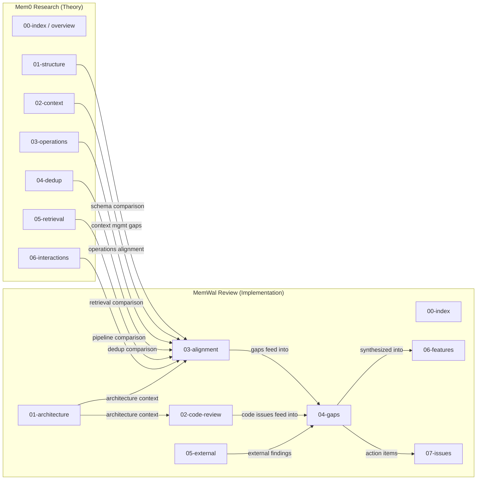

# MemWal Architecture Review -- Index

**Branch**: `feat/memory-structure-upgrade`
**Commit**: `ec00986` by ducnmm (Henry), April 6 2026
**Reviewer**: AI-assisted review pipeline
**Date**: April 2026

---

## TL;DR

MemWal implements the Mem0 base architecture with substantial improvements (typed memories, composite scoring, 3-stage dedup, universal soft deletion, batch consolidation, concurrency safety). The graph variant (Mem0^g) -- which enables relationship-based queries and excels at temporal reasoning -- is entirely absent. Two P0 code issues (SQL injection, transaction held during upload) need fixing before merge. Overall: strong foundation, clear path forward.

---

## Review Documents

| # | Document | Focus |
|---|----------|-------|
| 01 | [Architecture Overview](./01-architecture-overview.md) | What MemWal IS -- schema, API surface, flow diagrams, scoring formula |
| 02 | [Code Review](./02-code-review.md) | Review of commit ec00986 -- P0/P1/P2 issues, implementation quality |
| 03 | [Mem0 Alignment](./03-mem0-alignment.md) | Component-by-component comparison against the Mem0 paper |
| 04 | [Gap Analysis & Recommendations](./04-gap-analysis.md) | Consolidated gaps, severity assessment, recommended actions |
| 05 | [External Evaluation](./05-external-evaluation.md) | Cadru readiness experiment -- external consumer's perspective |
| 06 | [Features & Quality](./06-features-and-quality.md) | What MemWal built, Mem0 comparison, the graph question, scorecard |
| 07 | [Issues & Action Plan](./07-issues-and-actions.md) | All P0–P3 issues, architecture gaps, phased action plan with timeline |

---

## Relationship to Mem0 Research

> **Foundation**: This review builds on our [Mem0 Paper Analysis](../mem0-research/00-index.md) -- a 7-report deep dive into the architecture MemWal is based on, including a system overview and reading guide. Start there if you need the theoretical foundation.

The diagram below shows how the two report sets relate. The Mem0 research reports provide the theoretical baseline; each feeds into the alignment analysis (doc 03), which in turn drives the gap analysis (doc 04).

---

## Master Scorecard

| Area | Mem0 Paper | MemWal | Rating |
|------|-----------|--------|--------|
| Memory schema & typing | Untyped facts | 5 types + importance + access tracking + metadata | **Exceeds** |
| Content dedup | LLM-only | SHA-256 + vector + LLM (3-stage) | **Exceeds** |
| Soft deletion | Graph edges only | Universal (superseded_by + valid_until) | **Exceeds** |
| Memory operations | 4 ops, per-fact | 4 ops, batch + integer ID mapping + fallback | **Exceeds** |
| Composite scoring | Pure similarity | 4-signal weighted scoring with temporal decay | **Exceeds** |
| Concurrency safety | Not addressed | Advisory locks + transactional inserts | **Exceeds** |
| Context management | 3-layer prompt (S + window + current) | Raw text input (caller-managed) | **Different** |
| Conversation summary | Async periodic generation | Not implemented | **Gap** |
| Graph memory G=(V,E,L) | Full implementation | Not implemented | **Gap** |
| Entity extraction | LLM-based with types | Not implemented | **Gap** |
| Relationship triplets | Directed labeled edges | Not implemented | **Gap** |
| Entity-centric retrieval | Graph traversal | Not implemented | **Gap** |
| Semantic triplet matching | Query vs triplet embeddings | Not implemented | **Gap** |
| Feedback loops | Summary <-> extraction | Not implemented | **Gap** |

---

## Reading Paths

- **Quick assessment** (15 min): Read this index + [04-Gap Analysis](./04-gap-analysis.md)
- **Technical review** (1 hour): [01-Architecture](./01-architecture-overview.md) -> [02-Code Review](./02-code-review.md) -> [04-Gap Analysis](./04-gap-analysis.md)
- **Full deep dive** (2+ hours): All 7 docs in order (01-07), cross-referencing [Mem0 reports](../mem0-research/00-index.md) as needed

---

## Issue Summary

| Priority | Count | Key Items |
|----------|-------|-----------|
| P0 | 2 | SQL injection in `search_similar_filtered`, transaction held during Walrus upload |
| P1 | 3 | 5x over-fetch in recall, sequential touch queries, `InsertMemoryMeta` duplication |
| P2 | 4 | Sequential consolidation decrypts, emoji tokens, hardcoded decay rate, dead code |
| P3 | 2 | Missing `superseded_by` index, consolidation prompt missing type/importance |
