# 01 -- MemWal Architecture Overview

> **Branch**: `feat/memory-structure-upgrade` (commit [ec00986](https://github.com/MystenLabs/MemWal/commit/ec00986ed3695429dd3f5e32c78e44ce81ac1641))
> **Author**: ducnmm (Henry)
> **Date**: April 6, 2026

---

### Navigation

| | |
|---|---|
| **Part of** | [MemWal Review Set](./00-index.md) |
| **Next** | [02 -- Code Review](./02-code-review.md) |
| **Mem0 Foundation** | [Mem0 Paper Analysis](../mem0-research/00-index.md) |

### Purpose

This document describes what MemWal IS -- its schema, API surface, data flows, and scoring formula. It provides the architectural context needed for the code review ([Report 02](./02-code-review.md)) and the Mem0 alignment analysis ([Report 03](./03-mem0-alignment.md)).

---

## Table of Contents

1. [Overview](#1-overview)
2. [API Surface](#2-api-surface)
3. [Flow Diagrams](#3-flow-diagrams)
4. [Sequence Diagrams](#4-sequence-diagrams)
5. [Composite Scoring Formula](#5-composite-scoring-formula)
6. [SDK Usage](#6-sdk-usage)
7. [AI Middleware](#7-ai-middleware)
8. [Key Design Decisions](#8-key-design-decisions)

---

## 1. Overview

MemWal is a **structured memory layer** for AI agents with privacy-first design. Memories are typed, scored, temporally-aware, and encrypted end-to-end via SEAL + Walrus.

### System Architecture

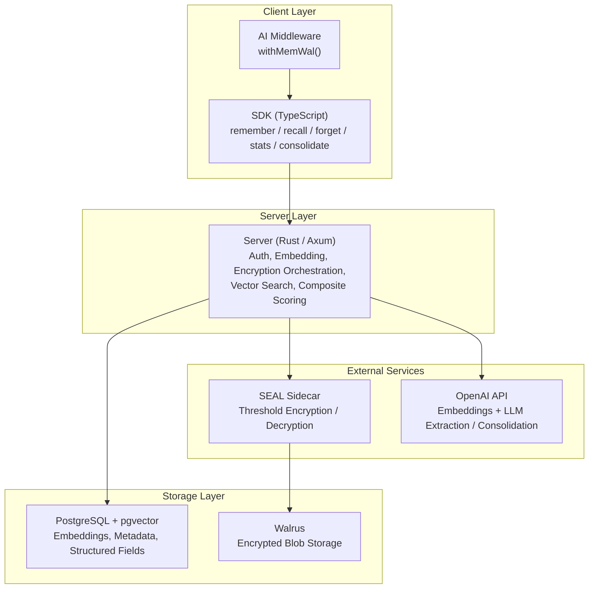

### Core Components

| Component | Role |
| --- | --- |
| **SDK (TypeScript)** | Client library -- `remember()`, `recall()`, `forget()`, `stats()`, `consolidate()` |
| **Server (Rust/Axum)** | API server -- auth, embedding, encryption orchestration, vector search |
| **PostgreSQL + pgvector** | Vector DB -- stores embeddings, metadata, structured fields |
| **SEAL Sidecar** | Encryption/decryption proxy (threshold encryption) |
| **Walrus** | Decentralized blob storage for encrypted memory payloads |
| **OpenAI API** | Embedding generation + LLM fact extraction/consolidation |

### Memory Schema

| Field | Type | Description |
| --- | --- | --- |
| `id` | `UUID` | Unique memory identifier |
| `owner` | `TEXT` | Sui wallet address (derived from delegate key) |
| `namespace` | `TEXT` | Memory isolation scope (default: `"default"`) |
| `blob_id` | `TEXT` | Walrus blob reference for encrypted payload |
| `embedding` | `VECTOR(1536)` | Semantic embedding vector |
| `memory_type` | `TEXT` | `fact` / `preference` / `episodic` / `procedural` / `biographical` |
| `importance` | `FLOAT` | 0.0 (trivial) to 1.0 (critical) |
| `source` | `TEXT` | `user` / `extracted` / `system` |
| `access_count` | `INTEGER` | Times this memory has been retrieved |
| `last_accessed_at` | `TIMESTAMPTZ` | Last retrieval timestamp |
| `content_hash` | `TEXT` | SHA-256 of plaintext (fast dedup without decrypting) |
| `metadata` | `JSONB` | Tags, context, arbitrary key-values |
| `superseded_by` | `TEXT` | Points to the newer memory that replaced this one |
| `valid_from` | `TIMESTAMPTZ` | When this fact became true |
| `valid_until` | `TIMESTAMPTZ` | When invalidated (NULL = still active) |

> **Mem0 cross-reference**: This schema extends the Mem0 base memory model (see [Mem0 Report 01, Section 1.2](../mem0-research/01-memory-structure.md#12-schema)) with typed memories, importance scoring, access tracking, and universal soft deletion. The Mem0 paper stores dense text facts with embeddings but does not define memory types, importance, access counters, content hashes, or temporal validity windows.

---

## 2. API Surface

| Endpoint | Method | Description |
| --- | --- | --- |
| `/api/remember` | POST | Store a memory (auto: embed, encrypt, upload, store) |
| `/api/recall` | POST | Semantic search with composite scoring |
| `/api/analyze` | POST | Extract facts from text, dedup, consolidate, store |
| `/api/forget` | POST | Soft-delete memories by semantic query |
| `/api/consolidate` | POST | LLM-driven merge/dedup/cleanup of existing memories |
| `/api/stats` | POST | Memory statistics (counts, types, importance, storage) |
| `/api/remember/manual` | POST | Store pre-encrypted memory (SDK handles encryption) |
| `/api/recall/manual` | POST | Raw vector search (SDK handles decryption) |
| `/api/ask` | POST | RAG: recall relevant memories, then LLM answer |
| `/api/restore` | POST | Restore memories from Walrus backup |
| `/health` | GET | Health check |

The primary five operations (`remember`, `recall`, `analyze`, `forget`, `consolidate`) map to the Mem0 paper's core lifecycle. The `manual` variants, `ask`, `restore`, and `stats` endpoints are MemWal additions with no direct Mem0 equivalent.

---

## 3. Flow Diagrams

### 3.1 Remember

The remember flow performs content-hash deduplication before any network calls, then runs embedding and encryption in parallel for new memories.

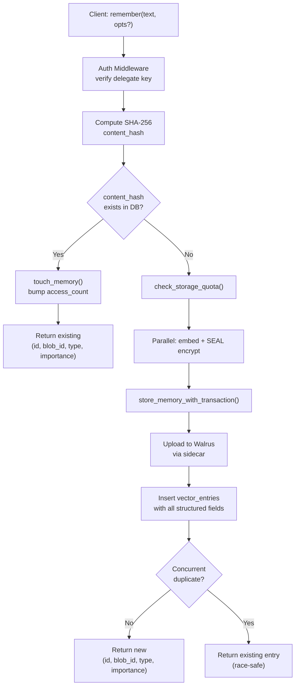

### 3.2 Recall (with Composite Scoring)

Recall oversamples by 5x, decrypts each hit, computes a four-signal composite score, then truncates to the requested limit.

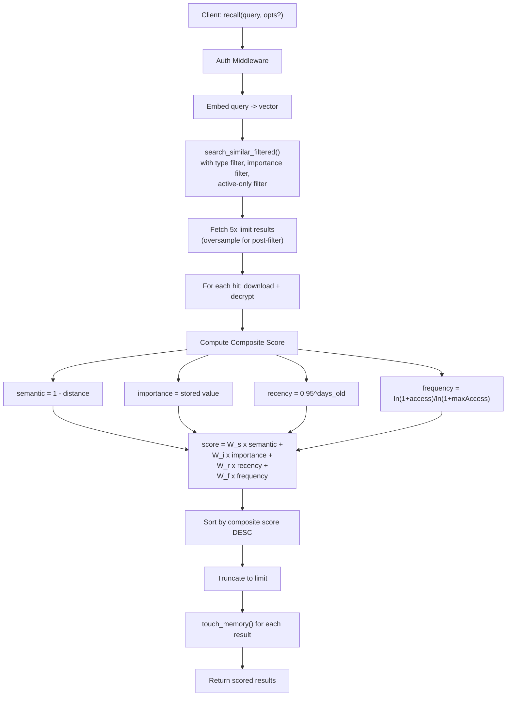

### 3.3 Analyze (3-Stage Pipeline)

The analyze endpoint runs a multi-stage pipeline: extract structured facts via LLM, fast-path dedup via content hash, find similar existing memories via vector search, then batch-consolidate via a single LLM call.

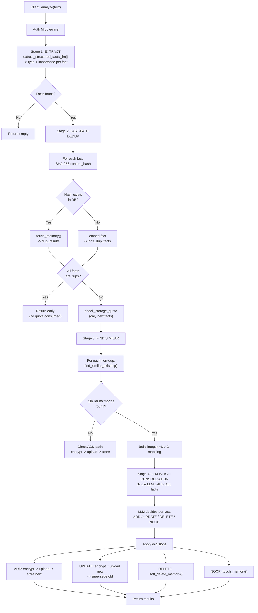

> **Mem0 cross-reference**: The batch consolidation approach is an improvement over the Mem0 paper's per-fact processing (see [Mem0 Report 03, Section 6](../mem0-research/03-memory-operations.md#6-per-fact-processing)). It reduces LLM calls from 1+n to approximately 2 per analyze invocation -- one for extraction, one for batch consolidation -- yielding significant cost and latency savings when processing messages that contain multiple facts.

### 3.4 Forget

Forget embeds the query, finds similar active memories via vector search, and soft-deletes each match by setting `valid_until = NOW()`.

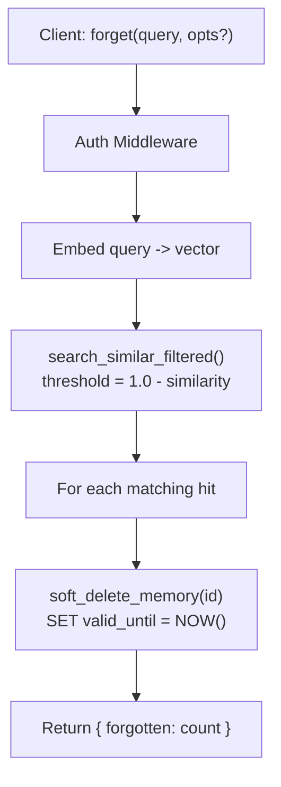

### 3.5 Consolidate

Consolidate fetches all active memories, decrypts them, sends the full set to a single LLM call for batch consolidation, and applies the resulting decisions.

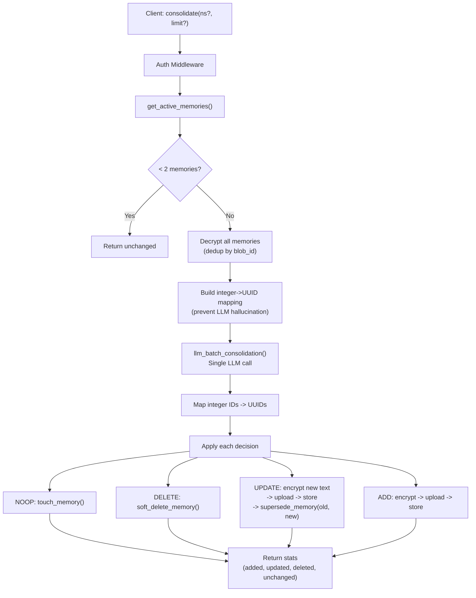

---

## 4. Sequence Diagrams

### 4.1 Remember

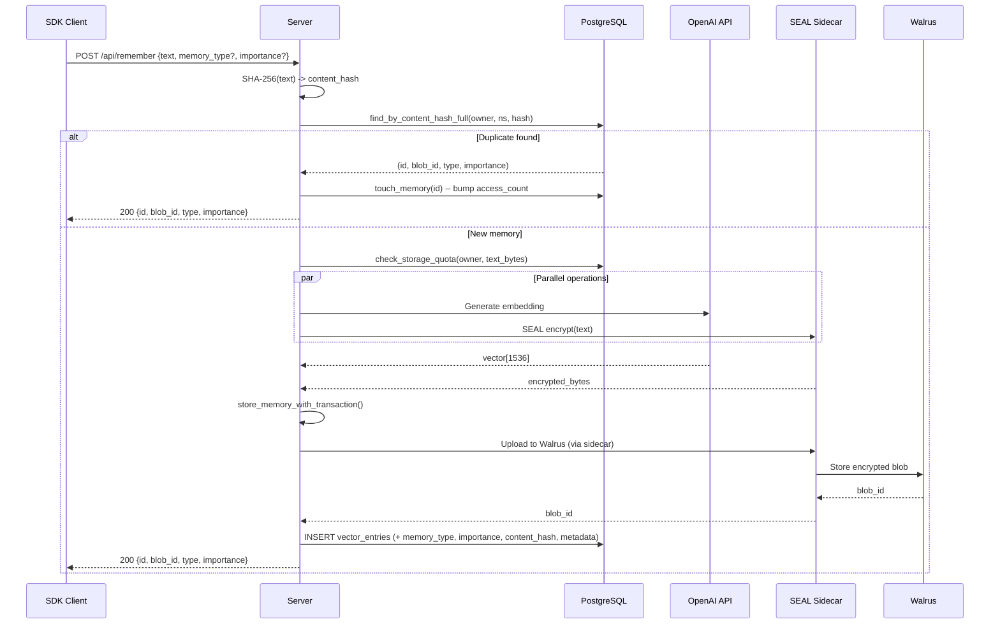

### 4.2 Recall

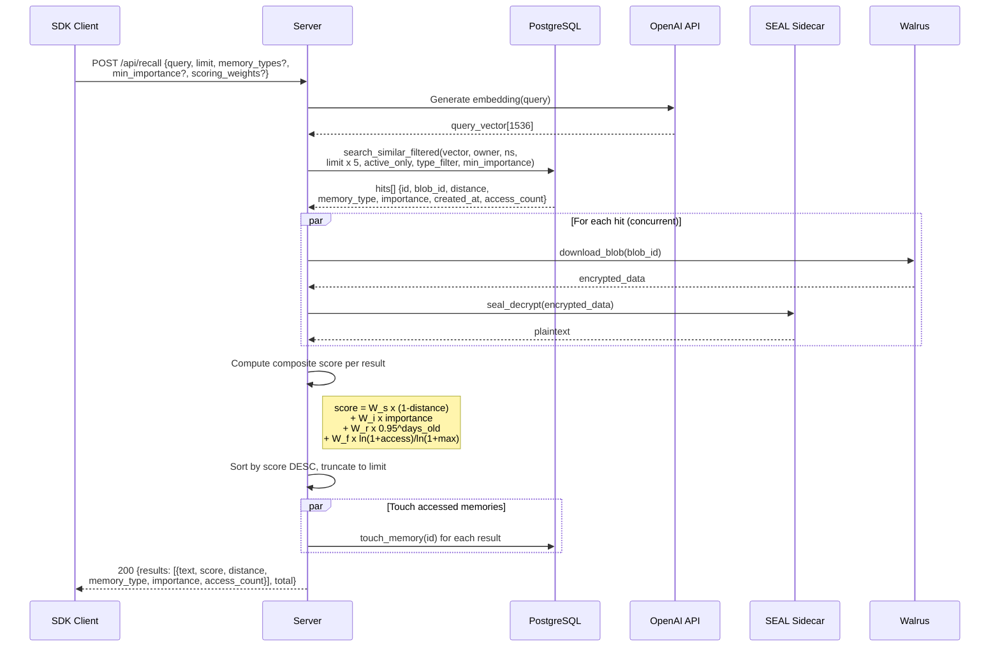

### 4.3 Analyze (3-Stage Pipeline)

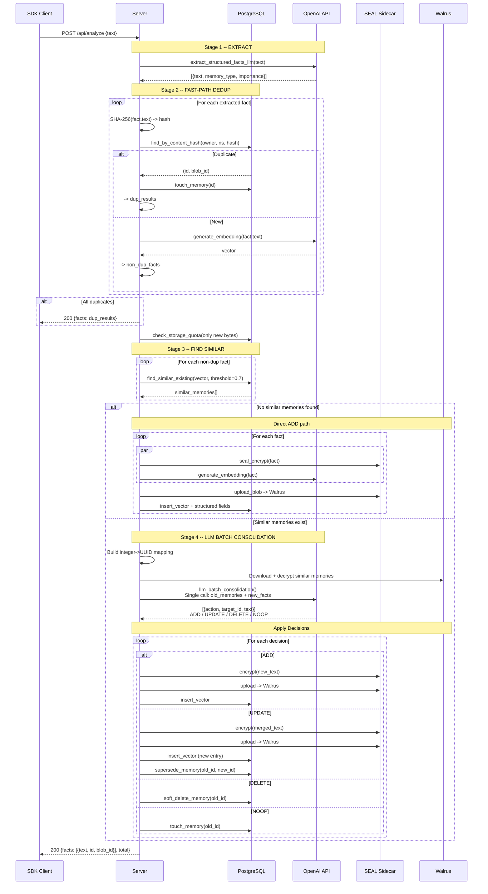

### 4.4 Forget

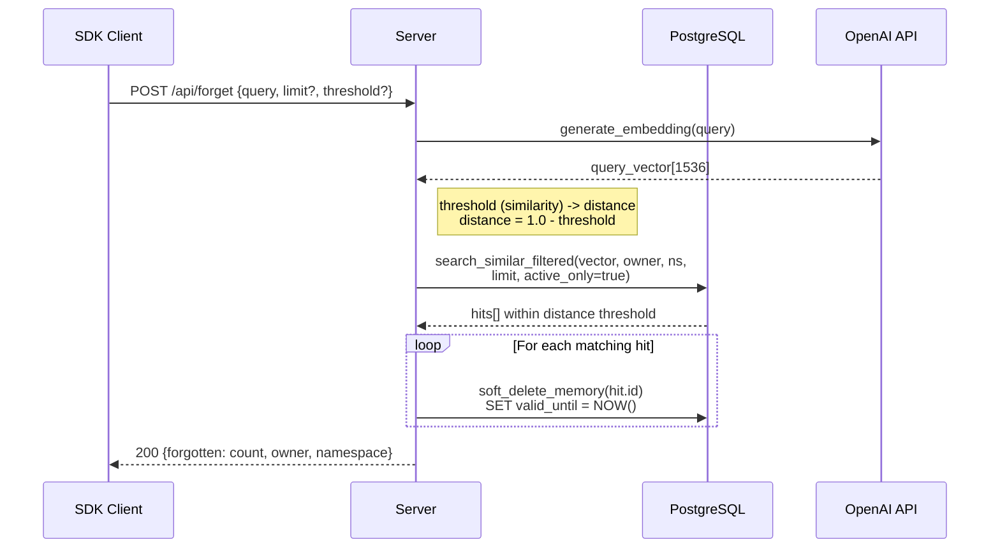

### 4.5 Consolidate

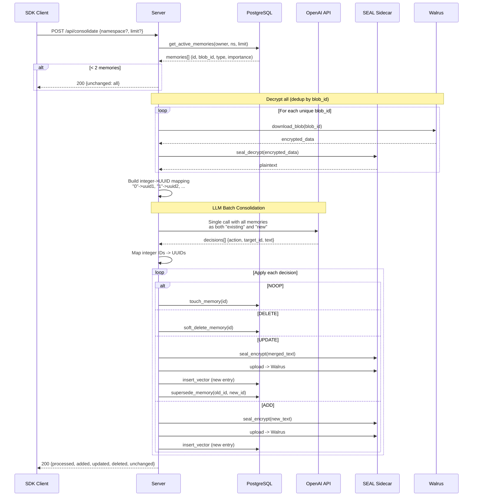

---

## 5. Composite Scoring Formula

MemWal uses a four-signal weighted composite score to rank recall results, replacing the pure cosine-similarity ranking used in the Mem0 paper.

```
score = W_semantic   x (1 - cosine_distance)
      + W_importance x importance
      + W_recency    x 0.95^(days_old)
      + W_frequency  x ln(1 + access_count) / ln(101)
```

### Default Weights

| Weight | Default | Signal Description |
| --- | --- | --- |
| `W_semantic` | 0.5 | Semantic similarity (primary signal) |
| `W_importance` | 0.2 | Assigned importance score (0.0--1.0) |
| `W_recency` | 0.2 | Newer = higher score (5% exponential decay per day) |
| `W_frequency` | 0.1 | Frequently accessed = more relevant (log-normalized) |

### Signal Breakdown

- **Semantic** (`1 - cosine_distance`): The core relevance signal. A value of 1.0 means perfect semantic match. This is the only signal the Mem0 paper uses for ranking.
- **Importance** (`importance`): Stored per-memory, assigned at extraction time by the LLM or explicitly by the user. Ranges from 0.0 (trivial) to 1.0 (critical).
- **Recency** (`0.95^days_old`): Exponential decay. A memory loses approximately 5% of its recency score per day. At 14 days old, recency contributes approximately 0.49; at 30 days, approximately 0.21.
- **Frequency** (`ln(1 + access_count) / ln(101)`): Log-normalized access frequency. Prevents heavily-accessed memories from dominating linearly. The denominator is hardcoded to `ln(101)`, normalizing scores to approximately [0, 1] assuming a practical ceiling of 100 accesses.

### Caller Overrides

The recall endpoint accepts `scoring_weights` in the request body, allowing callers to adjust the balance per query. For example, a time-sensitive query might use `{ semantic: 0.3, importance: 0.1, recency: 0.5, frequency: 0.1 }` to emphasize freshness.

> **Mem0 cross-reference**: The Mem0 paper uses pure semantic similarity for ranking (effectively alpha=1.0, all other weights=0). MemWal's composite scoring addresses the temporal ranking gap identified in our Mem0 analysis (see [Mem0 Report 05, Section 8.2](../mem0-research/05-retrieval.md#8-analysis--research-observations)). The recency and frequency signals give MemWal the ability to handle temporal queries ("what did I say recently about X?") that the Mem0 paper's pure-similarity approach cannot.

---

## 6. SDK Usage

The TypeScript SDK exposes five primary methods that map to server endpoints.

```typescript
// -- Remember --
await memwal.remember("allergic to peanuts", "health")

await memwal.remember("User prefers dark mode", {
  memoryType: 'preference',
  importance: 0.8,
  tags: ['ui', 'settings'],
})

// -- Recall --
await memwal.recall("food allergies", 10)

await memwal.recall("food allergies", {
  limit: 5,
  memoryTypes: ['fact', 'biographical'],
  minImportance: 0.3,
  scoringWeights: { semantic: 0.6, importance: 0.3, recency: 0.1 },
})

// -- Forget --
await memwal.forget("peanut allergy")

// -- Stats --
await memwal.stats()
// -> { total, by_type, avg_importance, storage_bytes, ... }

// -- Consolidate --
await memwal.consolidate()
// -> merge duplicates, resolve conflicts across all memories
```

---

## 7. AI Middleware

The `withMemWal()` middleware automatically injects relevant memories into LLM prompts. Memories are grouped by type and ranked by composite score (not just cosine distance).

### Formatted Output Example

```
[Memory Context] The following are known facts about this user:

Facts:
  [high] User is allergic to peanuts (score: 0.92)
  [med]  User works at Google (score: 0.78)

Preferences:
  [high] User prefers dark mode (score: 0.85)

Personal Info:
  [med]  User's name is Duc, lives in Hanoi (score: 0.71)
```

### Behavior

- Memories are ranked by composite score, not just cosine distance
- Importance levels: high (>= 0.8), medium (>= 0.5)
- Grouped by `memory_type` for better LLM comprehension
- The middleware calls `recall()` internally, so all scoring and filtering applies

---

## 8. Key Design Decisions

| Decision | Rationale | Mem0 Paper Equivalent |
| --- | --- | --- |
| **Content hash dedup** | SHA-256 check before any LLM/network call -- eliminates exact duplicates at zero cost | Not present in Mem0 paper -- MemWal addition |
| **Batch LLM consolidation** | 1 LLM call for ALL facts instead of per-fact -- cost-efficient, cross-fact awareness | Paper uses per-fact processing ([Report 03, Section 6](../mem0-research/03-memory-operations.md#6-per-fact-processing)) |
| **Integer->UUID mapping** | LLM sees `"0","1","2"` instead of UUIDs -- prevents hallucinated IDs | Not present in Mem0 paper -- MemWal addition |
| **Soft-delete** | `valid_until = NOW()` instead of DELETE -- full audit trail, recoverable | Paper applies to graph edges only ([Report 04, Section 3.3](../mem0-research/04-deduplication-conflict.md#33-soft-deletion)); MemWal universalizes |
| **Supersede chain** | Old memory points to new via `superseded_by` -- preserves history | Not present in Mem0 paper -- Mem0 overwrites in place |
| **Deferred quota check** | Quota checked AFTER dedup -- duplicates don't consume new storage | Not addressed in Mem0 paper |
| **5x oversampling** | Recall fetches 5x the requested limit, then post-filters by composite score | Not applicable -- Mem0 returns top-k by similarity only |
| **Temporal validity** | `valid_from` / `valid_until` window -- supports time-scoped queries | Not present in Mem0 base memory; graph edges have temporal markers |

### Decision Relationship Map

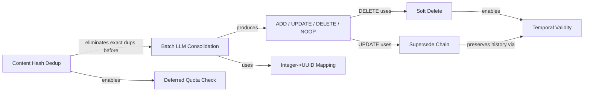

---

### Navigation

| | |
|---|---|
| **Part of** | [MemWal Review Set](./00-index.md) |
| **Next** | [02 -- Code Review](./02-code-review.md) |
| **Mem0 Foundation** | [Mem0 Paper Analysis](../mem0-research/00-index.md) |
