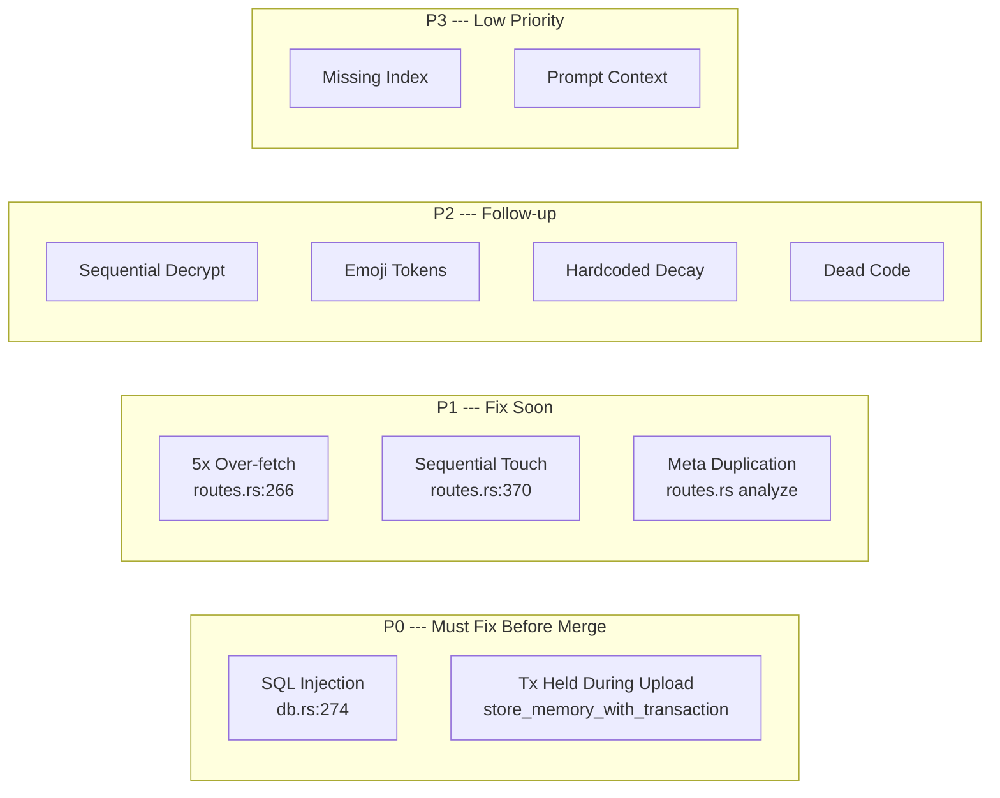

# 02 --- Code Review: Memory Structure Upgrade

> **Commit**: [ec00986](https://github.com/MystenLabs/MemWal/commit/ec00986ed3695429dd3f5e32c78e44ce81ac1641)
> **Author**: ducnmm (Henry)
> **Branch**: `feat/memory-structure-upgrade`
> **Date**: April 6, 2026
> **Scope**: 9 files, +2,445 / -175 lines

---

### Navigation

| | |
|---|---|
| **Part of** | [MemWal Review Set](./00-index.md) |
| **Previous** | [01 --- Architecture Overview](./01-architecture-overview.md) |
| **Next** | [03 --- Mem0 Alignment](./03-mem0-alignment.md) |
| **Mem0 Foundation** | [Mem0 Paper Analysis](../mem0-research/00-index.md) |

### Purpose

This document reviews the code quality, implementation patterns, and specific issues found in the memory structure upgrade commit. For architectural comparison against the Mem0 paper, see [Report 03](./03-mem0-alignment.md). For consolidated gaps and recommendations, see [Report 04](./04-gap-analysis.md).

---

## 1. Overview

This commit ports the Mem0 paper's core concepts into MemWal: typed memories, importance scoring, composite retrieval ranking, content-hash deduplication, soft deletion (`superseded_by` / `valid_until`), and batch LLM consolidation (ADD/UPDATE/DELETE/NOOP). It spans the full stack --- SQL migration, Rust server (db + routes + types), and TypeScript SDK.

### Files Changed

| File | Change | Lines |
|------|--------|-------|
| `services/server/migrations/004_memory_structure.sql` | **Added** --- new columns + indexes | +69 |
| `services/server/src/types.rs` | Modified --- new enums, API types, scoring weights | +285 |
| `services/server/src/db.rs` | Modified --- enriched insert, filtered search, soft delete, stats, consolidation queries | +503 |
| `services/server/src/routes.rs` | Modified --- remember dedup, recall scoring, analyze 6-stage pipeline, new endpoints | +1,484 |
| `services/server/src/main.rs` | Modified --- register 3 new routes | +3 |
| `packages/sdk/src/types.ts` | Modified --- new TS types for memory ops | +84 |
| `packages/sdk/src/memwal.ts` | Modified --- enriched remember/recall, new stats/forget/consolidate methods | +135 |
| `packages/sdk/src/ai/middleware.ts` | Modified --- composite scoring filter, grouped memory formatting | +49 |
| `packages/sdk/src/index.ts` | Modified --- export new types | +8 |

---

## 2. What's Good

### 2.1 Schema design is solid (`004_memory_structure.sql`)

> Extends the schema model from [Mem0 Report 01](../mem0-research/01-memory-structure.md).

- `memory_type`, `importance`, `access_count`, `source`, `content_hash`, `superseded_by`, `valid_from`/`valid_until` --- well-chosen columns that map directly to the Mem0 model
- The unique partial index `idx_ve_content_hash_active` on `(owner, namespace, content_hash) WHERE content_hash IS NOT NULL AND valid_until IS NULL AND superseded_by IS NULL` is clever --- it enforces uniqueness only among active memories, allowing historical duplicates
- All columns have defaults --- fully backward compatible with existing data

### 2.2 Fast-path SHA-256 dedup before any LLM/network work (`routes.rs:remember`)

> Not present in the Mem0 paper; novel addition by Henry.

- Content hash check happens before quota check, embedding, encryption, and Walrus upload --- big cost saver for exact duplicates
- Bumps `access_count` on duplicate hit, which feeds into the frequency scoring

### 2.3 Composite scoring formula (`routes.rs:recall`)

> Addresses the retrieval gap identified in [Mem0 Report 05, Section 8.2](../mem0-research/05-retrieval.md).

```
score = w_semantic * (1 - distance)
      + w_importance * importance
      + w_recency * 0.95^days_old
      + w_frequency * ln(1 + access_count) / ln(101)
```

- Client-configurable weights via `ScoringWeights` --- good for experimentation
- The 5% daily decay (`0.95^days`) is reasonable and aligns with what we identified as a gap in the Mem0 paper (see [05-retrieval.md](../mem0-research/05-retrieval.md))

### 2.4 Batch LLM consolidation (`routes.rs:analyze`)

> Improvement over Mem0's per-fact approach ([Report 03, Section 6](../mem0-research/03-memory-operations.md)).

- Single LLM call for ALL facts + all similar existing memories --- cost efficient
- Integer ID mapping (`"0"`, `"1"`, `"2"` instead of UUIDs) to prevent LLM hallucination of IDs --- smart design choice directly from the Mem0 approach
- Fallback to all-ADD if the LLM call fails --- graceful degradation
- Padding/truncation of decisions if LLM returns wrong count

### 2.5 Transactional store with advisory lock (`store_memory_with_transaction`)

- `pg_advisory_xact_lock(hashtextextended(...))` serializes concurrent duplicate inserts
- Reserve with `pending:` blob_id, upload, finalize, commit pattern prevents orphan Walrus uploads
- Rollback path for duplicate losers is clean

### 2.6 New endpoints are well-scoped

- `/api/stats` --- read-only, useful for debugging and dashboards
- `/api/forget` --- semantic soft-deletion with configurable similarity threshold
- `/api/consolidate` --- on-demand memory cleanup and deduplication

### 2.7 SDK backward compatibility

- `remember(text, namespace?)` still works; new overload accepts `RememberOptions`
- `recall(query, limit?)` still works; new overload accepts `RecallOptions`
- Type exports are additive --- no breaking changes

---

## 3. Issues and Concerns

### Issue Distribution



---

### P0 --- SQL Injection in `search_similar_filtered` (`db.rs:274`)

**Severity**: Critical --- security vulnerability.

```rust
// CURRENT (vulnerable):
let type_list: Vec<String> = types.iter()
    .map(|t| format!("'{}'", t.replace('\'', "''")))
    .collect();
conditions.push(format!("memory_type IN ({})", type_list.join(",")));
```

Manual escaping of single quotes is not sufficient for SQL injection prevention. This is string interpolation into SQL.

**Recommended fix** --- use parameterized queries with `ANY($N)` and a bound array parameter:

```rust
// RECOMMENDED:
conditions.push(format!("memory_type = ANY(${}))", next_param));
// ... bind as &[String]
```

Same concern with `min_importance` --- `format!("importance >= {}", min_imp)` is safe for `f32` but still not idiomatic parameterized SQL.

---

### P0 --- Transaction held during Walrus upload (`store_memory_with_transaction`)

**Severity**: Critical --- availability risk under load.

The advisory lock and transaction are held while `walrus::upload_blob` executes (network I/O). If Walrus is slow or times out, the lock and DB connection are held for the entire duration. This could:

- Exhaust the connection pool under load
- Block other writes with the same content hash for the full upload duration

**Recommendation**: Reserve the row and commit, upload to Walrus, then update `blob_id` in a separate transaction. The unique partial index already protects against duplicates --- the advisory lock during upload is unnecessary if the INSERT already uses `ON CONFLICT`.

---

### P1 --- 5x oversampling in recall (`routes.rs:266`)

```rust
let search_limit = body.limit.saturating_mul(5).max(body.limit);
```

Fetching 5x the requested limit to account for post-retrieval filtering, but ALL 5x results get downloaded from Walrus and decrypted before truncation. If a user requests `limit=20`, you download and decrypt up to 100 blobs.

**Impact**: Significant latency and cost amplification on recall.

**Recommendation**: Either:

- Filter before download (apply scoring on metadata-only, then download only top-k)
- Or document this cost amplification and add a cap

---

### P1 --- Sequential touch queries in recall (`routes.rs:370`)

```rust
tokio::spawn(async move {
    for id in hit_ids {
        if let Err(e) = state.db.touch_memory(&id).await { ... }
    }
});
```

Sequential touch calls inside a spawn. If there are 10 results, that's 10 individual UPDATE queries.

**Fix** --- batch into a single query:

```sql
UPDATE vector_entries
SET access_count = access_count + 1, last_accessed_at = NOW()
WHERE id = ANY($1)
```

---

### P1 --- `InsertMemoryMeta` construction duplication (`routes.rs:analyze`)

The `InsertMemoryMeta` construction in the `ConsolidationAction::Add | ConsolidationAction::Update` match arm is repeated approximately 4 times with minor variations (lines ~678-717 in the diff). Extract a helper:

```rust
impl InsertMemoryMeta {
    fn from_extracted(fact: &ExtractedFact, existing: Option<&ExistingMemory>, content_hash: String) -> Self {
        // ...
    }
}
```

---

### P2 --- Sequential consolidation decrypts (`routes.rs:consolidate`)

With `limit=50` (default), the endpoint downloads and decrypts up to 50 blobs sequentially. No parallelism here unlike other flows (recall uses `futures::future::join_all`).

**Fix**: Use `futures::future::join_all` for the decrypt loop, same pattern as recall.

---

### P2 --- Emoji tokens in LLM context (`middleware.ts`)

```typescript
const typeLabels: Record<string, string> = {
    fact: '\u{1F4CC} Facts',
    preference: '\u2B50 Preferences',
    // ...
};
```

Emojis in LLM context injection are token-wasteful (each emoji = 1-2 tokens) and may not improve retrieval quality. Consider making this configurable or using plain text labels by default.

---

### P2 --- Hardcoded `0.95` decay rate (`routes.rs:recall`)

```rust
0.95_f64.powf(days_old) // decay 5% per day
```

After 14 days, a memory's recency score drops to ~0.49. After 30 days, ~0.21. This is aggressive and not configurable.

**Recommendation**: Add a `decay_rate` parameter to `ScoringWeights` (default 0.95) so users can tune how aggressively old memories are demoted.

---

### P2 --- Dead code flagged with `#[allow(dead_code)]`

Several functions carry `#[allow(dead_code)]`:

- `touch_by_blob_id` (`db.rs`)
- `from_str_opt` on `MemoryType` (`types.rs`)
- `default_importance()` (`types.rs`)
- `extract_facts_llm` (legacy wrapper, `routes.rs`)
- `llm_decide_consolidation` (per-fact fallback, `routes.rs`)

Either use them or remove them. If kept intentionally for future use, add a brief comment explaining the planned usage.

---

### P3 --- Missing `superseded_by` index

The migration adds `superseded_by` column but no dedicated index. Queries filtering `WHERE superseded_by IS NULL` appear in almost every query. The partial index `idx_ve_active` covers `(owner, namespace) WHERE valid_until IS NULL AND superseded_by IS NULL` which helps for scoped queries, but the `supersede_memory` UPDATE (`WHERE id = $1`) relies only on the primary key --- which is fine. Low priority.

---

### P3 --- Consolidation prompt missing type/importance

The batch consolidation prompt sends old memories as:

```json
{"id": "0", "text": "User is allergic to peanuts"}
```

But doesn't include `memory_type` or `importance`. The LLM can't make importance-aware decisions (e.g., "this high-importance biographical fact shouldn't be superseded by a low-importance extracted fact"). Consider enriching the prompt context.

---

## 4. Issue Summary Table

| Priority | Count | Items |
|----------|-------|-------|
| **P0** | 2 | SQL injection in `search_similar_filtered`, transaction held during Walrus upload |
| **P1** | 3 | 5x over-fetch in recall, sequential touch queries, `InsertMemoryMeta` duplication |
| **P2** | 4 | Sequential consolidation decrypts, emoji tokens, hardcoded decay rate, dead code |
| **P3** | 2 | Missing `superseded_by` index, consolidation prompt missing type/importance |

**Verdict**: Strong first implementation that covers the core Mem0 pipeline. The SQL injection in `search_similar_filtered` and the transaction-held-during-upload pattern are the two items that should be addressed before merge. The rest are improvements that can be follow-ups.

---

### Architecture Alignment with Mem0 Reports

> For the full alignment analysis, see [03 --- Mem0 Alignment](./03-mem0-alignment.md).

| Mem0 Concept | Status | Notes |
|---|---|---|
| ADD/UPDATE/DELETE/NOOP operations | **Implemented** | Via `ConsolidationAction` enum + LLM batch call |
| Content-hash deduplication | **Implemented** | SHA-256 fast-path before LLM/network |
| Soft deletion | **Implemented** | `valid_until` + `superseded_by` columns |
| Temporal validity window | **Implemented** | `valid_from` / `valid_until` columns |
| Memory type classification | **Implemented** | 5 types: fact, preference, episodic, procedural, biographical |
| Composite scoring | **Implemented** | semantic + recency + importance + frequency, client-configurable weights |
| Batch consolidation (single LLM call) | **Implemented** | With integer ID mapping to prevent hallucination |
| Async summary generation | **Not implemented** | No conversation summary module |
| Graph-based memory (Mem0^g) | **Not implemented** | No knowledge graph --- flat vector store only |
| Entity extraction / relationship generation | **Not implemented** | No graph pipeline |
| Dual retrieval (entity-centric + semantic triplet) | **Not implemented** | Vector similarity only |

The commit delivers the **Mem0 base architecture** comprehensively. The graph variant (Mem0^g) --- which our reports identified as critical for temporal reasoning and memory linking (see [Report 01](../mem0-research/01-memory-structure.md) and [Report 04](../mem0-research/04-deduplication-conflict.md)) --- is not addressed here. That is expected for a first iteration.

---

| | |
|---|---|
| **Previous** | [01 --- Architecture Overview](./01-architecture-overview.md) |
| **Next** | [03 --- Mem0 Alignment](./03-mem0-alignment.md) |
| **Index** | [00 --- MemWal Review Set](./00-index.md) |
