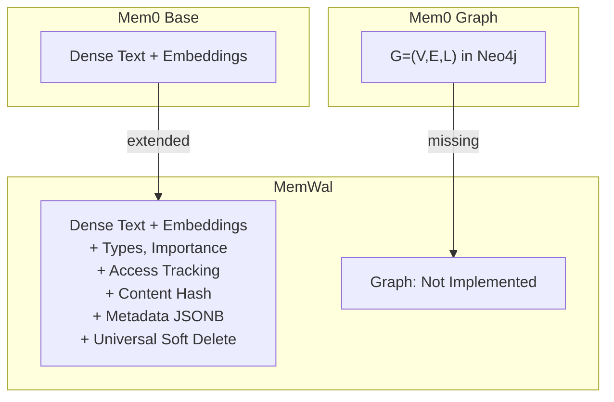
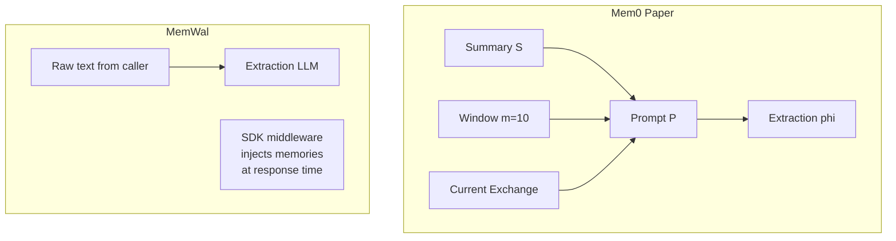
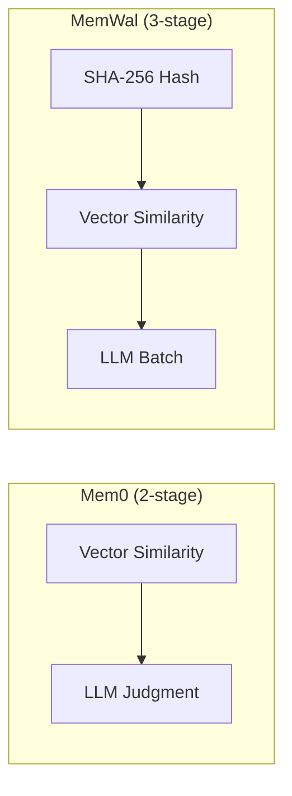
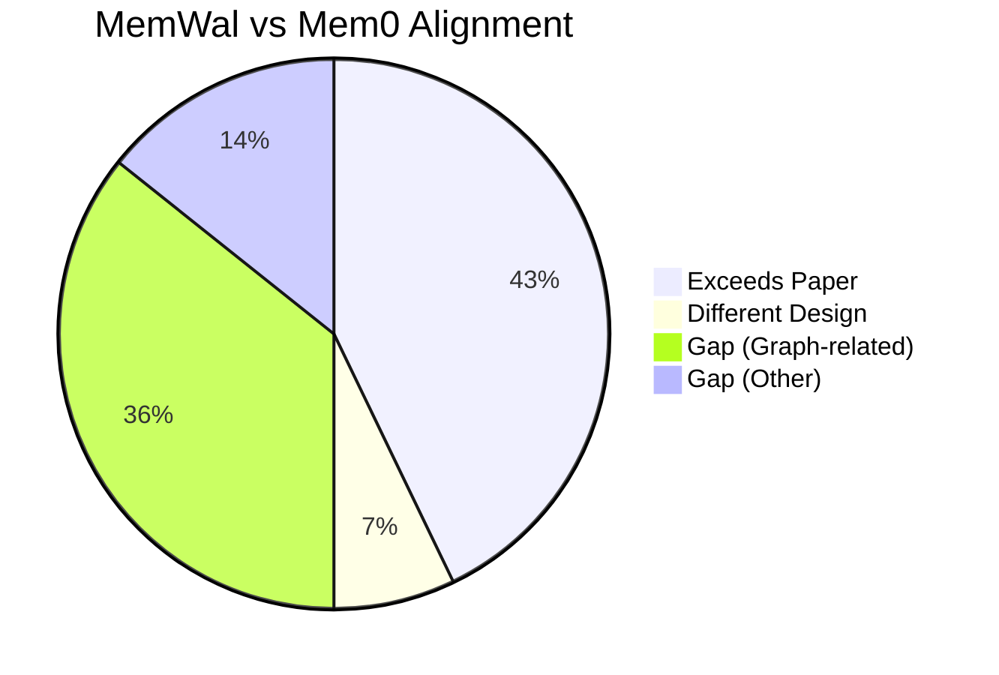

# 03 --- Mem0 Alignment Analysis

> **Branch**: `feat/memory-structure-upgrade` (commit ec00986)

---

### Navigation

| | |
|---|---|
| **Part of** | [MemWal Review Set](./00-index.md) |
| **Previous** | [02 --- Code Review](./02-code-review.md) |
| **Next** | [04 --- Gap Analysis](./04-gap-analysis.md) |
| **Mem0 Foundation** | [Mem0 Paper Analysis](../mem0-research/00-index.md) |

### Purpose

This document maps every architectural choice in MemWal against the Mem0 paper, component by component. Each section references a specific Mem0 research report and the corresponding MemWal source files, then rates alignment as **Aligned**, **Extends**, **Improves**, **Different design**, or **Gap**.

---

## 1. Memory Structure

**Paper ref**: [Mem0 Report 01](../mem0-research/01-memory-structure.md)
**Code ref**: `migrations/004_memory_structure.sql`, `db.rs` (`InsertMemoryMeta`), `types.rs` (`MemoryType`, `MemorySource`)

| Aspect | Mem0 Paper | MemWal | Rating |
|--------|-----------|--------|--------|
| Memory content | Untyped facts (plain text) | 5 types (`fact`, `preference`, `episodic`, `procedural`, `biographical`) | **Extends** |
| Importance | Not present | `FLOAT` 0--1 with default | **Extends** |
| Provenance | Not present | `source` field (`MemorySource` enum) | **Extends** |
| Access tracking | Not present | `access_count` + `last_accessed_at` | **Extends** |
| Content dedup | Not present | SHA-256 `content_hash` | **Extends** |
| Flexible metadata | Not present | JSONB `metadata` column | **Extends** |
| Temporal validity | Graph edges only | Universal `valid_from` / `valid_until` / `superseded_by` | **Improves** |
| Embedding model | `text-embedding-3-small` | Same | **Aligned** |
| Graph memory G=(V,E,L) | Full implementation (Neo4j) | Not implemented | **Gap** |
| Entity types / labels | 7 categories | Not implemented | **Gap** |
| Relationship triplets | Directed labeled edges | Not implemented | **Gap** |

**Summary**: MemWal substantially enriches the base memory schema -- adding typing, importance, provenance, access tracking, content hashing, and metadata -- but has no graph layer at all. The three graph-related gaps (G=(V,E,L), entity types, relationship triplets) are the largest single category of missing functionality.

---

## 2. Context Management

**Paper ref**: [Mem0 Report 02](../mem0-research/02-context-management.md)
**Code ref**: `routes.rs` (`analyze`, `FACT_EXTRACTION_PROMPT` at line 923), `packages/sdk/src/ai/middleware.ts`

| Aspect | Mem0 Paper | MemWal | Rating |
|--------|-----------|--------|--------|
| Extraction prompt | 3-layer P=(S, window, current) | Raw text input from caller | **Different design** |
| Conversation summary | Async periodic generation | Not implemented | **Gap** |
| Sliding window m=10 | Included in prompt assembly | Not implemented | **Gap** |
| Async summary module | Non-blocking refresh cycle | Not implemented | **Gap** |
| Structured fact output | Plain text | JSON with `text` + `type` + `importance` | **Extends** |
| Response-time formatting | "Memories for user {id}" | Grouped by type with importance icons | **Extends** |

**Note**: This is an intentional architectural difference, not an oversight. MemWal is a stateless memory server -- context assembly (conversation history, summaries, windowing) is the caller's responsibility. The SDK middleware handles memory injection at response time, but the server itself never manages conversation state. This trades the Mem0 paper's richer extraction context for a cleaner separation of concerns. The trade-off is that extraction quality depends entirely on the quality of text the caller sends.

---

## 3. Memory Operations

**Paper ref**: [Mem0 Report 03](../mem0-research/03-memory-operations.md)
**Code ref**: `types.rs` (`ConsolidationAction`, `LlmConsolidationDecision`), `routes.rs` (`llm_batch_consolidation` at line 1067, `analyze` at line 554)

| Aspect | Mem0 Paper | MemWal | Rating |
|--------|-----------|--------|--------|
| Operations | ADD / UPDATE / DELETE / NOOP | Same four operations | **Aligned** |
| Classification method | Per-fact LLM tool calling | Batch LLM prompt (all facts at once) | **Improvement** |
| Similar memory retrieval | Top s=10 candidates | Threshold 0.25, limit 5 | **Different params** |
| Integer ID mapping | Not in paper | Maps UUIDs to short integers for LLM, prevents hallucination | **Improvement** |
| Fallback on failure | Not addressed | All-ADD fallback on LLM parse failure | **Improvement** |
| Decision padding | Not addressed | Pad or truncate decisions to match fact count | **Improvement** |
| LLM model | GPT-4o-mini, temp=0 | GPT-4o-mini, temp=0.1 | **Minor diff** |
| Hard DELETE behavior | Memory removed from store | Soft delete via `valid_until = NOW()` | **Improvement** |
| UPDATE behavior | Overwrite existing memory | New memory created + old superseded via `superseded_by` | **Improvement** |
| Consolidation prompt | Not published in paper | Full prompt with worked examples (`routes.rs:1093`) | **Implemented** |

**Key design wins**: Batch classification is both cheaper (fewer LLM calls) and more coherent (the model sees all facts together, reducing contradictory decisions). Integer ID mapping is a practical improvement -- LLMs reliably produce integers but frequently corrupt UUIDs. The all-ADD fallback ensures no data is silently lost on LLM failure.

---

## 4. Deduplication & Conflict Resolution

**Paper ref**: [Mem0 Report 04](../mem0-research/04-deduplication-conflict.md)
**Code ref**: `routes.rs` (`analyze` stages 2--5), `db.rs` (`find_by_content_hash`, `find_similar_existing`, `supersede_memory`, `soft_delete_memory`)

| Aspect | Mem0 Paper | MemWal | Rating |
|--------|-----------|--------|--------|
| Stage 1 -- exact match | Not present | SHA-256 content hash check | **Extends** |
| Stage 2 -- vector similarity | Top s=10 candidates | Vector threshold 0.25, limit 5 | **Aligned** |
| Stage 3 -- LLM judgment | Per-fact tool calling | LLM batch classification | **Aligned / improved** |
| Entity-level dedup threshold t | Graph nodes matched by label | Not implemented (no graph) | **Gap** |
| Soft deletion | Graph edges only | Universal `superseded_by` + `valid_until` | **Improvement** |
| Cascading invalidation | Not in paper | Not implemented | **Same gap** |
| Temporal decay | Not in paper | `0.95^days` in composite scoring | **Extends** |

**Why the hash stage matters**: SHA-256 catches exact duplicates in microseconds, before any embedding computation or LLM calls. In workloads with high duplicate rates (e.g., repeated system instructions, boilerplate facts), this eliminates the most expensive operations entirely.

---

## 5. Retrieval

**Paper ref**: [Mem0 Report 05](../mem0-research/05-retrieval.md)
**Code ref**: `db.rs` (`search_similar_filtered` at line 252), `routes.rs` (recall composite scoring at lines 316--342)

| Aspect | Mem0 Paper | MemWal | Rating |
|--------|-----------|--------|--------|
| Vector similarity | Pure cosine similarity | Composite 4-signal weighted scoring | **Extends** |
| Entity-centric traversal | Graph traversal from matched entities | Not implemented | **Gap** |
| Semantic triplet matching | Query vs triplet embeddings | Not implemented | **Gap** |
| Temporal ranking | Not in paper | `0.95^days` recency decay | **Extends** |
| Access frequency | Not in paper | `ln(1 + count) / ln(101)` frequency signal | **Extends** |
| Type filtering | Not in paper | `memory_types` parameter | **Extends** |
| Importance threshold | Not in paper | `min_importance` parameter | **Extends** |
| Include expired | Not in paper | `include_expired` flag | **Extends** |
| Oversampling | Not in paper | 5x fetch then post-filter (see P1 in Report 02) | **Novel** |
| Result formatting | "Memories for user {id}" | Grouped by type with importance indicators | **Extends** |

### Paper Benchmark Context

The Mem0 paper's own benchmarks show mixed results for the graph variant. From [Mem0 Report 05](../mem0-research/05-retrieval.md), Section 4.3:

| Task Type | Base J-score | Graph J-score | Winner |
|-----------|-------------|---------------|--------|
| Single-hop | 67.13 | 65.71 | Base |
| Multi-hop | 51.15 | 48.23 | Base |
| Temporal | 55.51 | 58.13 | **Graph** |
| Open-domain | 75.71 | 75.09 | Base |

The graph variant only wins on temporal reasoning tasks. MemWal's composite scoring with temporal decay may partially compensate for the missing graph -- particularly the `0.95^days` recency signal -- but multi-hop relationship traversal remains impossible without an actual graph structure.

---

## 6. Component Interactions

**Paper ref**: [Mem0 Report 06](../mem0-research/06-component-interactions.md)
**Code ref**: `main.rs` (route registration), `routes.rs` (full pipeline)

| Aspect | Mem0 Paper | MemWal | Rating |
|--------|-----------|--------|--------|
| Feedback loops | Summary refreshes extraction context | Not implemented | **Gap** |
| Concurrent duplicate prevention | Not addressed | Advisory locks + `ON CONFLICT` | **Extends** |
| Parallel operations | Not specified | `tokio::join!` and `join_all` for concurrent work | **Implemented** |
| LLM call budget | 1 + n per message (extraction + n per-fact consolidation) | ~2 per analyze call (extraction + 1 batch consolidation) | **Improvement** |
| Graceful degradation | Not addressed | All-ADD fallback on LLM/parse failure | **Improvement** |
| Transaction safety | Not addressed | Advisory lock + transaction + rollback on error | **Improvement** |
| Blob expiry handling | Not addressed | `cleanup_expired_blob` reactive cleanup | **Improvement** |

**LLM cost note**: The Mem0 paper's architecture requires 1 + n LLM calls per message (one extraction call, then one consolidation call per extracted fact). MemWal reduces this to approximately 2 calls regardless of fact count by batching all consolidation decisions into a single prompt. For a message yielding 5 facts, this is a 3x reduction in LLM calls.

---

## 7. Summary Scorecard

| Area | Mem0 Paper | MemWal | Rating |
|------|-----------|--------|--------|
| Memory schema and typing | Untyped facts | 5 types + importance + access tracking + metadata | **Exceeds** |
| Content deduplication | LLM-only (2-stage) | SHA-256 + vector + LLM (3-stage) | **Exceeds** |
| Soft deletion | Graph edges only | Universal `superseded_by` + `valid_until` | **Exceeds** |
| Memory operations | 4 ops, per-fact LLM | 4 ops, batch LLM + ID mapping + fallback | **Exceeds** |
| Composite scoring | Pure cosine similarity | 4-signal weighted scoring with temporal decay | **Exceeds** |
| Concurrency safety | Not addressed | Advisory locks + transactional inserts | **Exceeds** |
| Context management | 3-layer prompt (S + window + current) | Raw text input (caller-managed via SDK) | **Different** |
| Graph memory G=(V,E,L) | Full Neo4j implementation | Not implemented | **Gap** |
| Entity extraction | LLM-based with 7 categories | Not implemented | **Gap** |
| Relationship triplets | Directed labeled edges | Not implemented | **Gap** |
| Entity-centric retrieval | Graph traversal | Not implemented | **Gap** |
| Semantic triplet matching | Query vs triplet embeddings | Not implemented | **Gap** |
| Conversation summary | Async periodic generation | Not implemented | **Gap** |
| Feedback loops | Summary refreshes extraction | Not implemented | **Gap** |

**Reading**: MemWal exceeds the Mem0 paper's base architecture in 6 of 14 areas. The 7 gaps cluster around two missing subsystems: the graph layer (5 gaps) and the conversation-level features — summary module and feedback loops (2 gaps). The "Different Design" rating for context management reflects a deliberate architectural choice, not a deficiency -- though it does shift complexity to the caller.
