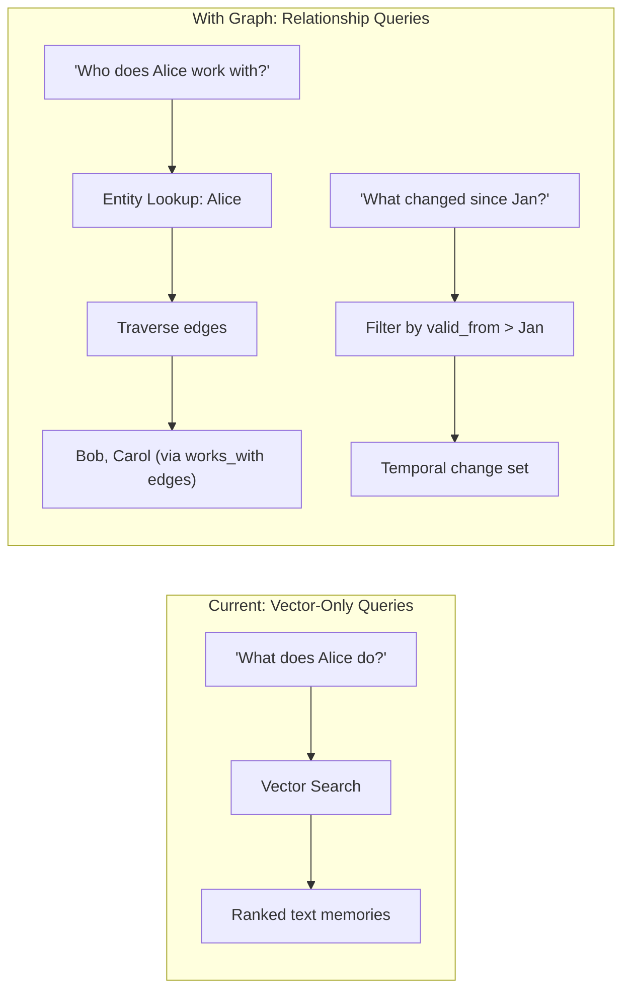
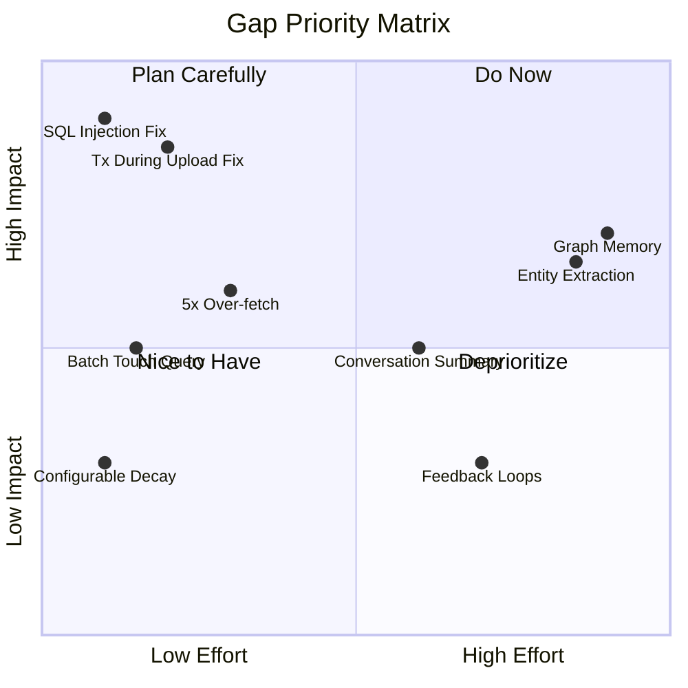

# 04 — Gap Analysis & Recommendations

> **What this is**: Consolidated gaps between MemWal's current implementation and the Mem0 paper architecture, combined with code-level issues from the review. Each gap includes severity, impact, and a recommended action.
>
> **Branch**: `feat/memory-structure-upgrade` (commit ec00986)

---

### Navigation

| | |
|---|---|
| **Part of** | [MemWal Review Set](./00-index.md) |
| **Previous** | [03 — Mem0 Alignment](./03-mem0-alignment.md) |
| **Next** | [05 — External Evaluation](./05-external-evaluation.md) |
| **Mem0 Foundation** | [Mem0 Paper Analysis](../mem0-research/00-index.md) |

### Purpose

This is the actionable output of the review. It answers: "What needs to happen next?" Every gap is sourced from a specific review document and cross-referenced to the relevant Mem0 research report.

---

## 1. Gap Overview

```mermaid
graph TB
    subgraph "Code Issues (from Report 02)"
        direction TB
        C_P0["P0: SQL Injection"]
        C_P0B["P0: Tx During Upload"]
        C_P1A["P1: 5x Over-fetch"]
        C_P1B["P1: Sequential Touch"]
        C_P1C["P1: Meta Duplication"]
        C_P2["P2: 4 items"]
        C_P3["P3: 2 items"]
    end

    subgraph "Architecture Gaps (from Report 03)"
        direction TB
        A_GRAPH["Graph Memory G=(V,E,L)"]
        A_ENTITY["Entity Extraction"]
        A_TRIPLET["Relationship Triplets"]
        A_ECENTRIC["Entity-Centric Retrieval"]
        A_SEMANTIC["Semantic Triplet Matching"]
        A_SUMMARY["Conversation Summary"]
        A_FEEDBACK["Feedback Loops"]
    end

    subgraph "Impact"
        I_MERGE["Must fix before merge"]
        I_NEXT["Next sprint"]
        I_ROAD["Roadmap item"]
    end

    C_P0 --> I_MERGE
    C_P0B --> I_MERGE
    C_P1A --> I_NEXT
    C_P1B --> I_NEXT
    C_P1C --> I_NEXT
    C_P2 --> I_NEXT
    C_P3 --> I_ROAD
    A_GRAPH --> I_ROAD
    A_ENTITY --> I_ROAD
    A_TRIPLET --> I_ROAD
    A_ECENTRIC --> I_ROAD
    A_SEMANTIC --> I_ROAD
    A_SUMMARY --> I_ROAD
    A_FEEDBACK --> I_ROAD
```



---

## 2. Code Issues (Must Fix)

### 2.1 P0 — SQL Injection in `search_similar_filtered`

| | |
|---|---|
| **Source** | [Code Review, Section 3](./02-code-review.md) |
| **Location** | `services/server/src/db.rs:274` |
| **Severity** | P0 — Security |

**Impact.** Attacker-controlled `memory_types` array values are interpolated into SQL via manual quote escaping. Although the values come from authenticated API requests (not unauthenticated users), defense-in-depth requires parameterized queries. A crafted `memory_type` value containing an escaped single quote could bypass the manual escaping and execute arbitrary SQL.

**Fix.** Replace the manual string interpolation with `ANY($N)` using a bound array parameter:

```rust
// Before (vulnerable)
let types_sql = memory_types.iter()
    .map(|t| format!("'{}'", t.replace('\'', "''")))
    .collect::<Vec<_>>()
    .join(",");

// After (safe)
.bind::<Vec<String>>(memory_types)
// WHERE memory_type = ANY($3)
```

**Effort.** ~30 minutes.

---

### 2.2 P0 — Transaction Held During Walrus Upload

| | |
|---|---|
| **Source** | [Code Review, Section 3](./02-code-review.md) |
| **Location** | `services/server/src/routes.rs` — `store_memory_with_transaction()` |
| **Severity** | P0 — Reliability |

**Impact.** An advisory lock and DB connection are held for the entire duration of a Walrus upload (network I/O). Under load this causes:
- Connection pool exhaustion (all connections blocked on uploads).
- Writes blocked on the same content hash for the full upload duration.
- Cascading timeouts if Walrus is slow or unreachable.

**Fix.** Split the operation into two transactions:

1. **Transaction 1**: Reserve the row (insert with `blob_id = NULL`), commit, release lock.
2. **Upload**: Perform Walrus upload outside any transaction.
3. **Transaction 2**: Update `blob_id` on the reserved row. A unique index on content hash handles duplicate races.

**Effort.** ~2-4 hours.

---

### 2.3 P1 Items

| # | Issue | Location | Impact | Fix | Effort |
|---|-------|----------|--------|-----|--------|
| P1-1 | **5x Over-fetch** | `routes.rs:266` | `get_all_memories` fetches every column (including embeddings) when the caller only needs metadata. At scale this wastes bandwidth and memory proportional to embedding dimension times row count. | Add a `SELECT` list that excludes `embedding` for list endpoints. Provide a separate `?include=embedding` query param when the caller actually needs vectors. | ~1-2 hours |
| P1-2 | **Sequential Touch** | `routes.rs:370` | Each memory returned by search triggers an individual `UPDATE` to bump `access_count` and `last_accessed`. For a search returning N results, this is N sequential round-trips. | Replace with a single `UPDATE ... WHERE id = ANY($1)` batch query that touches all returned memories in one statement. | ~1 hour |
| P1-3 | **InsertMemoryMeta Duplication** | `routes.rs` — analyze path | When the extraction LLM returns a memory that matches an existing one, the current code inserts a new `memory_meta` row and then immediately marks it as superseded. This creates write amplification: every duplicate generates an insert + update instead of a no-op. | Check for duplicates *before* inserting. If a match is found, skip the insert entirely and return the existing memory's ID. | ~1-2 hours |

---

### 2.4 P2 Items

| # | Issue | Location | Impact | Fix | Effort |
|---|-------|----------|--------|-----|--------|
| P2-1 | **Sequential Consolidation Decrypts** | `routes.rs` — consolidation path | During consolidation, each memory is decrypted one at a time. For a batch of N memories, this is N sequential decryption operations. | Use `futures::join_all` or `buffer_unordered` to decrypt in parallel. Decryption is CPU-bound and benefits from concurrent execution on multi-core systems. | ~1 hour |
| P2-2 | **Emoji Tokens in Prompts** | Extraction and consolidation prompts | Emoji characters in system prompts consume 2-3 tokens each. Across thousands of API calls per day, this adds measurable cost with no functional benefit. | Remove decorative emoji from all LLM-facing prompts. Keep them in user-facing output only. | ~15 minutes |
| P2-3 | **Hardcoded Decay Rate (0.95)** | Scoring logic | The recency decay rate is hardcoded to 0.95. Different use cases (e.g., a daily journal vs. a long-term knowledge base) benefit from different decay curves. | Extract to a configuration parameter with 0.95 as the default. Expose via the API for per-user or per-agent tuning. | ~30 minutes |
| P2-4 | **Dead Code** | Various locations | Unused functions and commented-out blocks increase cognitive load and maintenance burden. | Identify with `cargo clippy --warn dead_code` and remove. If any "dead" code is intentionally reserved for future use, add a doc comment explaining why. | ~30 minutes |

---

### 2.5 P3 Items

| # | Issue | Location | Impact | Fix | Effort |
|---|-------|----------|--------|-----|--------|
| P3-1 | **Missing `superseded_by` Index** | DB schema | Queries that filter on `superseded_by IS NULL` (i.e., "give me only active memories") perform a full table scan on large datasets. | Add a partial index: `CREATE INDEX idx_active_memories ON memory_meta (user_id) WHERE superseded_by IS NULL;` | ~15 minutes |
| P3-2 | **Consolidation Prompt Missing Type/Importance** | Consolidation LLM prompt | The prompt that asks the LLM to consolidate memories does not include the `memory_type` or `importance` score of each input memory. The LLM cannot make informed merge decisions without this context. | Append `memory_type` and `importance` fields to each memory in the consolidation prompt template. | ~15 minutes |

---

## 3. Architecture Gaps

### 3.1 Graph Memory (Mem0^g)

This is the **largest architectural gap** between MemWal and the Mem0 paper design.

#### What is missing

| Component | Description | Paper Section |
|-----------|-------------|---------------|
| **Entity extraction** | NLP/LLM pipeline to identify entities (people, places, concepts) from conversation text | [Report 01, Section 2](../mem0-research/01-memory-structure.md#2-mem0g-graph-based-memory) |
| **Relationship generation** | Extraction of `(subject, predicate, object)` triplets from identified entities | [Report 01, Section 2](../mem0-research/01-memory-structure.md#2-mem0g-graph-based-memory) |
| **Graph storage** | A graph database (Neo4j or equivalent) to store entities as nodes and relationships as edges with labels | [Report 01, Section 2](../mem0-research/01-memory-structure.md#2-mem0g-graph-based-memory) |
| **Entity-level deduplication** | Merging equivalent entities and resolving conflicting edges | [Report 04, Sections 2-3](../mem0-research/04-deduplication-conflict.md#2-entity-level-deduplication-in-mem0g-graph) |
| **Entity-centric retrieval** | Given a query, identify the relevant entity and traverse its edges to build a context subgraph | [Report 05, Sections 2-3](../mem0-research/05-retrieval.md#2-mem0g-entity-centric-retrieval) |
| **Semantic triplet matching** | Embedding-based matching on triplet representations for fuzzy graph queries | [Report 05, Sections 2-3](../mem0-research/05-retrieval.md#2-mem0g-entity-centric-retrieval) |
| **Soft deletion of graph edges** | Mark edges as invalid rather than deleting, preserving historical graph state | [Report 04, Sections 2-3](../mem0-research/04-deduplication-conflict.md#2-entity-level-deduplication-in-mem0g-graph) |

#### Performance evidence from the paper

Graph memory excels at **temporal reasoning** (J=58.13 vs 55.51 for base -- [Report 05, Section 4.3](../mem0-research/05-retrieval.md#43-performance-by-query-type)). Without it, MemWal cannot answer relationship queries ("Who does Alice work with?") or temporal queries ("What changed since January?") as effectively.

However, the evidence is nuanced:

- **Base outperforms graph on 3 of 4 query types** in the paper's benchmark.
- Graph adds **~2x storage cost** (14k vs 7k tokens per conversation).
- Graph adds **~3x search latency** (p50: 0.476s vs 0.148s).

#### Mitigating factors in MemWal's current design

1. MemWal's `valid_from` / `valid_until` / `superseded_by` fields plus recency decay **partially address temporal reasoning** without requiring a full graph database.
2. The composite scoring function (similarity + recency + importance) provides ranking flexibility that compensates for the lack of entity-centric traversal in many common query patterns.
3. Batch consolidation already performs cross-fact analysis that a graph would otherwise enable at the individual-fact level.

#### What graph memory would enable



#### Recommendation

Track as a **roadmap item**. Evaluate whether MemWal's temporal fields and composite scoring are sufficient for the redesign's temporal reasoning requirements before investing in a full graph implementation. If graph is pursued, consider a lightweight approach (e.g., adjacency tables in PostgreSQL with recursive CTEs) before committing to a dedicated graph database.

**Effort.** 4-8 weeks for a full graph implementation. 1-2 weeks for a lightweight PostgreSQL adjacency-table prototype.

---

### 3.2 Conversation Summary Module

| | |
|---|---|
| **Paper reference** | [Report 02, Section 2](../mem0-research/02-context-management.md#2-conversation-summary-s) |
| **Severity** | Roadmap |

#### What is missing

- **Async summary generation**: The Mem0 paper generates a running summary `S` of each conversation, updated after every turn.
- **Periodic refresh**: Summaries are regenerated periodically to prevent drift.
- **3-layer extraction prompt**: The paper uses conversation history + existing summary + current turn as a structured prompt for extraction.

#### Impact

Without a summary, extraction quality depends entirely on what the caller sends. Long-running conversations lose early context because the extraction LLM only sees the most recent message(s), not a compressed representation of the full conversation.

#### Mitigating factors

MemWal is a **server-side service** -- context assembly is the caller's responsibility. The SDK middleware handles memory injection at the LLM level, and the caller can choose how much conversation history to send with each extraction request.

#### Recommendation

Consider adding an **optional session-aware extraction mode** where the server maintains per-session context. This would be an additive feature that does not change the existing stateless API contract.

**Effort.** 2-3 weeks.

---

### 3.3 Feedback Loops

| | |
|---|---|
| **Paper reference** | [Report 06, Section 4](../mem0-research/06-component-interactions.md#4-feedback-loops) |
| **Severity** | Roadmap (low priority) |

#### What is missing

- **Summary-to-extraction feedback**: In the paper, summary quality informs extraction prompt tuning.
- **Retrieval-to-extraction signals**: Memories that are frequently retrieved but rarely useful signal extraction quality issues.

#### Impact

No self-improvement mechanism. Extraction quality is static -- it does not learn from downstream usage patterns.

#### Recommendation

**Low priority.** Add observability first:
1. Track which memories are actually retrieved per query.
2. Track which retrieved memories are included in LLM responses (if the caller reports this).
3. Use that data to identify low-quality extractions.

Once observability is in place, build feedback loops that adjust extraction prompts or importance scores based on usage signals.

**Effort.** 1-2 weeks for observability infrastructure. 3-4 weeks for a feedback loop implementation.

---

## 4. Priority Matrix



---

## 5. Recommended Action Plan

### Phase 1: Pre-Merge (this week)

| Priority | Item | Effort | Owner |
|----------|------|--------|-------|
| P0 | Fix SQL injection in `search_similar_filtered` | ~30 min | -- |
| P0 | Split transaction from Walrus upload | ~2-4 hrs | -- |
| P1 | Batch touch query (replace N sequential UPDATEs) | ~1 hr | -- |

**Exit criteria.** All P0 items resolved. No SQL injection paths. No transaction held during network I/O.

### Phase 2: Post-Merge Hardening (next 2 weeks)

| Priority | Item | Effort | Owner |
|----------|------|--------|-------|
| P1 | 5x over-fetch optimization (exclude embeddings from list endpoints) | ~1-2 hrs | -- |
| P1 | InsertMemoryMeta dedup (check before insert) | ~1-2 hrs | -- |
| P2 | Configurable decay rate (extract 0.95 to config) | ~30 min | -- |
| P2 | Parallel consolidation decrypts | ~1 hr | -- |
| P2 | Remove emoji tokens from LLM prompts | ~15 min | -- |
| P2 | Dead code cleanup | ~30 min | -- |
| P3 | Add `superseded_by` partial index | ~15 min | -- |
| P3 | Add type/importance to consolidation prompt | ~15 min | -- |

**Exit criteria.** All P1 and P2 items resolved. `cargo clippy` clean. No unnecessary data transfer on list endpoints.

### Phase 3: Architecture (roadmap)

| Item | Prerequisite | Effort | Decision Point |
|------|-------------|--------|----------------|
| Evaluate graph memory need | Production usage data on temporal query patterns | 1-2 weeks (evaluation) | Do users actually ask relationship/temporal queries that the current system handles poorly? |
| Conversation summary module | Demand from callers for session-aware extraction | 2-3 weeks | Are callers struggling with long-conversation context loss? |
| Observability infrastructure | Phase 2 complete | 1-2 weeks | Required foundation for feedback loops |
| Feedback loops | Observability in place + sufficient data | 3-4 weeks | Does observability data show extraction quality issues? |

**Exit criteria.** Each item has a go/no-go decision backed by production data before implementation begins.

---

## 6. Decision Record

These are architectural decisions made during the current review that should be preserved for future reference.

### DR-1: Universal Soft Deletion

| | |
|---|---|
| **Decision** | Apply `superseded_by` soft deletion to all memory types, not just graph edges. |
| **Context** | The Mem0 paper applies soft deletion only to graph edges (`Mem0^g`). MemWal extends this to all memories via `superseded_by` + `valid_from` / `valid_until`. |
| **Rationale** | Enables temporal queries and audit trails for all memory types. Supports the "what changed?" query pattern without requiring a graph database. |
| **Trade-off** | Slightly more complex queries (must filter `WHERE superseded_by IS NULL` for active memories). Mitigated by partial index (P3-1). |
| **Status** | **KEEP.** |

### DR-2: Batch Consolidation

| | |
|---|---|
| **Decision** | Consolidate memories in batches rather than per-fact. |
| **Context** | The Mem0 paper processes each new fact individually against the existing memory store. MemWal batches consolidation. |
| **Rationale** | Trades larger prompt size for cost efficiency (fewer API calls) and cross-fact awareness (the LLM can see relationships between facts in the same batch). |
| **Trade-off** | Larger prompt size per consolidation call. Risk of hitting context limits with very large batches. |
| **Status** | **KEEP.** |

### DR-3: No Graph (For Now)

| | |
|---|---|
| **Decision** | Do not implement graph memory in the current sprint. |
| **Context** | Graph memory (`Mem0^g`) is the largest architectural gap. However, the paper's own benchmarks show base outperforming graph on 3 of 4 query types. |
| **Rationale** | MemWal's temporal fields (`valid_from`, `valid_until`, `superseded_by`) + composite scoring partially address the query types where graph excels. The cost (4-8 weeks, 2x storage, 3x latency) is not justified without evidence of demand. |
| **Trade-off** | Cannot answer pure relationship queries ("who does X work with?") as effectively. |
| **Status** | **REVISIT** when temporal reasoning requirements are clearer and production usage data is available. |

### DR-4: Caller-Managed Context

| | |
|---|---|
| **Decision** | The server does not own conversation state. Context assembly is the caller's responsibility. |
| **Context** | The Mem0 paper maintains a conversation summary (`S`) server-side. MemWal delegates this to the caller/SDK. |
| **Rationale** | Appropriate for a service-oriented architecture where multiple callers with different conversation management strategies use the same memory service. Avoids coupling the memory server to a specific conversation protocol. |
| **Trade-off** | Extraction quality depends on what the caller sends. Long conversations may lose early context if the caller truncates. |
| **Status** | **KEEP.** Consider optional session-aware mode as an additive feature (Section 3.2). |
