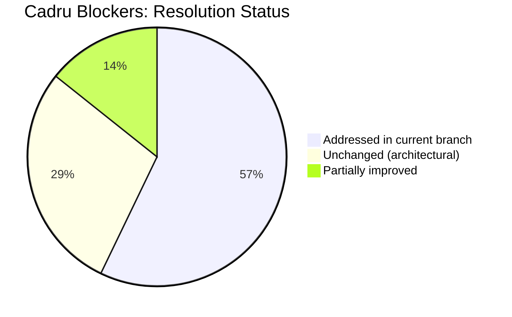

# 05 -- External Evaluation: Cadru Readiness Experiment

> **Source**: Cadru team experiment, April 7 2026
> **Experimenter**: Claude Code (Opus 4.6) for the Cadru project
> **Note**: This experiment tested the **published SDK** (`@mysten-incubation/memwal@0.0.1`), which predates the memory structure upgrade. Many findings are addressed in the current branch.

| Navigation | Link |
|---|---|
| Part of | MemWal Review Set |
| Previous | [04 -- Gap Analysis](./04-gap-analysis.md) |
| Mem0 Foundation | [../mem0-research/00-index.md](../mem0-research/00-index.md) |

**Purpose**: Captures an external consumer's evaluation of the MemWal SDK. Provides benchmark data and real-world integration concerns from a production-oriented project (Cadru) that attempted to adopt MemWal as its memory layer.

---

## 1. What Has Changed Since This Evaluation

The Cadru experiment was conducted against the published `0.0.1` SDK. Henry's memory structure upgrade (the current branch) addresses several of the blockers identified.

| Cadru Finding | Status in Current Branch | Reference |
|---|---|---|
| No delete/forget -- GDPR blocker | **Addressed** -- `/api/forget` with soft deletion | [Architecture, Section 3.4](./01-architecture-overview.md) |
| No update -- memories immutable | **Addressed** -- `ConsolidationAction::Update` with supersede chain | [Architecture, Section 3.3](./01-architecture-overview.md) |
| No structured metadata | **Addressed** -- 5 memory types + importance + metadata JSONB + tags | [Architecture, Section 1](./01-architecture-overview.md) |
| No composite scoring | **Addressed** -- 4-signal weighted scoring | [Architecture, Section 5](./01-architecture-overview.md) |
| 32 KiB ceiling | **Unchanged** -- limited by text-embedding-3-small context window | Architectural constraint |
| ~18s write latency | **Unchanged** -- pipeline bottleneck is embed + encrypt + Walrus upload | Architectural constraint |
| $480/customer/year projected cost | **Partially improved** -- content-hash dedup avoids redundant writes | Needs benchmarking |

---

## 2. Original Experiment Summary

### 2.1 SDK Status

- **Package**: `@mysten-incubation/memwal@0.0.1`, 15 days old at time of test
- 8 versions published in 2 days (March 23--24 2026)
- Beta maturity, no SLA, storage fees subsidized by Walrus Foundation
- Source: https://github.com/MystenLabs/MemWal, Apache 2.0

### 2.2 API Shape Tested

| Primitive | Description |
|---|---|
| `remember(text)` | Store a memory blob (text only) |
| `recall(query)` | Semantic search over stored memories |
| `analyze(query)` | Higher-level reasoning over memory set |
| `restore(id)` | Retrieve a specific memory by ID |
| `embed(text)` | Generate embedding without storing |
| `health()` | Service health check |

Additional surface area: `MemWalManual` (lower-level control) and account management (create, authorize delegates).

**Key findings from API review:**

- No structured data support -- text-only API, no metadata fields
- No partial updates -- memories are immutable once written
- No delete or forget capability
- SEAL encryption integration is native and end-to-end

### 2.3 Benchmark Results

**Hello-world latency:**

| Operation | Latency |
|---|---|
| `health()` | 484 ms |
| `remember()` first call | 19.64 s |
| `recall()` first call | 2.62 s |

**Size-bound probe:**

| Payload Size | Result | Latency |
|---|---|---|
| 1 KiB | OK | ~16 s |
| 4 KiB | OK | ~17 s |
| 16 KiB | OK | ~18 s |
| 32 KiB | OK | ~19 s |
| 48 KiB | FAIL | Embedding model context exceeded |
| 64 KiB | FAIL | Embedding model context exceeded |
| 96 KiB | FAIL | Embedding model context exceeded |

**Practical ceiling**: ~32 KiB per memory blob.

**Cadru payload test** (250 KiB JSON serialized customer state): **FAIL** -- embedding API rejects the input before the pipeline begins.

**Throughput benchmark** (5 writes + 5 reads, 16 KiB payloads):

| Metric | Write | Recall |
|---|---|---|
| Mean | 18.09 s | 1.36 s |
| p50 | 18.39 s | 909 ms |
| p95 | 18.83 s | 1.19 s |
| First call | -- | 3.06 s (cold) |
| Subsequent | -- | 731 ms -- 1.19 s (warm) |

### 2.4 Cost Analysis

| Cost Component | Value |
|---|---|
| Bootstrap (one-time) | ~0.0039 SUI for account setup |
| Per-write (beta) | Subsidized by Walrus Foundation |
| Per-write (projected at scale) | $0.005 -- $0.01 |
| Per-customer/year (under chunking) | Projected ~$480 |
| Cadru target | $5/customer/year |

The projected cost under a chunking strategy ($480/customer/year) exceeds the Cadru target by two orders of magnitude. This gap is driven by the need to split large payloads into many small blobs, each incurring a separate write fee.

### 2.5 Success Criteria

| Criterion | Result | Notes |
|---|---|---|
| Store 250 KiB customer state | **FAIL** | 32 KiB ceiling blocks single-blob storage |
| Sub-2s write latency | **FAIL** | 18s mean write latency |
| Sub-500ms read latency | **PARTIAL** | 731ms warm, 3s cold |
| Delete/forget for GDPR | **FAIL** | No API support |
| Cost under $5/customer/year | **FAIL** | Projected $480 under chunking |
| SEAL encryption end-to-end | **PASS** | Native integration confirmed |
| Account/delegate model | **PASS** | Clean one-account-per-address design |

---

## 3. Fallback Evaluation (from Cadru)

The Cadru team evaluated four fallback options after the MemWal SDK did not meet their integration criteria.

| Option | Eng Effort | Op Cost (100 cust) | Custodial Fit | Decentralization | Migration to MemWal |
|---|---|---|---|---|---|
| (a) Raw Walrus + SEAL | 3--5 wk | ~$50/mo | Excellent | Full | Easy |
| (b) Postgres + KMS | 1--2 wk | ~$30/mo | N/A | None | Hard |
| (c) SQLite + SQLCipher | 2--3 wk | ~$20/mo | N/A | None | Hard |
| (d) Hybrid (Postgres + Walrus) | 4--5 wk | ~$50--70/mo | Partial | Partial | Partial |

**Cadru's recommendation**: Fallback (a) -- raw Walrus + SEAL. This preserves decentralization and the delegate-key model while avoiding the SDK's current limitations. Revisit MemWal in ~9 months when the SDK matures.

---

## 4. What to Adopt Regardless

From Cadru's analysis, these patterns are worth adopting even without the full SDK:

- **Delegate-key model**: Ed25519 delegate keys with on-chain account, `seal_approve` gating decryption. This is well-designed and production-ready.
- **Account-per-customer**: One shared object on Sui per customer. Clean ownership semantics.
- **One-account-per-address constraint**: Prevents state fragmentation and keeps the authorization model simple.

These three patterns are architectural decisions baked into the Move contracts and are independent of the relayer or SDK maturity.

---

## 5. Open Questions (from Cadru)

1. What is the real per-write cost after the Walrus Foundation subsidy ends?
2. Does `MemWalManual` offer meaningfully different performance characteristics than the high-level API?
3. Can the relayer be self-hosted to reduce latency and avoid rate limits?
4. Is the 32 KiB ceiling a token limit or a byte limit? Can a different embedding model raise it?
5. What does tail latency look like under concurrent writes (p99, p999)?
6. What is the key rotation story for delegate keys?
7. Are the Move contracts upgradeable, or are they frozen at deployment?
8. What is the geographic latency profile? (Walrus node distribution, relayer location)
9. What is the expected SDK breaking-change cadence during beta?
10. Will the npm namespace remain `@mysten-incubation` or move to `@mysten`?

---

## 6. Relevance to Current Review

- **Delegate-key analysis remains valid.** The Move contract layer has not changed, and Cadru's assessment of the authorization model is still accurate.
- **Latency benchmarks (writes ~18s, reads ~1s warm) are useful baseline data.** The memory structure upgrade does not touch the relayer pipeline, so these numbers are expected to hold.
- **SEAL integration confirmed native and end-to-end.** This is a strength of the architecture and is not affected by the memory structure changes.
- **32 KiB ceiling and write latency are relayer architecture constraints.** Henry's memory structure commit does not change these -- they are upstream of the Postgres layer.
- **Cost model needs re-evaluation post-subsidy.** The new content-hash dedup optimization should reduce redundant writes, but the magnitude of improvement needs benchmarking.

---

## 7. Sources

1. MemWal SDK npm page: https://www.npmjs.com/package/@mysten-incubation/memwal
2. MemWal GitHub repository: https://github.com/MystenLabs/MemWal
3. Walrus documentation: https://docs.walrus.site
4. SEAL documentation: https://docs.seal.mystenlabs.com
5. Sui Move reference: https://docs.sui.io/concepts/sui-move-concepts
6. text-embedding-3-small specification: https://platform.openai.com/docs/guides/embeddings
7. Cadru internal experiment log, April 7 2026
8. Walrus Foundation subsidy announcement: https://blog.walrus.site
