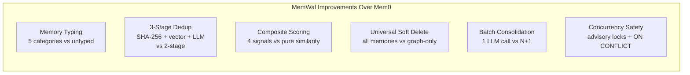
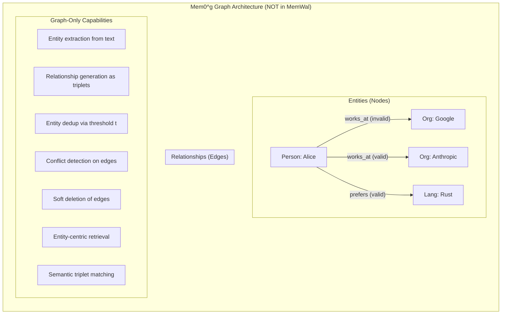
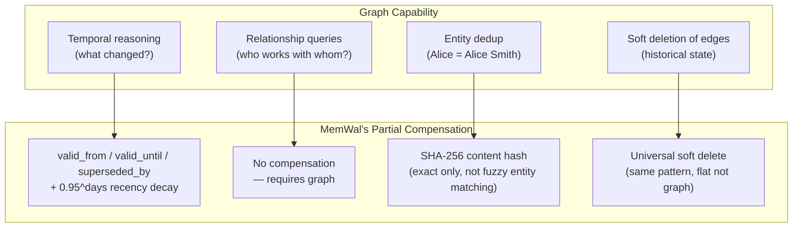
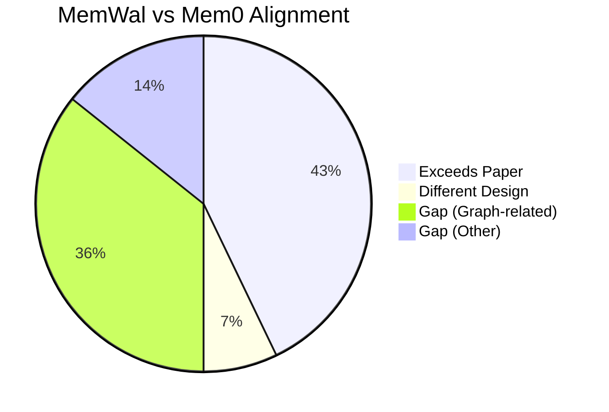
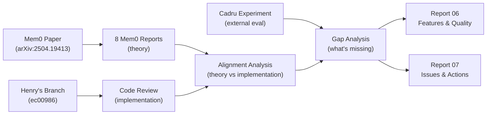

# 06 — Features & Quality: MemWal vs Mem0

> **Context**: This report covers what MemWal built, how it compares to the Mem0 paper's architecture, and the graph question. For code-level issues and action items, see [Report 07 — Issues & Action Plan](./07-issues-and-actions.md).
>
> **Audience**: The redesign team (Daniel, Henry, Margo, Aaron)

---

### Navigation

| | |
|---|---|
| **Part of** | [MemWal Review Set](./00-index.md) |
| **Previous** | [05 — External Evaluation](./05-external-evaluation.md) |
| **Next** | [07 — Issues & Action Plan](./07-issues-and-actions.md) |
| **Mem0 Foundation** | [Mem0 Paper Analysis](../mem0-research/00-index.md) |

---

## 1. What We Researched

We conducted a deep analysis of the Mem0 paper ([arXiv:2504.19413](https://arxiv.org/abs/2504.19413)) — "Building Production-Ready AI Agents with Scalable Long-Term Memory" by Chhikara et al. — and produced 7 interconnected reports covering every architectural component:

| Report | What It Covers |
|---|---|
| [System Overview & Index](../mem0-research/00-index.md) | Narrative walkthrough, reading guide, related work, consolidated gaps |
| [Memory Structure](../mem0-research/01-memory-structure.md) | Dense text vs graph `G=(V,E,L)`, schemas, storage trade-offs |
| [Context Management](../mem0-research/02-context-management.md) | 3-layer extraction prompt, async summary, sliding window |
| [Memory Operations](../mem0-research/03-memory-operations.md) | ADD/UPDATE/DELETE/NOOP via LLM tool calling |
| [Deduplication & Conflict](../mem0-research/04-deduplication-conflict.md) | Similarity detection, entity matching, soft deletion |
| [Retrieval](../mem0-research/05-retrieval.md) | Vector search, entity-centric traversal, semantic triplet matching |
| [Component Interactions](../mem0-research/06-component-interactions.md) | End-to-end pipeline, feedback loops, failure modes |

We then reviewed Henry's implementation on `feat/memory-structure-upgrade` (commit [ec00986](https://github.com/MystenLabs/MemWal/commit/ec00986ed3695429dd3f5e32c78e44ce81ac1641)) against these findings.

---

## 2. Where MemWal Exceeds the Paper

Henry's commit implements the **Mem0 base architecture** and in several areas goes significantly beyond what the paper describes.

| What | Mem0 Paper | MemWal | Why It Matters |
|---|---|---|---|
| **Memory typing** | Untyped text facts | 5 types: fact, preference, episodic, procedural, biographical | Enables type-filtered retrieval and type-aware LLM context injection. **Not present in Mem0 paper at all** — MemWal innovation. |
| **Importance scoring** | Not present | 0.0–1.0 float per memory | Enables importance-weighted retrieval. Feeds into composite scoring. |
| **Content-hash dedup** | Not present | SHA-256 fast-path before any LLM/network work | Eliminates exact duplicates at zero compute cost. Checked before quota, embedding, encryption, and upload — saves the entire pipeline cost for duplicates. |
| **Composite scoring** | Pure cosine similarity (α=1.0, all other weights=0) | `W_s × similarity + W_i × importance + W_r × 0.95^days + W_f × ln(access)` | Directly addresses the temporal ranking gap we identified in [Report 05, Section 8.2](../mem0-research/05-retrieval.md). The paper uses ONLY semantic similarity — MemWal adds 3 additional signals. |
| **Universal soft delete** | Graph edges only; base Mem0 does hard delete (permanent removal) | `superseded_by` + `valid_from`/`valid_until` on ALL memories | Enables temporal queries and audit trails for every memory. We identified this as the "most architecturally significant difference" between base and graph Mem0 in [Report 03, Section 4.2](../mem0-research/03-memory-operations.md). MemWal closes this gap. |
| **Batch consolidation** | Per-fact LLM calls: 1 extraction + N classification = N+1 calls per message | Single batch LLM call for all facts: ~2 calls total | ~70% LLM cost reduction. Also enables **cross-fact awareness** — the LLM sees all facts together and can detect relationships between them. Paper processes each fact in isolation ([Report 03, Section 6](../mem0-research/03-memory-operations.md)). |
| **Integer ID mapping** | Not in paper | LLM sees `"0","1","2"` instead of UUIDs in consolidation prompt | Prevents hallucinated IDs. Without this, LLMs often fabricate plausible-looking UUIDs that don't map to real memories. |
| **Access tracking** | Not in paper | `access_count` + `last_accessed_at` per memory | Feeds into frequency scoring: frequently retrieved memories are ranked higher. Creates a usage signal that the paper lacks entirely. |
| **Concurrency safety** | Not addressed in paper ([Report 06, Section 5.3](../mem0-research/06-component-interactions.md)) | `pg_advisory_xact_lock` + `ON CONFLICT` + transactional inserts with rollback | Handles concurrent duplicate writes safely. The paper doesn't discuss what happens when two messages arrive simultaneously — MemWal handles this explicitly. |

**Source**: [Mem0 Alignment Analysis](./03-mem0-alignment.md), [Code Review](./02-code-review.md)

---

## 3. Where MemWal Diverges (Intentionally)

| What | Mem0 Paper | MemWal | Why It's Different |
|---|---|---|---|
| **Context management** | Server owns context: conversation summary S + sliding window m=10 + current exchange → 3-layer extraction prompt P ([Report 02](../mem0-research/02-context-management.md)) | Server is stateless: receives raw text from caller. SDK `withMemWal()` middleware handles memory injection at LLM call time. | MemWal is a **service**, not an integrated agent. It doesn't own the conversation session. Context assembly is the caller's responsibility. This is a valid architectural choice — it means MemWal can be used by any client, not just a specific chat framework. |

This is **not a gap** — it's a deliberate design decision. The trade-off is that extraction quality depends on what the caller sends, but the benefit is that MemWal is framework-agnostic.

---

## 4. The Graph Question

This is the central architectural decision. The Mem0 paper describes **two complementary architectures**:

- **Mem0 (Base)**: Dense text memories in a vector database — **what MemWal implements**
- **Mem0^g (Graph)**: A directed labeled knowledge graph `G=(V,E,L)` in Neo4j — **what MemWal does NOT implement**

### 4.1 What the Graph Variant Is

The graph adds a **parallel processing pipeline**:

1. **Entity Extraction** — LLM identifies entities (Person, Organization, Location, Event, Concept, etc.) from extracted facts ([Report 01, Section 2.2](../mem0-research/01-memory-structure.md))
2. **Relationship Generation** — LLM generates semantic triplets: `(source, relationship, destination)` — e.g., `(Alice, works_at, Anthropic)` ([Report 04, Section 2](../mem0-research/04-deduplication-conflict.md))
3. **Entity Deduplication** — Each entity is embedded and matched against existing nodes via similarity threshold `t`. "Alice", "alice", "Alice Smith" may all map to the same node ([Report 04, Section 2.1](../mem0-research/04-deduplication-conflict.md))
4. **Conflict Detection** — When a new edge conflicts with an existing one, the old edge is soft-deleted ([Report 04, Section 3](../mem0-research/04-deduplication-conflict.md))
5. **Dual Retrieval** — Entity-centric traversal + semantic triplet matching ([Report 05, Sections 2–3](../mem0-research/05-retrieval.md))

### 4.2 What the Graph Enables That MemWal Can't Do

| Query Type | Without Graph (MemWal now) | With Graph (Mem0^g) |
|---|---|---|
| **"Who does Alice work with?"** | Vector search returns text memories mentioning Alice + coworkers. Relies on the fact being explicitly stated in a single memory. | Traverse Alice's node → find `works_with` edges → return connected Person nodes. Works even if the relationship was implied across multiple conversations. |
| **"What changed since January?"** | Can filter by `valid_from > January` on flat memories. Limited to individual memory timestamps. | Filter edges by timestamp. Traverse invalidated edges to show what was true before. Build temporal chains: `works_at Google (invalid, Jan) → works_at Anthropic (valid, Mar)`. |
| **"How are project X and project Y related?"** | Vector search might surface memories mentioning both. No structural connection between them. | Traverse nodes for both projects, find shared edges (same team members, same technologies, shared dependencies). |
| **"What does the user's team look like?"** | Must hope a memory explicitly says "User's team is Alice, Bob, Carol". | Traverse from User node → `works_with` / `manages` / `reports_to` edges → build the org graph dynamically from accumulated knowledge. |

### 4.3 What the Paper's Own Benchmarks Say

The Mem0 paper evaluates both architectures on the LOCOMO benchmark (Maharana et al., 2024) across 4 question types:

| Query Type | Mem0 Base (J) | Mem0^g Graph (J) | Winner | Delta |
|---|---|---|---|---|
| **Single-hop** | **67.13** | 65.71 | Base | -1.42 |
| **Multi-hop** | **51.15** | 48.23 | Base | -2.92 |
| **Temporal** | 55.51 | **58.13** | Graph | +2.62 |
| **Open-domain** | **75.71** | 75.09 | Base | -0.62 |

**Source**: Mem0 paper Table 1, analyzed in [Report 05, Section 4.3](../mem0-research/05-retrieval.md)

Key takeaways:
- **Base wins 3 out of 4 query types.** Dense natural language memories capture enough context for most factual retrieval.
- **Graph only wins on temporal reasoning** — and the margin is modest (+2.62 J points).
- **Graph adds cost**: ~2x storage (14k vs 7k tokens/conversation), ~3x search latency (p50: 0.476s vs 0.148s), additional LLM calls for entity extraction + relationship generation.

### 4.4 How MemWal Partially Compensates Without the Graph

| Graph Strength | MemWal Compensation | Coverage |
|---|---|---|
| **Temporal reasoning** | `valid_from`/`valid_until`/`superseded_by` + recency decay scoring | **~70%** — can answer "what's current" and "what changed" for individual memories, but can't trace relationship evolution chains |
| **Relationship queries** | None | **0%** — flat vector search cannot follow relationship edges |
| **Fuzzy entity dedup** | SHA-256 content hash (exact match only) | **~20%** — catches identical text but not "Alice" ≈ "Alice Smith" |
| **Historical state** | Universal soft delete + `include_expired` flag | **~80%** — can retrieve invalidated memories, but without graph structure to show *how* they connect |

### 4.5 The Decision: Do We Need the Graph Now?

**Arguments for building the graph now:**
- The [redesign breakdown doc](../memory-redesign-breakdown.md) specifically calls out **memory linking** and **temporal relevance** as core pillars
- Relationship queries are **impossible** without it — 0% coverage
- The longer we wait, the more flat memories accumulate without graph structure — retroactive graph-ification is harder than building it incrementally
- Aaron and Daniel discussed timestamp-based memory relevance — graph is the paper-validated answer for temporal queries

**Arguments for deferring:**
- Base outperforms graph on 3/4 query types in the paper's benchmarks
- MemWal's temporal fields + composite scoring partially cover temporal reasoning (~70%)
- Graph adds significant complexity: entity extraction pipeline, Neo4j (or equivalent), conflict detection, dual retrieval — estimated **4–8 weeks** of work
- We haven't validated actual query patterns — we don't know if users will ask relationship/temporal questions frequently enough to justify the investment

**Our recommendation** (from [Gap Analysis](./04-gap-analysis.md)):

> **Defer graph implementation. Validate first.**
>
> 1. Ship the current base architecture (fix the P0 issues first)
> 2. Add observability: track what kinds of queries users make, what recall patterns emerge
> 3. If >20% of queries are relationship-based or temporal, prioritize the graph
> 4. If not, the composite scoring + temporal fields are sufficient

---

## 5. Other Architecture Gaps

Beyond the graph, these gaps were identified across our research:

| Gap | Impact | Effort | Source | Recommendation |
|---|---|---|---|---|
| **Conversation summary module** | Extraction quality depends entirely on what the caller sends | 2–3 weeks | [Mem0 Report 02](../mem0-research/02-context-management.md) | Consider optional session-aware extraction mode |
| **Feedback loops** | No self-improvement mechanism — extraction quality is static | 3–4 weeks | [Mem0 Report 06, Section 4](../mem0-research/06-component-interactions.md) | Add observability first, then design feedback signals |
| **Cascading invalidation** | Superseding one memory doesn't auto-invalidate related ones | 1–2 weeks | [Mem0 Report 04, Section 5.2](../mem0-research/04-deduplication-conflict.md) | Track for graph phase — cascading makes more sense with edges |

---

## 6. Overall Scorecard

| Area | Mem0 Paper | MemWal | Rating |
|---|---|---|---|
| Memory schema & typing | Untyped facts | 5 types + importance + access tracking + metadata | **Exceeds** |
| Content dedup | LLM-only | SHA-256 + vector + LLM (3-stage) | **Exceeds** |
| Soft deletion | Graph edges only | Universal (superseded_by + valid_until) | **Exceeds** |
| Memory operations | 4 ops, per-fact | 4 ops, batch + integer ID mapping + fallback | **Exceeds** |
| Composite scoring | Pure similarity | 4-signal weighted scoring with temporal decay | **Exceeds** |
| Concurrency safety | Not addressed | Advisory locks + transactional inserts | **Exceeds** |
| Context management | 3-layer prompt (S + window + current) | Raw text input (caller-managed) | **Different design** |
| Conversation summary | Async periodic generation | Not implemented | **Gap** |
| Graph memory G=(V,E,L) | Full implementation | Not implemented | **Gap** |
| Entity extraction | LLM-based with types | Not implemented | **Gap** |
| Relationship triplets | Directed labeled edges | Not implemented | **Gap** |
| Entity-centric retrieval | Graph traversal | Not implemented | **Gap** |
| Semantic triplet matching | Query vs triplet embeddings | Not implemented | **Gap** |
| Feedback loops | Summary ↔ extraction | Not implemented | **Gap** |

---

## 7. What We Produced

| Artifact | Purpose | Size |
|---|---|---|
| [Mem0 Paper Analysis](../mem0-research/00-index.md) (7 reports) | Deep dive into every Mem0 architectural component | 3,154 lines |
| [MemWal Review](./00-index.md) (7 reports) | Architecture, code review, alignment, gaps, external eval, summaries | ~2,100 lines |
| [mem0-paper.pdf](../mem0-research/mem0-paper.pdf) | Downloaded paper for reference | 1.1 MB |

