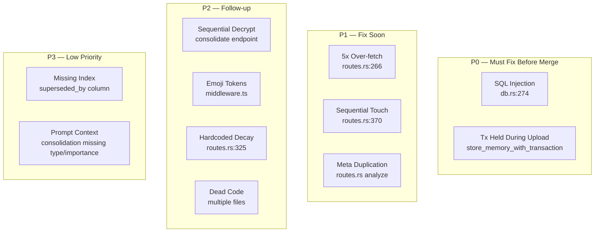
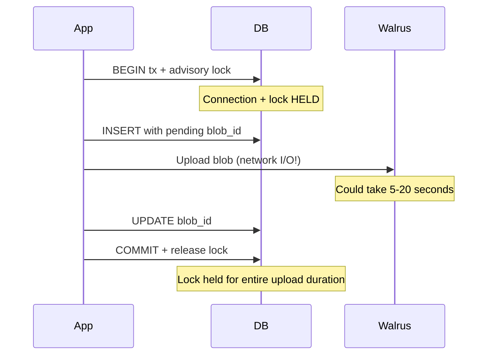
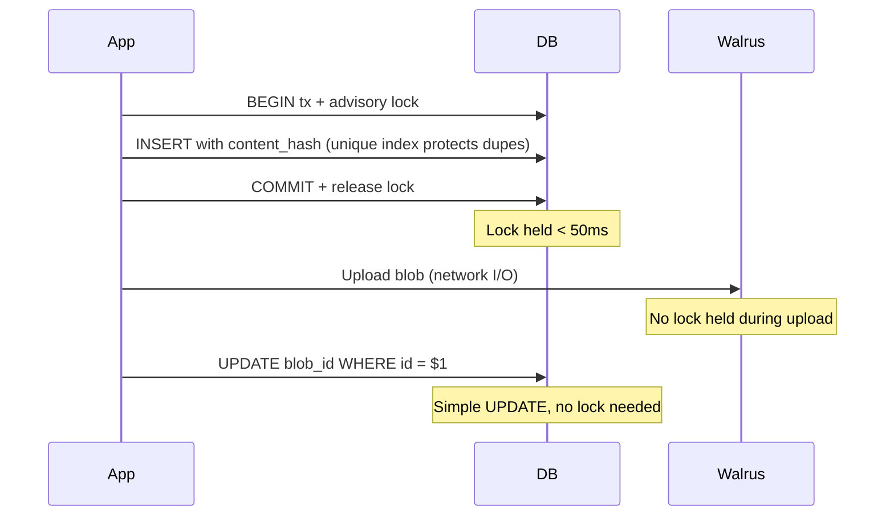
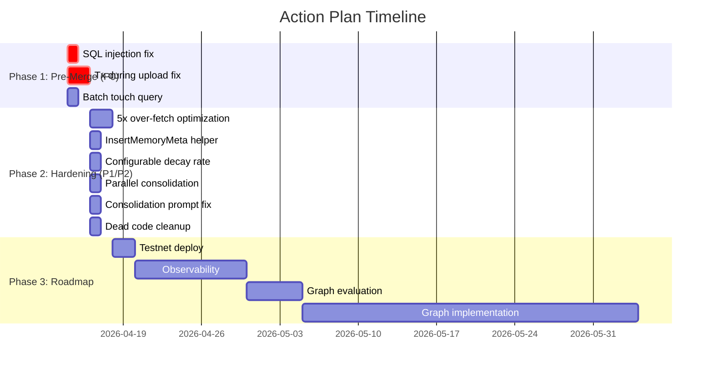

# 07 — Issues & Action Plan

> **Context**: This report consolidates all code-level issues, architecture gaps, and recommended actions. For feature comparison and quality analysis, see [Report 06 — Features & Quality](./06-features-and-quality.md).
>
> **Branch**: `feat/memory-structure-upgrade` (commit [ec00986](https://github.com/MystenLabs/MemWal/commit/ec00986ed3695429dd3f5e32c78e44ce81ac1641))

---

### Navigation

| | |
|---|---|
| **Part of** | [MemWal Review Set](./00-index.md) |
| **Previous** | [06 — Features & Quality](./06-features-and-quality.md) |
| **Detailed Code Review** | [02 — Code Review](./02-code-review.md) |
| **Detailed Gap Analysis** | [04 — Gap Analysis](./04-gap-analysis.md) |

---

## 1. Issue Overview



| Priority | Count | Summary |
|---|---|---|
| **P0** | 2 | Security + reliability issues that block merge |
| **P1** | 3 | Performance + code quality issues for near-term |
| **P2** | 4 | Quality improvements for follow-up |
| **P3** | 2 | Minor optimizations |
| **Total** | **11** | |

---

## 2. P0 Issues — Must Fix Before Merge

### 2.1 SQL Injection in `search_similar_filtered`

| | |
|---|---|
| **Location** | `services/server/src/db.rs:274` |
| **Source** | [Code Review, Section 3](./02-code-review.md) |
| **Impact** | Attacker-controlled `memory_types` array values are interpolated into SQL via manual quote escaping. Although values come from authenticated API requests, defense-in-depth requires parameterized queries. |

**Current code (vulnerable):**
```rust
let type_list: Vec<String> = types.iter()
    .map(|t| format!("'{}'", t.replace('\'', "''")))
    .collect();
conditions.push(format!("memory_type IN ({})", type_list.join(",")));
```

**Recommended fix:**
```rust
// Use ANY($N) with bound array parameter
conditions.push(format!("memory_type = ANY(${})", next_param_idx));
// ... later, bind as &[String]
```

Same concern with `min_importance`: `format!("importance >= {}", min_imp)` — safe for `f32` but not idiomatic. Use a bound parameter.

**Effort**: ~30 minutes

---

### 2.2 Transaction Held During Walrus Upload

| | |
|---|---|
| **Location** | `services/server/src/routes.rs` — `store_memory_with_transaction()` |
| **Source** | [Code Review, Section 3](./02-code-review.md) |
| **Impact** | Advisory lock + DB connection held during Walrus upload (network I/O). Under load: connection pool exhaustion, writes blocked on same content hash for full upload duration. |

**Current flow:**


**Recommended fix:**


Reserve row → commit → upload → update `blob_id` separately. The unique partial index `idx_ve_content_hash_active` already protects against duplicates.

**Effort**: ~2-4 hours

---

## 3. P1 Issues — Fix Soon

| Issue | Location | Impact | Fix | Effort |
|---|---|---|---|---|
| **5x over-fetch in recall** | `routes.rs:266` | `search_limit = limit * 5` — ALL 5x results are downloaded from Walrus and decrypted before truncation. If user requests `limit=20`, you download and decrypt up to 100 blobs. | Score on metadata first (distance + importance + created_at), download only the top-k that will survive truncation. | ~4 hours |
| **Sequential touch queries** | `routes.rs:370-380` | N individual `UPDATE` queries in a spawned task — 10 results = 10 queries. | Batch: `UPDATE vector_entries SET access_count = access_count + 1, last_accessed_at = NOW() WHERE id = ANY($1)` | ~30 minutes |
| **InsertMemoryMeta duplication** | `routes.rs` analyze endpoint | `InsertMemoryMeta` construction repeated ~4 times with minor variations in the `Add/Update` match arm. | Extract `InsertMemoryMeta::from_fact_and_existing(fact, existing, hash)` helper. | ~1 hour |

---

## 4. P2 Issues — Follow-up

| Issue | Location | Impact | Fix | Effort |
|---|---|---|---|---|
| **Sequential consolidation decrypts** | `routes.rs:1505+` (consolidate endpoint) | Downloads and decrypts up to 50 blobs sequentially. No parallelism unlike recall which uses `join_all`. | Use `futures::future::join_all` same pattern as recall. | ~1 hour |
| **Emoji tokens in middleware** | `packages/sdk/src/ai/middleware.ts` | Emojis in LLM context injection (📌, ⭐, 📅, etc.) are 1-2 tokens each — wasteful. May not improve retrieval quality. | Make configurable or use plain text labels by default. | ~30 minutes |
| **Hardcoded 0.95 decay rate** | `routes.rs:325` | `0.95_f64.powf(days_old)` — not configurable. After 14 days: ~0.49. After 30 days: ~0.21. Aggressive for long-lived memories. | Add `decay_rate` to `ScoringWeights` (default 0.95). | ~30 minutes |
| **Dead code** | Multiple files | `touch_by_blob_id`, `from_str_opt`, `default_importance()`, `extract_facts_llm`, `llm_decide_consolidation` — all `#[allow(dead_code)]`. | Remove or add comments explaining planned usage. | ~30 minutes |

**Decay rate impact visualization:**

```
Days old:   0    7    14    21    30    60    90
Score:    1.00  0.70  0.49  0.34  0.21  0.05  0.01

At 30 days, a memory's recency signal is nearly zero.
For long-term biographical facts ("User is allergic to peanuts"),
this means recency unfairly penalizes stable knowledge.
```

---

## 5. P3 Issues — Low Priority

| Issue | Location | Impact | Fix | Effort |
|---|---|---|---|---|
| **Missing `superseded_by` index** | `migrations/004_memory_structure.sql` | No dedicated index. The partial index `idx_ve_active` covers `WHERE valid_until IS NULL AND superseded_by IS NULL`, which handles most queries. The `supersede_memory` UPDATE targets by `id` (primary key), so this is minor. | Add index if query patterns warrant it. | ~5 minutes |
| **Consolidation prompt missing type/importance** | `routes.rs:1081-1084` | Old memories sent as `{"id": "0", "text": "..."}` without `memory_type` or `importance`. The LLM can't make importance-aware decisions. | Include type and importance in the prompt JSON. | ~1 hour |

---

## 6. Architecture Gaps

These are not code bugs — they're features from the Mem0 paper that MemWal hasn't implemented. Detailed analysis in [Report 04 — Gap Analysis](./04-gap-analysis.md) and [Report 06 — Features & Quality](./06-features-and-quality.md).

| Gap | Impact | Effort | Source | Priority |
|---|---|---|---|---|
| **Graph memory `G=(V,E,L)`** | Can't do relationship queries. ~70% temporal coverage without it. | 4–8 weeks | [Mem0 Report 01](../mem0-research/01-memory-structure.md) | Roadmap — validate need first |
| **Entity extraction** | No entity dedup across conversations | 2–3 weeks (part of graph) | [Mem0 Report 04](../mem0-research/04-deduplication-conflict.md) | Roadmap — requires graph |
| **Entity-centric retrieval** | Can't traverse relationships from anchor entities | 1–2 weeks (part of graph) | [Mem0 Report 05](../mem0-research/05-retrieval.md) | Roadmap — requires graph |
| **Semantic triplet matching** | Can't match query against relationship patterns | 1–2 weeks (part of graph) | [Mem0 Report 05](../mem0-research/05-retrieval.md) | Roadmap — requires graph |
| **Conversation summary** | Extraction quality depends on caller context | 2–3 weeks | [Mem0 Report 02](../mem0-research/02-context-management.md) | Roadmap |
| **Feedback loops** | No self-improvement mechanism | 3–4 weeks | [Mem0 Report 06](../mem0-research/06-component-interactions.md) | Roadmap — add observability first |
| **Cascading invalidation** | Superseding one memory doesn't auto-invalidate related ones | 1–2 weeks | [Mem0 Report 04](../mem0-research/04-deduplication-conflict.md) | Roadmap — makes more sense with graph |

---

## 7. Action Plan

### Phase 1: Pre-Merge (this week)

| Action | Owner | Effort | Exit Criteria |
|---|---|---|---|
| Fix SQL injection in `search_similar_filtered` | Henry | 30 min | Uses parameterized `ANY($N)` for type filter |
| Fix transaction-held-during-upload | Henry | 2–4 hours | Advisory lock released before Walrus upload |
| Fix batch touch query | Henry | 30 min | Single `UPDATE ... WHERE id = ANY($1)` |

### Phase 2: Post-Merge Hardening (next 2 weeks)

| Action | Owner | Effort | Exit Criteria |
|---|---|---|---|
| Optimize 5x over-fetch | Henry | 4 hours | Score on metadata first, download only survivors |
| Extract InsertMemoryMeta helper | Henry | 1 hour | Single construction point, no duplication |
| Make decay rate configurable | Henry | 30 min | `decay_rate` field in `ScoringWeights` |
| Parallel consolidation decrypts | Henry | 1 hour | Uses `futures::future::join_all` |
| Add type/importance to consolidation prompt | Henry | 1 hour | LLM sees `{"id":"0","text":"...","type":"fact","importance":0.8}` |
| Clean dead code | Henry | 30 min | No `#[allow(dead_code)]` without justification |

### Phase 3: Roadmap

| Action | Owner | Effort | Depends On |
|---|---|---|---|
| Deploy to testnet | Team | 1 day | Phase 1 complete |
| Add observability (query pattern tracking) | TBD | 1–2 weeks | Deploy |
| Evaluate graph need | Margo/Daniel | 1 week | Observability data |
| Build graph layer if validated | TBD | 4–8 weeks | Evaluation decision |
| Conversation summary module | TBD | 2–3 weeks | Evaluation |



---

## 8. Decision Record

Key decisions made during this review:

| Decision | Rationale | Status |
|---|---|---|
| **Universal soft deletion** | Paper only soft-deletes graph edges; base does hard delete. MemWal applies soft deletion to ALL memories — enables temporal queries and audit trails universally. | **KEEP** — this is an improvement over the paper |
| **Batch consolidation** | Paper processes facts one-at-a-time (N+1 LLM calls). MemWal batches all facts in a single LLM call — reduces cost ~70%, enables cross-fact awareness. | **KEEP** — strictly better |
| **No graph (for now)** | Base outperforms graph on 3/4 query types ([Report 05](../mem0-research/05-retrieval.md)). MemWal's temporal fields partially compensate. Graph adds 4–8 weeks + operational complexity. | **DEFER** — revisit after observability data |
| **Caller-managed context** | MemWal is a stateless service, not an integrated agent. Context assembly via SDK middleware. Different from paper but appropriate for service architecture. | **KEEP** — valid design choice |
| **0.95^days decay rate** | Currently hardcoded. Aggressive for long-term memories. | **CHANGE** — make configurable |
